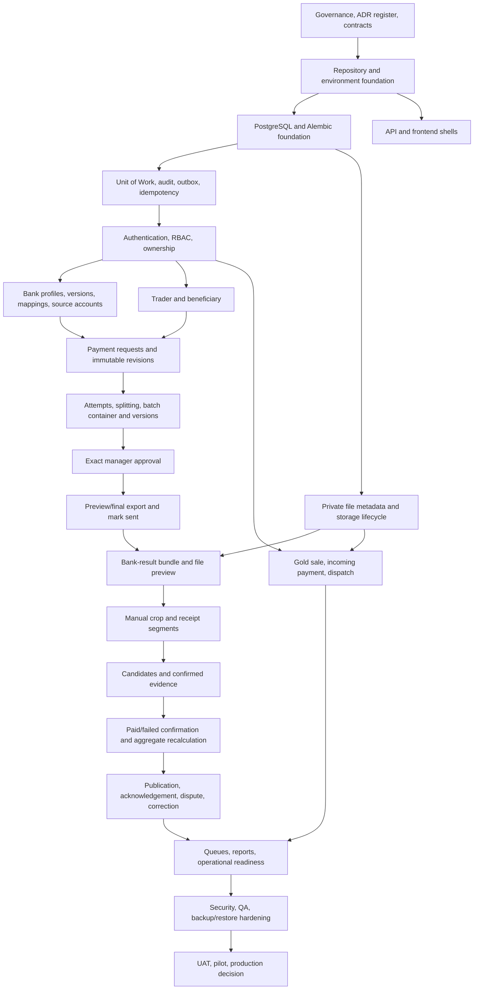

# 15 — Agent Implementation Plan

## Gold Trade Settlement Platform

**Document type:** Authoritative implementation execution plan for coding agents and engineering teams  
**Version:** 1.1  
**Language:** English  
**Phase focus:** Phase 1A — Operational Manual Core  
**Primary audience:** Coding agents, backend engineers, frontend engineers, database engineers, QA engineers, DevOps engineers, security reviewers, technical leads, and product owners  
**Status:** Revised authoritative implementation baseline  

---

## Document Control

| Item | Value |
|---|---|
| Supersedes | `15_Agent_Implementation_Plan.md` version 1.0 |
| Must conform to | Documents `00` through `14`, version 1.1 |
| Primary architecture | Single-tenant modular monolith |
| Backend | FastAPI, SQLAlchemy 2.x, Alembic, PostgreSQL 16+ |
| Frontends | Separate Trader PWA and Admin Web applications using Next.js, React, and TypeScript |
| Background jobs | Celery with Redis as broker; PostgreSQL is authoritative for durable job state |
| Deployment | Docker Compose behind Nginx; only Nginx is publicly exposed |
| Phase 1A AI dependency | None |
| Phase 1A bank API dependency | None |
| Phase 1A manager approval | Required for every outgoing payment batch version |
| Phase 1A manual crop | Required internal rectangular crop, with external evidence fallback |

### Change Summary — Version 1.1

This revision:

- replaces the previous linear feature-first plan with an integrity-first critical path;
- removes premature multi-company and `organizations` implementation from Phase 1A;
- makes Unit of Work, audit, transactional outbox, idempotency, optimistic concurrency, and private file lifecycle foundational work rather than late hardening;
- makes two separately deployable frontend applications mandatory;
- introduces immutable payment-request revisions and immutable payment-batch versions;
- binds manager approval to the exact version, ordered rows, total, source account, mapping version, and content hash;
- separates preview export, final export, and mark-as-sent operations;
- adds internal manual crop to Phase 1A;
- separates matching candidates, confirmed evidence, payment-result confirmation, and trader publication;
- adds publication versioning and correction workflows;
- introduces workstream ownership, entry gates, exit gates, and cross-stream integration contracts;
- adds explicit coding-agent task contracts, prohibited shortcuts, migration rules, and handoff evidence;
- aligns implementation milestones with the QA and production release gates defined in document `14` version 1.1.

---

# 1. Purpose and Authority

This document defines how the approved specification pack must be converted into a working, testable, secure, and deployable Phase 1A system.

It answers:

- what must be implemented first;
- what may be implemented in parallel;
- which dependencies block later work;
- which decisions must be resolved before implementation begins;
- what each coding task must contain;
- what evidence is required before a milestone is accepted;
- which shortcuts are prohibited;
- when Phase 1A may enter UAT, pilot, and production;
- when future AI, integration, and multi-company work may begin.

This document is not permission to reinterpret the business model. It is an execution plan for the approved design.

The guiding principle is:

> Preserve the business need and business logic, not the limitations or appearance of the current manual tools.

The implementation must replace scattered messaging, spreadsheets, copied files, and informal confirmations with structured, versioned, auditable commands and records.

---

# 2. Authoritative Source Pack and Precedence

## 2.1 Required documents

The coding agent must read the relevant sections of these version 1.1 documents before implementing a task:

1. `00_Master_Implementation_Blueprint.md`
2. `01_Product_Requirements_PRD.md`
3. `02_Domain_Model_and_Business_Rules.md`
4. `03_System_Architecture.md`
5. `04_Database_Schema.md`
6. `05_API_Specification.md`
7. `06_Workflows_and_State_Machines.md`
8. `07_UI_UX_Specification.md`
9. `08_Bank_File_and_Result_Processing.md`
10. `09_OCR_AI_Module_Specification.md`
11. `10_Backend_Implementation_Guide.md`
12. `11_Frontend_Implementation_Guide.md`
13. `12_Security_RBAC_Audit.md`
14. `13_DevOps_Deployment_Operations.md`
15. `14_Testing_QA_Acceptance.md`
16. this document.

Document `23_Discovery_Questions_and_Answers_FA.md` is historical discovery material. It may explain intent but is not implementation authority when it conflicts with documents `00` through `22`.

## 2.2 Precedence rule

When a conflict appears, do not silently choose one interpretation. Apply this order:

1. explicit approved product decision or ADR;
2. security and financial invariants;
3. domain model and workflow/state-machine rules;
4. database integrity constraints;
5. API command contract;
6. architecture and implementation guides;
7. UI/UX behavior;
8. optional future-phase guidance.

The agent must record the conflict in the task or pull request and request a decision when the conflict is material.

## 2.3 No invention rule

A coding agent must not invent:

- new financial statuses;
- new approval authorities;
- new deletion behavior;
- new bank rules;
- new tenant/company boundaries;
- automatic AI authority;
- hidden fallback behavior;
- alternate money units or conversion assumptions;
- direct mutable relationships that replace approved version/history entities.

A necessary assumption must be written explicitly and must not weaken an approved invariant.

---

# 3. Non-Negotiable Phase 1A Baseline

Every implementation task must preserve the following baseline.

## 3.1 Product boundary

Phase 1A is a manual operational core.

It must not require:

- OCR;
- AI;
- automatic segmentation;
- automatic matching;
- bank APIs;
- SMS;
- external messaging integrations;
- native mobile applications;
- in-app chat;
- subscription billing;
- multi-company SaaS features;
- beneficiary logins;
- automated financial finality.

## 3.2 Human authority

- Accountants review requests and confirm operational bank results.
- Managers approve every outgoing payment batch in Phase 1A.
- The manager approves an exact immutable batch version, not a mutable batch container.
- A material change requires a new version and new approval.
- Workers and AI cannot approve, confirm payment, publish results, dispatch gold, or override financial controls.

## 3.3 Money

- PostgreSQL stores canonical monetary amounts as integer IRR using `BIGINT`.
- Original entered value and selected unit are retained.
- No unit is inferred from number size.
- API financial amounts use integer strings to prevent JavaScript precision loss.
- Frontends use `BigInt` or an integer-safe decimal approach, never floating point.
- Full payment requires exact equality between authoritative paid sum and requested amount.
- Overpayment blocks normal confirmation and creates reconciliation work.

## 3.4 Records and corrections

- Financial records are not generically deleted.
- Corrections create revisions, replacements, superseding records, or explicit cancellation/void history.
- Payment requests have immutable revisions.
- Payment attempts preserve split, retry, and correction lineage.
- Batch versions and finalized items are immutable.
- Approvals are append-only.
- Publications are immutable and versioned.
- Evidence is replaced or revoked, not silently deleted.

## 3.5 File and evidence model

- Files are private and authorized through business ownership.
- Raw storage paths are never returned to clients.
- File lifecycle and scan/quarantine state are enforced.
- Manual rectangular crop is a Phase 1A capability.
- Original files remain unchanged.
- Crop provenance includes source file, page, normalized rectangle, rotation, renderer version, and checksum.
- A matching candidate is not confirmed evidence.
- Confirmed evidence is not payment confirmation.
- Payment confirmation is not publication.

## 3.6 Reliability and integrity

The following are foundational, not final-polish work:

- Unit of Work;
- transactional audit;
- transactional outbox;
- idempotency records;
- optimistic concurrency;
- explicit database locks where required;
- private file lifecycle;
- durable processing-job state in PostgreSQL;
- backup and restore;
- security and ownership tests.

---

# 4. Decisions and ADR Gates

Implementation may begin while some ADRs remain open, but affected interfaces must remain abstract and no irreversible assumption may be embedded.

## 4.1 ADRs required before dependent work is finalized

| ADR | Decision | Must be resolved before |
|---|---|---|
| ADR-001 | Browser authentication/session transport | final auth implementation and production security review |
| ADR-002 | Production hosting/topology | production infrastructure procurement |
| ADR-003 | Production storage adapter | final file deployment and backup design |
| ADR-004 | RPO/RTO and backup schedule | production release gate |
| ADR-005 | Retention and legal-hold policy | any governed deletion job |
| ADR-006 | Business timezone and bank-date conventions | final bank date/time UI and parsing |
| ADR-007 | Initial bank profiles, mappings, and source accounts | UAT with bank export fixtures |
| ADR-008 | Malware scanning policy/provider | production file-acceptance gate |
| ADR-009 | Manager strong-auth/recent-auth method and timeout | manager approval production gate |
| ADR-010 | Separation-of-duty exceptions and break-glass authority | production approval workflow |
| ADR-011 | Text-only payment confirmation policy | payment-result production gate |
| ADR-012 | Published-paid-result correction authority | correction UAT and production gate |
| ADR-013 | IBAN masking by role and publication | final UI/security acceptance |
| ADR-014 | File size, type, and operational volume limits | load test and Nginx/backend configuration |
| ADR-AI-* | AI provider, privacy, evaluation, and cost | enabling any real AI provider |

## 4.2 ADR-safe implementation rule

Until an ADR is resolved:

- define an interface or configuration boundary;
- use a safe default;
- keep the feature disabled when required;
- add tests for the default behavior;
- document what remains blocked;
- do not create conflicting schema or API contracts.

---

# 5. Delivery Model and Workstreams

## 5.1 Required workstreams

The project is delivered through coordinated workstreams.

| Workstream | Primary responsibility |
|---|---|
| WS-GOV | Architecture decisions, documentation consistency, scope control |
| WS-BE | FastAPI application, commands, policies, Unit of Work, repositories |
| WS-DB | PostgreSQL schema, Alembic, constraints, indexes, migration safety |
| WS-FE-T | Trader PWA |
| WS-FE-A | Admin Web application |
| WS-FILE | Private storage, upload lifecycle, previews, crop/rendering |
| WS-SEC | Authentication, RBAC, ownership, recent-auth, security testing |
| WS-JOBS | Celery, outbox dispatch, durable job state, maintenance jobs |
| WS-OPS | Docker Compose, Nginx, environments, backup/restore, monitoring |
| WS-QA | Test design, automation, UAT, release evidence |

One engineer may own multiple workstreams, but their boundaries remain explicit.

## 5.2 Parallel-work rule

Work may proceed in parallel only when shared contracts are frozen for the milestone.

Examples:

- Frontend form work may begin after OpenAPI DTOs and status mappings are agreed.
- Export UI may begin after the batch-version and export API contracts are stable.
- Crop UI may begin after normalized-coordinate and file-preview contracts are stable.
- QA may build fixtures while services are implemented, but expected outcomes must come from the authoritative rules.

## 5.3 Critical path

The critical path is:

```text
Governance and contracts
  → persistence/integrity foundation
  → authentication/RBAC/ownership
  → bank/file configuration
  → requests and revisions
  → attempts and immutable batch versions
  → exact manager approval and final export
  → bank-result processing and manual crop
  → confirmed evidence and payment result
  → immutable trader publication
  → security/QA/restore gates
  → UAT and pilot
```

AI, advanced reporting, bank integrations, and multi-company work are not on the Phase 1A critical path.

---

# 6. Dependency Graph



---

# 7. Milestone Overview

| Milestone | Name | Exit outcome |
|---|---|---|
| M0 | Governance and contract baseline | Source pack, ADR register, status/permission/API contracts controlled |
| M1 | Repository and runtime foundation | Two frontends, FastAPI, Compose, CI, health/version baseline |
| M2 | Persistence and integrity foundation | Alembic schema, Unit of Work, audit, outbox, idempotency, durable jobs |
| M3 | Authentication, RBAC, and ownership | Separate auth domains, permissions, trader isolation, session controls |
| M4 | Bank configuration and private file lifecycle | Versioned bank config, private upload/download, quarantine, preview foundation |
| M5 | Trader, beneficiary, and payment-request revisions | Onboarding and complete request/revision workflow |
| M6 | Attempts, splitting, and batch versions | Server preview, attempts, immutable batch versions, validation/hash |
| M7 | Manager approval and bank export | Exact approval, preview/final export, integrity validation, mark sent |
| M8 | Bank-result processing and manual crop | Bundles, files, internal crop, segments, review workspace |
| M9 | Evidence, result confirmation, and publication | Candidate/evidence separation, payment results, publication versions, disputes |
| M10 | Gold sale and incoming settlement | Pricing versions, receipt/statement matching, dispatch guard |
| M11 | Operational queues, reports, and maintenance | Role queues, notifications, reconciliation, operational jobs |
| M12 | Security, QA, and operational hardening | Full tests, restore drill, runbooks, security review, release evidence |
| M13 | UAT, pilot, and production release | Signed UAT, controlled pilot, go/no-go decision |

No milestone is complete because screens appear to work. Each milestone must satisfy its database, API, security, audit, test, and operations gates.

---

# 8. M0 — Governance and Contract Baseline

## 8.1 Goal

Create a controlled implementation baseline before coding business workflows.

## 8.2 Required outputs

- versioned authoritative documentation pack `00` through `22`, with document `23` retained as governed historical evidence;
- ADR register with owner and status;
- canonical status catalogue;
- canonical permission catalogue;
- canonical error-code catalogue;
- OpenAPI generation strategy;
- database naming conventions;
- audit action naming conventions;
- outbox event naming conventions;
- money and date serialization rules;
- branch, review, and release policy;
- decision-log location.

## 8.3 Contract freeze items

The following must be stable enough for implementation:

- Phase 1A single-tenant boundary;
- two-frontend architecture;
- command endpoint pattern;
- `Idempotency-Key` requirements;
- `ETag`/`If-Match` concurrency approach;
- integer-string financial API fields;
- immutable request revisions;
- immutable batch versions;
- approval version/hash binding;
- manual crop coordinate contract;
- evidence/publication separation;
- health endpoint contract.

## 8.4 Definition of Done

M0 is complete when:

- conflicting status names have been removed from implementation artifacts;
- each open ADR has an owner and blocking milestone;
- generated-code strategy is agreed;
- no team is implementing from version 1.0 documents;
- an agent can identify the authoritative section for every planned Phase 1A epic.

## 8.5 Prohibited shortcuts

- starting schema work from the old `organizations` model;
- creating ad hoc endpoint names before the API contract is reviewed;
- copying statuses from UI mockups;
- treating historical discovery notes as implementation authority.

---

# 9. M1 — Repository and Runtime Foundation

## 9.1 Goal

Create the buildable, testable runtime skeleton without premature financial workflow logic.

## 9.2 Required repository shape

```text
gold-trade-platform/
  apps/
    trader-pwa/
    admin-web/
    backend/
  packages/
    api-client/
    auth-client/
    domain-contracts/
    design-system/
    financial-ui/
    file-ui/
    localization/
    validation/
  ops/
    compose/
    docker/
    nginx/
    scripts/
    runbooks/
    monitoring/
  tests/
    contract/
    integration/
    e2e/
    fixtures/
  docs/
    implementation/
    adr/
```

Equivalent structures are acceptable only if the two frontend applications and backend module boundaries remain separate.

## 9.3 Backend tasks

- create FastAPI application and `/api/v1` routing;
- add settings and environment validation;
- add standardized error envelope;
- add correlation/request ID middleware;
- add structured redacted logging;
- add OpenAPI metadata and generation checks;
- add graceful startup/shutdown;
- add the approved health endpoints:
  - `/api/v1/health/live`;
  - `/api/v1/health/ready`;
  - `/api/v1/health/dependencies`;
  - `/api/v1/health/workers`;
- add release/version endpoint or metadata;
- create test bootstrap.

## 9.4 Frontend tasks

- create separate `trader-pwa` and `admin-web` applications;
- establish Persian/RTL root layout;
- define safe design tokens;
- add API-client package shell;
- add auth-client abstraction shell;
- add error, empty, loading, forbidden, and conflict states;
- establish generated OpenAPI type workflow;
- prevent service-worker caching of sensitive routes and files;
- add accessibility smoke-test foundation.

## 9.5 DevOps tasks

- create local Docker Compose stack;
- create pinned Dockerfiles for all applications;
- expose only Nginx in the production model;
- create application and data networks;
- create service-specific `.env.example` files;
- create explicit local storage bind mount;
- add log rotation and container health checks;
- create CI pipeline for lint, type check, tests, builds, and secret scan.

## 9.6 Tests and gate

- both frontend builds succeed;
- backend starts with validated settings;
- health endpoints return the approved minimal contract;
- PostgreSQL and Redis are private inside Compose;
- no secrets appear in frontend bundles;
- no production container uses `latest`;
- no container mounts the Docker socket.

## 9.7 Definition of Done

M1 is complete when a new developer or agent can run the full local stack using documented commands and CI validates all three applications.

---

# 10. M2 — Persistence and Integrity Foundation

## 10.1 Goal

Build the database and application integrity mechanisms required by every later financial command.

## 10.2 Required database foundation

Implement Alembic migrations for the approved Phase 1A foundation, including:

- `center_profile`;
- admin and trader identity tables;
- roles, permissions, assignments;
- auth sessions and auth events;
- bank-profile and configuration foundation;
- file metadata and relationships;
- idempotency records;
- outbox events;
- append-only audit logs;
- durable processing jobs;
- retention policies and legal holds where required by the approved schema.

Do not create an `organizations` or partial tenant model for Phase 1A.

## 10.3 Application foundation

Implement:

- SQLAlchemy 2.x session factory;
- Unit of Work;
- repository interfaces and implementations;
- one-commit command pattern;
- transaction-safe audit writer;
- transaction-safe outbox writer;
- idempotency resolver and result store;
- optimistic concurrency helpers;
- database lock helpers with deterministic lock ordering;
- canonical money serializers;
- canonical entity/version/hash utilities.

## 10.4 Database roles

Prepare separate roles for:

- migration;
- API runtime;
- worker runtime;
- read-only operations;
- backup.

Runtime roles must not own the schema or update/delete append-only audit and approval records.

## 10.5 Migration gate

Required tests:

- clean database to Alembic head;
- previous supported schema to head;
- migration retry after a controlled failure where practical;
- all constraints and indexes created;
- PostgreSQL repository tests, not SQLite substitutes;
- audit insert failure rolls back the business transaction;
- outbox insert failure rolls back the business transaction;
- idempotency replay returns the original result.

## 10.6 Definition of Done

M2 is complete when a sample command can atomically write business state, audit, outbox, and idempotency result through Unit of Work and all rollback tests pass.

## 10.7 Prohibited shortcuts

- repository-level `commit()`;
- audit written after business commit;
- Redis as durable idempotency or job source of truth;
- generic `deleted_at` added to every financial table;
- SQLite used as proof that PostgreSQL constraints work.

---

# 11. M3 — Authentication, RBAC, Ownership, and Sensitive Action Assurance

## 11.1 Goal

Create separate, revocable security domains for Trader PWA and Admin Web.

## 11.2 Required capabilities

- admin login/logout/current-session;
- trader login/logout/current-session;
- registration and pending-approval access for traders;
- password hashing and reset/admin recovery process;
- session revocation;
- account suspension and lock behavior;
- backend permission guards;
- trader ownership guards;
- role-aware navigation;
- CSRF controls for cookie authentication;
- recent-auth abstraction;
- separation-of-duty policy service;
- security-event logging;
- rate limiting for authentication.

## 11.3 Role baseline

- `trader_owner`;
- `accountant`;
- `manager`;
- `warehouse_operator`;
- `business_admin`;
- `technical_admin`;
- `read_only_auditor`;
- optional `support_operator`;
- system/worker actor identities.

Do not implement a permanently omnipotent general `super_admin`. Emergency access must use the approved break-glass process.

## 11.4 Permission baseline

Permissions must map to explicit actions, including:

- request creation, revision, submission, review, batching eligibility;
- batch creation, version finalization, approval;
- preview/final export generation and mark sent;
- result bundle upload;
- crop creation;
- candidate review;
- evidence confirmation/replacement;
- paid/failed confirmation;
- publication;
- dispatch;
- configuration changes;
- audit and file access;
- retention/legal-hold commands.

## 11.5 Security tests

- trader A cannot read trader B records or files;
- admin sessions are rejected on trader-only assumptions and vice versa;
- technical admin lacks financial authority by default;
- read-only users cannot trigger hidden side effects;
- suspended users lose operational access immediately or within the approved revocation model;
- CSRF failures are rejected;
- recent-auth context cannot be replayed for a different action or session;
- break-glass access expires and creates alerts/audit.

## 11.6 Definition of Done

M3 is complete when ownership and permission negative tests exist for every implemented protected resource and the two frontends cannot access each other's protected surfaces.

---

# 12. M4 — Bank Configuration and Private File Lifecycle

## 12.1 Goal

Create the versioned configuration and secure file foundation required before payment workflows rely on bank-specific behavior.

## 12.2 Bank configuration deliverables

- bank profiles;
- immutable bank-profile versions;
- source bank accounts;
- immutable bank mappings/templates;
- splitting-rule configuration;
- effective-date/version handling;
- test fixture bank profiles;
- configuration validation and audit;
- no fake production bank configuration.

## 12.3 File lifecycle deliverables

- pending upload initiation;
- streaming upload without holding a long database transaction;
- size, extension, MIME, and signature validation;
- checksum calculation;
- scan/quarantine state;
- finalize-to-available command;
- private authorized preview/download;
- original/derived relationships;
- preview job dispatch through outbox;
- stale-pending and orphan reconciliation;
- storage adapter interface;
- local pilot adapter and future object-storage adapter boundary.

## 12.4 File states

The implementation must support the approved lifecycle:

```text
pending
quarantined
available
processing_failed
archived
retention_pending
deleted
```

## 12.5 Tests and gate

- malicious or unsupported file is rejected/quarantined;
- a user cannot download by guessing a file ID;
- a trader cannot download an internal bank bundle;
- a storage object without DB metadata is detected;
- DB metadata without an object is detected;
- checksum mismatch blocks use;
- retry does not create duplicate file records;
- signed/authorized access expires or is re-authorized correctly.

## 12.6 Definition of Done

M4 is complete when every later module can reference a stable `FileObject` and a stable bank configuration version without directly handling storage paths or mutable bank settings.

---

# 13. M5 — Trader, Beneficiary, and Payment-Request Revision Workflow

## 13.1 Goal

Implement trader onboarding and the full business-intent lifecycle for outgoing payment requests.

## 13.2 Trader and beneficiary deliverables

- trader registration;
- pending approval;
- approval/rejection/suspension/reactivation;
- trader profile;
- reusable beneficiary per trader;
- normalized IBAN;
- duplicate warning without automatic merge;
- beneficiary deactivation/superseding for future use;
- beneficiary is never a platform user;
- beneficiary never stores the payment amount.

## 13.3 Request aggregate

Implement:

- `PaymentRequest` aggregate;
- immutable `PaymentRequestRevision` records;
- exact beneficiary, IBAN, amount, entered value/unit, description, and attachment snapshots;
- current-revision pointer with same-request composite integrity;
- draft creation;
- draft/revision correction;
- submission;
- accountant review;
- return to trader for correction;
- mark eligible for batching;
- cancellation where permitted;
- revision and status history.

## 13.4 Canonical statuses

Use only the approved states from document `06`, including:

```text
draft
submitted_to_center
under_accountant_review
needs_trader_correction
eligible_for_batching
batched
sent_to_bank
partially_paid
paid
failed
retry_required
result_ready_for_trader
result_published
trader_acknowledged
trader_disputed
cancelled
closed
```

A manager does not approve individual ordinary requests for batching.

## 13.5 Money requirements

- request accepts entered amount and explicit `IRR` or `TOMAN` unit;
- server computes and validates canonical IRR;
- API uses string integers;
- duplicate warning does not auto-block unless an approved policy says so;
- no frontend-authoritative conversion.

## 13.6 Tests and gate

- pending/suspended trader cannot create or submit;
- trader ownership is enforced;
- beneficiary history is not mutated by later edits;
- material correction creates a new revision;
- prior revision remains unchanged;
- invalid unit or mismatched IRR conversion fails;
- stale `If-Match` returns `412`;
- submit/revision commands are idempotent;
- accountant action is audited and emitted through outbox.

## 13.7 Definition of Done

M5 is complete when a trader can submit a request, receive a correction request, create a new immutable revision, resubmit, and reach `eligible_for_batching` without any manager approval at request level.

---

# 14. M6 — Payment Attempts, Splitting, and Immutable Batch Versions

## 14.1 Goal

Translate eligible business requests into exact bank-execution attempts and an immutable versioned batch snapshot.

## 14.2 Server-side preview

Implement a non-mutating batch preview that:

- selects eligible request revisions;
- applies exact versioned splitting rules;
- creates proposed attempts and rows;
- returns validation warnings;
- returns totals and row counts;
- does not reserve or mutate data until the create command succeeds.

## 14.3 Required entities

- `PaymentAttempt`;
- `PaymentBatch` container;
- immutable `PaymentBatchVersion`;
- immutable ordered `PaymentBatchItem`;
- version validation summary;
- content hash;
- current-version pointer with same-batch integrity.

## 14.4 Attempt lineage

Support:

- original attempts;
- split attempts;
- retry attempts;
- correction attempts;
- exact request-revision reference;
- previous-attempt lineage;
- no mutable direct batch foreign key as the sole source of history.

## 14.5 Batch-version lifecycle

```text
preview selection
→ create batch container
→ create draft version
→ validate
→ finalize exact immutable version
→ ready for manager approval
```

Finalization must calculate a canonical content hash from all bank-relevant approved data, including ordered rows, amounts, beneficiary/IBAN snapshots, bank profile version, mapping version, source account, and other required fields.

## 14.6 Concurrency controls

- lock eligible requests/attempts during allocation;
- enforce unique active allocation through constraints;
- use deterministic lock ordering;
- require `If-Match` for mutable batch container changes;
- finalized version is immutable;
- replacement requires a new version.

## 14.7 Tests and gate

- split sums exactly equal request amount;
- no request/attempt enters two active batch versions incorrectly;
- concurrent allocation creates only one valid allocation;
- hash is deterministic for identical canonical content;
- ordered-row change alters hash;
- material field change alters hash;
- finalized items cannot be edited;
- replacement version supersedes operational use of the prior version;
- preview does not mutate records.

## 14.8 Definition of Done

M6 is complete when an accountant can produce an exact immutable batch version ready for manager review and all row-level bank data is frozen in relational snapshots.

---

# 15. M7 — Exact Manager Approval, Final Export, and Mark Sent

## 15.1 Goal

Implement the complete controlled path from immutable batch version to the exact file manually sent to the bank.

## 15.2 Approval command

Approval must require:

- exact batch ID and version ID;
- expected content hash;
- current-version check;
- permission;
- valid recent-auth context;
- separation-of-duty check;
- no conflicting decision;
- no blocking validation errors;
- mandatory idempotency key;
- audit and outbox in the same transaction.

Approval and rejection are append-only decisions.

## 15.3 Stale approval behavior

If a replacement version becomes current:

- an open approval screen for the old version is stale;
- the old version cannot be approved for operational use;
- no decision is transferred automatically;
- the user is directed to the current version;
- the old view remains history only.

## 15.4 Export deliverables

Implement separate:

- preview export;
- final export;
- final-export validation;
- authorized download;
- exact-export mark-sent command;
- export superseding/void/quarantine history.

Preview exports must be permanently identifiable as non-sendable.

Final export requires an active approval for the exact version and must be generated only from immutable version/items, not current mutable beneficiary data.

## 15.5 Integrity checks

Before final download and before mark sent, verify:

```text
export version == approved version
export content hash == batch-version hash
approval hash == batch-version hash
export total == version total
export row count == version row count
mapping version == approved mapping version
source account == approved source account
actual file checksum == stored checksum
```

A mismatch quarantines the export and creates a high-priority task/security event.

## 15.6 Excel safety

- escape or reject formula-like untrusted text according to policy;
- validate required columns and types;
- preserve exact row order;
- test Persian/English encoding;
- never use floating-point values for amounts.

## 15.7 Mark sent

Mark sent acts on an exact `BankExcelExport`, not a generic batch.

It records:

- export ID;
- batch/version;
- actor;
- sent timestamp;
- submission channel;
- note;
- checksum/integrity state.

Downloading does not mean sent.

## 15.8 Tests and gate

- accountant/finalizer cannot approve their own version under default separation policy;
- stale version, wrong hash, expired recent-auth, or replay mismatch is rejected;
- preview cannot be marked sent;
- final export cannot exist without exact approval;
- formula injection fixture is safe;
- two concurrent approvals produce one valid decision;
- two concurrent final-export commands produce one logical result;
- timeout-after-commit returns the stored result;
- quarantine blocks download for bank submission.

## 15.9 Definition of Done

M7 is complete when the system can prove exactly which approved immutable version produced the exact checksummed file that an authorized accountant marked as sent to the bank.

---

# 16. M8 — Bank-Result Bundles, Internal Manual Crop, and Review Workspace

## 16.1 Goal

Bring bank-returned evidence into the system and enable safe manual transaction segmentation without AI dependency.

## 16.2 Required entities and services

- bank-result bundle;
- bundle files;
- optional links to one or more batches;
- receipt segments;
- render/crop processing jobs;
- manual-review tasks;
- secure preview services;
- structured extracted/manual fields;
- provenance and checksums.

## 16.3 Admin workspace

Implement a desktop-first review workspace with:

- bundle summary and unresolved navigation;
- PDF/image/Excel preview;
- page selection;
- zoom, pan, and rotation;
- rectangular crop selection;
- normalized coordinates;
- selected-segment fields;
- attempt search;
- candidate/evidence/history drawers;
- keyboard-accessible controls;
- external evidence fallback.

## 16.4 Crop command

Crop creation must:

- authorize source file and page;
- validate file lifecycle state;
- validate normalized rectangle and rotation;
- create pending segment/job records;
- process asynchronously when appropriate;
- preserve source file;
- create a derived file and checksum;
- record renderer/version/source dimensions;
- be idempotent;
- create audit/outbox records.

Crop creation must not:

- confirm evidence;
- mark an attempt paid;
- publish to a trader.

## 16.5 Privacy review

Before evidence can be included in publication, the operator must verify that the crop does not reveal unrelated names, IBANs, amounts, tracking references, or transactions.

## 16.6 Tests and gate

- multi-page PDFs and rotated images work;
- normalized coordinates reproduce the same crop within approved tolerance;
- render retry does not duplicate segments;
- source file remains unchanged;
- failed render leaves no active evidence;
- inaccessible or quarantined source cannot be cropped;
- trader cannot access bundle or internal segment;
- privacy-risk crop cannot be published;
- external evidence fallback remains available.

## 16.7 Definition of Done

M8 is complete when an accountant can securely inspect a mixed bank bundle, create a reproducible internal rectangular crop, and continue the workflow without OCR or AI.

---

# 17. M9 — Matching Candidates, Confirmed Evidence, Payment Results, and Publication

## 17.1 Goal

Implement the separated human decisions that convert evidence into a financial result and then into a trader-visible immutable publication.

## 17.2 Candidate workflow

A candidate may be manually created in Phase 1A and AI-assisted later.

Candidate actions:

- propose;
- accept for confirmation;
- reject;
- supersede/expire.

Candidate acceptance does not change financial status.

## 17.3 Confirmed evidence

Implement `ConfirmedEvidenceLink` with:

- primary or supplementary type;
- active/replaced/revoked state;
- actor, reason, and timestamps;
- exact attempt and segment/file relationship;
- database partial unique constraints;
- transactional replacement.

Default cardinality:

- one active primary evidence per attempt;
- one active primary target per transaction segment;
- multiple supplementary evidence records allowed.

## 17.4 Payment-result commands

Implement separate explicit commands to:

- confirm paid;
- confirm failed;
- create retry requirement;
- create retry attempt;
- perform sensitive correction through approved review.

Paid confirmation validates:

- attempt was sent;
- attempt is not cancelled/superseded;
- amount is exact;
- evidence or approved exception exists;
- no duplicate conflict remains;
- authoritative paid sum does not exceed requested amount;
- actor permission, version, and idempotency.

## 17.5 Request aggregate recalculation

```text
paid_sum == request amount → paid
0 < paid_sum < request amount → partially_paid
paid_sum > request amount → reconciliation required and normal confirmation blocked
```

## 17.6 Publication workflow

Implement immutable `PaymentResultPublication` versions.

Publication contains only the approved trader-safe snapshot:

- request and publication version;
- beneficiary;
- amount;
- masked IBAN according to policy;
- attempt results;
- bank and tracking data;
- safe evidence/share file;
- content hash;
- published actor/time.

Trader actions:

- view current and historical/superseded indication;
- acknowledge;
- dispute/report issue;
- download/share authorized output.

## 17.7 Correction workflow

A material correction to a published paid result must:

- create a sensitive review task;
- preserve old result and evidence;
- require the approved manager/dual-control decision;
- recalculate aggregates;
- create publication N+1;
- supersede N;
- notify the trader;
- retain full audit history.

## 17.8 Tests and gate

- accepting a candidate does not mark paid;
- concurrent primary evidence creation is constrained;
- evidence replacement is atomic;
- overpayment is blocked;
- duplicate paid confirmation is idempotent;
- trader sees only own active publication;
- old publication is preserved after correction;
- dispute references exact publication version;
- notification failure does not roll back committed financial state;
- full bundle never reaches trader APIs or files.

## 17.9 Definition of Done

M9 is complete when every trader-visible result can be traced through publication → confirmed result → confirmed evidence → exact bank-result source and the full correction history is preserved.

---

# 18. M10 — Gold Sale, Incoming Payment, Statement Import, and Dispatch

## 18.1 Goal

Implement the Phase 1A gold-sale and incoming-settlement workflow without automatic pricing or bank APIs.

## 18.2 Required capabilities

- gold-sale order;
- immutable pricing versions;
- incoming payment receipt upload;
- bank-statement file;
- versioned statement import runs;
- immutable parsed statement rows;
- incoming-payment match records;
- partial payment and overpayment review;
- physical or offset settlement type;
- dispatch guard;
- gold dispatch and trader receipt/acknowledgement;
- correction and audit history.

## 18.3 Statement-import rules

- reparse creates a new import run;
- rows are immutable within a run;
- raw and normalized values are retained;
- duplicate fingerprints create warnings/tasks;
- statement rows do not use generic polymorphic matched-entity fields;
- human confirmation is required.

## 18.4 Dispatch guard

Gold cannot be dispatched unless the approved payment/settlement condition is satisfied or an explicitly authorized override is recorded with reason and audit.

## 18.5 Tests and gate

- multiple receipts and partial incoming payments aggregate correctly;
- reparse does not overwrite prior rows;
- duplicate statement rows are detected;
- overpayment requires review;
- unauthorized warehouse user cannot bypass dispatch guard;
- offset settlement is distinct from physical receipt;
- corrections preserve prior pricing/payment/dispatch history.

## 18.6 Definition of Done

M10 is complete when a trader order can be priced, paid or settled, verified, dispatched, and closed with a traceable manual workflow.

---

# 19. M11 — Operational Queues, Notifications, Reports, and Maintenance

## 19.1 Goal

Make daily work visible and manageable without weakening financial controls.

## 19.2 Required queues

Accountant:

- new requests;
- correction responses;
- eligible-for-batching items;
- draft/invalid batch versions;
- approved exports awaiting manual send;
- sent attempts awaiting result;
- unresolved bundles/segments;
- failed/partial/retry-required payments;
- incoming receipts/statements requiring review;
- trader disputes;
- reconciliation tasks.

Manager:

- exact batch versions awaiting approval;
- sensitive result/publication corrections;
- approved exception tasks;
- operational warning summaries.

Warehouse:

- orders ready for dispatch;
- blocked dispatches;
- receipt confirmation work.

Technical/operations:

- failed jobs;
- stale outbox records;
- storage reconciliation;
- quarantined files/exports;
- backup and health warnings;
- AI status only when enabled.

## 19.3 Query rules

- server-side cursor pagination for large queues/audit;
- stable ordering;
- allowlisted filters and sorting;
- permission-aware counts;
- no client loading of all financial records;
- technical admin does not receive full financial detail by default.

## 19.4 Notifications

Use outbox-driven in-app notifications.

Notification failure:

- is retried;
- is observable;
- does not undo a committed financial result;
- cannot become a hidden workflow dependency.

## 19.5 Maintenance jobs

Implement bounded jobs for:

- outbox dispatch;
- stale job recovery;
- pending upload cleanup through governed rules;
- storage reconciliation;
- file checksum verification;
- notification retry;
- report generation;
- retention dry run and approved execution only.

## 19.6 Definition of Done

M11 is complete when each role can identify and complete its work from controlled queues and all operational failures are visible to the responsible role.

---

# 20. M12 — Security, QA, Backup/Restore, and Operational Hardening

## 20.1 Goal

Produce objective evidence that the system is safe and recoverable enough for UAT and pilot.

## 20.2 Security hardening

- full RBAC and ownership matrix;
- session revocation;
- CSRF and origin controls;
- recent-auth and separation-of-duty tests;
- rate limits;
- secure headers and CSP validation;
- XSS and log-injection tests;
- spreadsheet formula-injection tests;
- file parser and path-traversal tests;
- secret and dependency scans;
- runtime database permission tests;
- audit immutability tests;
- break-glass test and review procedure.

## 20.3 QA hardening

Execute document `14` requirements, including:

- unit and policy tests;
- PostgreSQL integration tests;
- API contract tests;
- frontend component tests;
- E2E workflows;
- concurrency and idempotency tests;
- manual crop tests;
- export-integrity tests;
- publication-version tests;
- accessibility smoke tests;
- performance checks with realistic fixtures;
- UAT dataset preparation.

## 20.4 Operational hardening

- production-like Compose stack;
- pinned immutable images;
- Nginx HTTPS configuration;
- private network validation;
- backup automation;
- off-server encrypted backup;
- consistency manifest;
- full restore drill;
- runbook testing;
- monitoring and alert ownership;
- log redaction review;
- release and rollback/forward-fix procedure.

## 20.5 Exit gate

M12 is complete only when:

- no critical defect remains;
- no unaccepted high defect remains;
- required security tests pass;
- idempotency/concurrency suites pass;
- exact export integrity suite passes;
- cross-trader isolation passes;
- backup and full restore drill pass;
- restored files, approvals, publications, and audit records reconcile;
- release evidence package is complete;
- open production-blocking ADRs are resolved.

---

# 21. M13 — UAT, Pilot, and Production Release

## 21.1 UAT roles

At minimum:

- real business representative acting as trader;
- accountant;
- manager;
- warehouse/dispatch representative where applicable;
- business administrator;
- technical/operations representative;
- QA facilitator.

## 21.2 Required UAT scenarios

- trader registration and approval;
- beneficiary reuse and duplicate warning;
- request draft, explicit unit entry, submission, and correction revision;
- accountant marks request eligible for batching;
- server batch preview and split review;
- batch version finalization;
- manager reviews and approves exact version/hash;
- preview export is visibly non-sendable;
- final export generation, integrity display, download, and mark sent;
- result bundle upload;
- internal manual crop;
- candidate/evidence confirmation;
- paid, failed, partial, and retry flows;
- overpayment block;
- publication and trader acknowledgement/dispute;
- wrong-evidence or wrong-result correction and publication N+1;
- incoming receipt/statement and dispatch guard;
- permission denial and cross-trader denial;
- audit review;
- backup/restore evidence review.

## 21.3 Pilot model

Recommended initial pilot:

- limited trusted traders;
- small number of trained accountants;
- one or more managers with recent-auth configured;
- approved bank profile/mapping fixtures;
- dual verification against the existing manual process for a limited period;
- explicit daily reconciliation;
- direct incident/escalation channel;
- feature flags conservative by default;
- AI and bank APIs disabled.

## 21.4 Source-of-truth transition

During pilot, define whether the platform or legacy process is authoritative for each operation. Do not allow both systems to independently authorize money movement.

A controlled parallel-check period may compare records, but financial authority must be explicit.

## 21.5 Production gate

Production release requires:

- signed UAT;
- release digest and Alembic revision recorded;
- approved bank profiles/mappings/source accounts;
- security sign-off;
- restore drill sign-off;
- monitoring and alert owners;
- support and incident owners;
- rollback/forward-fix plan;
- retention/legal-hold policy;
- RPO/RTO decision;
- no production demo credentials/data;
- AI disabled unless separately approved.

---

# 22. Coding Agent Operating Protocol

## 22.1 Preflight before every task

The agent must identify:

1. task ID and milestone;
2. authoritative document sections;
3. affected aggregates and immutable records;
4. command versus query behavior;
5. required permissions and ownership scope;
6. expected status transition and guards;
7. idempotency requirement;
8. optimistic concurrency or lock requirement;
9. audit action and outbox event;
10. file lifecycle implications;
11. migration requirements;
12. tests and acceptance evidence;
13. observability requirements;
14. rollback/forward-fix implications;
15. explicit out-of-scope items;
16. blocking ADRs.

No coding begins until this preflight is written in the task or implementation note.

## 22.2 During implementation

The agent must:

- keep the change scoped and reviewable;
- implement domain/application command before wiring UI;
- keep routers/controllers thin;
- use Unit of Work and one business commit;
- avoid repository commits;
- add audit, outbox, and idempotency in the same transaction;
- use `If-Match`/version guards where required;
- use explicit commands, not generic status PATCH;
- derive trader scope from authentication context;
- use immutable snapshots for bank execution;
- never expose raw storage keys;
- add negative tests, not only success tests;
- update generated OpenAPI/client contracts;
- update documentation when a contract changes;
- avoid enabling future-phase features by default.

## 22.3 Before handoff

The agent must provide:

- concise implementation summary;
- files changed;
- migration IDs and upgrade behavior;
- API/contract changes;
- permissions and security implications;
- audit and outbox events;
- idempotency/concurrency behavior;
- tests added and results;
- manual verification steps;
- screenshots only when UI review needs them;
- observability/runbook changes;
- assumptions, limitations, and remaining ADRs;
- confirmation that no prohibited Phase 1A scope was added.

## 22.4 Evidence required for sensitive tasks

For approval, export, paid confirmation, evidence replacement, publication correction, dispatch, retention, and access-control changes, handoff must include:

- relevant test IDs;
- database state before/after;
- audit event evidence;
- idempotency replay evidence;
- stale/concurrent request evidence;
- permission-denial evidence;
- failure/rollback behavior.

---

# 23. Canonical Task Contract

Every coding-agent task must use this structure.

```text
Task ID:
Milestone:
Task name:
Phase:
Business outcome:
Authoritative document sections:
Blocking ADRs:
Affected applications/modules:
Affected aggregates/entities:
Commands and queries:
API endpoints/contracts:
Permissions and ownership rules:
Allowed transitions and guards:
Money/date/file rules:
Idempotency requirement:
Concurrency/locking requirement:
Audit actions:
Outbox events:
Database migration and constraints:
Frontend screens/components:
Background jobs:
Observability and alerts:
Tests required by ID/category:
Manual verification:
Acceptance criteria:
Rollback/forward-fix notes:
Out of scope:
Assumptions requiring approval:
```

## 23.1 Example task

```text
Task ID: PAY-BATCH-APPROVE-001
Milestone: M7
Task name: Approve exact payment-batch version
Phase: 1A
Business outcome: Manager approves the exact immutable outgoing payment snapshot.
Authoritative document sections: 02 batch approval, 04 batch_approvals, 05 approval command, 06 guards, 12 recent-auth and separation of duty, 14 approval tests.
Blocking ADRs: ADR-009 recent-auth method and timeout; ADR-010 separation exceptions.
Affected modules: Backend payments, Admin Web approvals, Auth, Audit, Outbox.
Affected entities: PaymentBatch, PaymentBatchVersion, BatchApproval, IdempotencyRecord, AuditLog, OutboxEvent.
Command: ApprovePaymentBatchVersion.
API endpoint: POST /api/v1/payment-batches/{batch_id}/versions/{version_id}/approve.
Permissions: payment_batch_version.approve.
Guards: exact current version, ready_for_approval, expected hash, no blocking validation, valid recent-auth, finalizer != approver, no prior conflicting decision.
Idempotency: required.
Concurrency: lock batch/version and enforce append-only unique decision.
Audit: payment_batch_version.approved.
Outbox: PaymentBatchVersionApproved.
Tests: success, unauthorized, stale version, wrong hash, expired recent-auth, same-user finalizer, concurrent approval, replay, payload mismatch, audit/outbox rollback.
Acceptance: Final export becomes eligible only for this exact approved version.
Out of scope: generating or downloading the bank file.
```

---

# 24. Pull Request and Change-Control Rules

## 24.1 Pull request size

Prefer one coherent command/workflow slice per pull request. A PR may include database, backend, generated client, frontend, and tests when they form one vertical slice.

Avoid large PRs that mix unrelated modules or future phases.

## 24.2 Required PR checklist

- authoritative docs referenced;
- schema/API/status changes described;
- migration reviewed;
- permissions reviewed;
- audit/outbox/idempotency reviewed;
- negative tests included;
- sensitive logging reviewed;
- generated artifacts updated;
- docs synchronized;
- feature flags safe;
- no deleted history;
- no raw storage paths;
- no floating-point money;
- no generic financial status mutation.

## 24.3 Mandatory reviewers

Sensitive changes require reviewers from the appropriate areas:

- payment/approval/export: backend/domain + business/QA + security where applicable;
- auth/RBAC/files: security + backend;
- migrations: database/backend;
- production/backup: DevOps + security/technical lead;
- UI financial confirmation: frontend + QA/product;
- AI enablement: security/privacy + product + technical lead.

## 24.4 Documentation synchronization

A contract change is incomplete until affected implementation documents, OpenAPI, generated client, tests, and task plan are updated.

---

# 25. Backend Implementation Order

1. application bootstrap and settings;
2. standardized errors and correlation IDs;
3. SQLAlchemy sessions and Unit of Work;
4. Alembic and PostgreSQL roles;
5. audit, outbox, idempotency, durable jobs;
6. private file metadata and storage abstraction;
7. authentication/session and RBAC;
8. trader ownership guards;
9. bank profiles/versions/mappings/accounts;
10. trader and beneficiary services;
11. payment request and revisions;
12. splitting policies and attempts;
13. batch container and immutable versions;
14. manager approval;
15. preview/final bank export and integrity validation;
16. mark exact export sent;
17. result bundles and secure previews;
18. manual crop and receipt segments;
19. candidates and confirmed evidence;
20. payment result confirmation/retry/correction;
21. publication/acknowledgement/dispute;
22. gold sale/incoming payment/dispatch;
23. queues, reports, notifications, maintenance;
24. optional AI interfaces, disabled by default.

---

# 26. Frontend Implementation Order

## 26.1 Shared foundation

1. design tokens and Persian/RTL foundation;
2. OpenAPI-generated contracts;
3. API client and normalized errors;
4. auth-client abstraction;
5. money-safe components;
6. status and permission mappings;
7. ETag/If-Match handling;
8. idempotency manager;
9. conflict/timeout states;
10. secure file upload/preview components.

## 26.2 Trader PWA

1. login/registration/pending approval;
2. profile and beneficiary reuse;
3. payment request draft and explicit money unit;
4. request revisions/correction;
5. request status timeline;
6. immutable result publication view;
7. share/download;
8. acknowledge/dispute;
9. gold-sale and receipt flows.

## 26.3 Admin Web

1. role-aware shell and queues;
2. trader approval and management;
3. payment-request review/revision history;
4. batch preview and builder;
5. batch-version detail/finalize;
6. exact manager approval with stale-view handling;
7. preview/final export and mark sent;
8. result-bundle upload/review workspace;
9. manual crop;
10. candidate/evidence/result confirmation;
11. publication preview/correction;
12. incoming statement and dispatch;
13. audit, reports, settings, operational tasks.

---

# 27. API Implementation Order

1. health/version and authentication;
2. current user, permissions, recent-auth;
3. file upload/finalize/preview/download;
4. bank profiles, profile versions, mappings, accounts;
5. trader and beneficiary resources;
6. payment request drafts/revisions/submit/review/eligibility;
7. batch preview/create/version/finalize;
8. approval view/approve/reject;
9. preview/final export/download/mark sent;
10. result bundles/files;
11. crop and receipt segments;
12. candidates;
13. confirmed evidence link/replace/revoke;
14. paid/failed/retry/correction commands;
15. publication preview/create/ack/dispute;
16. statement files/import runs/rows/matches;
17. gold-sale pricing/receipts/dispatch;
18. queues, notifications, audit, reports;
19. retention/legal-hold commands;
20. optional AI runs and candidates in later phase.

---

# 28. Database Migration Strategy

## 28.1 Principles

- Alembic is the only normal schema-change mechanism.
- Applied migrations are never edited.
- Use expand-and-contract for risky changes.
- Prefer forward-fix over destructive downgrade.
- Use named constraints.
- Add indexes for foreign keys and queue/filter paths intentionally.
- Use concurrent index creation where production conditions require it.
- Validate large constraints safely.
- Backfills must be bounded, restartable, observable, and idempotent.
- Production migration runs under a dedicated migration role.

## 28.2 Recommended migration groups

### Group A — platform integrity

- `center_profile`;
- identity/RBAC/auth sessions/events;
- idempotency;
- outbox;
- audit;
- processing jobs;
- retention/legal hold.

### Group B — bank and files

- bank profiles and versions;
- source accounts;
- mappings;
- file objects, links, derivations.

### Group C — trader and outgoing requests

- traders;
- beneficiaries;
- payment requests;
- request revisions.

### Group D — attempts, batching, and export

- attempts;
- batches;
- batch versions;
- batch items;
- approvals;
- exports;
- publications.

### Group E — result evidence

- result bundles and files;
- batch links;
- receipt segments;
- candidates;
- confirmed evidence links;
- review tasks.

### Group F — gold and incoming payments

- gold-sale orders;
- pricing versions;
- incoming receipts;
- statement files/import runs/rows;
- incoming matches;
- dispatches.

### Group G — optional future AI

- AI runs/job attempts/usage logs only when the future phase begins or when harmless disabled scaffolding is explicitly approved.

## 28.3 Production seeding

Production seed scripts may create:

- permission catalogue;
- approved roles;
- file categories;
- required static configuration keys.

They must not create:

- fake financial transactions;
- demo trader accounts;
- default passwords;
- unapproved bank mappings;
- unapproved source accounts;
- a hard-coded named bank profile presented as production truth.

---

# 29. Feature Flags

Recommended initial flags:

```text
feature.manual_crop_enabled=true
feature.ai_ocr_enabled=false
feature.auto_segmentation_enabled=false
feature.auto_matching_enabled=false
feature.bank_api_enabled=false
feature.sms_enabled=false
feature.trader_issue_reporting_enabled=true
feature.gold_sale_enabled=true
feature.text_only_confirmation_enabled=false
feature.break_glass_enabled=false
```

Rules:

- security and audit are never feature-flagged off;
- manager approval is never optional in Phase 1A;
- disabling AI must not change manual workflows;
- manual crop is not an AI feature;
- a flag cannot bypass migration, authorization, or integrity checks;
- production flag changes are audited and follow change control.

---

# 30. Critical Invariants for Coding Agents

## 30.1 Financial

- every outgoing Phase 1A batch requires manager approval;
- approval binds to exact immutable version and hash;
- final export binds to exact approval/version/hash;
- mark sent binds to exact final export;
- payment request and attempt remain separate;
- attempts reference exact request revisions;
- paid sum cannot exceed requested amount through the normal path;
- retry preserves failed history;
- correction preserves prior result/publication.

## 30.2 Concurrency and reliability

- required commands use idempotency;
- mutable aggregates use `If-Match`/record version;
- critical allocation/confirmation operations use locks/constraints;
- audit, outbox, idempotency result, and business state are atomic;
- worker retries do not duplicate authoritative artifacts;
- Redis loss does not lose financial truth.

## 30.3 Files and privacy

- all financial files are private;
- raw storage keys are not client contracts;
- quarantined or pending files cannot be evidence/publication/export;
- original files are immutable;
- trader publication never exposes a mixed bundle;
- crop privacy is reviewed before publication.

## 30.4 Security

- trader scope comes from authenticated identity;
- technical admin has no implicit financial authority;
- read-only users trigger no side effects;
- sensitive approvals require recent-auth;
- finalizer and approver are separated by default;
- break-glass is controlled, expiring, alerted, and audited.

## 30.5 AI

- AI is disabled by default in Phase 1A;
- AI output is proposal data;
- AI cannot create authoritative evidence, financial status, approval, export, publication, or dispatch;
- external provider outage never blocks the manual core.

---

# 31. Common Implementation Failures to Reject

Reject an implementation that:

1. creates `organization_id` on every Phase 1A table without an approved multi-tenant design;
2. adds a generic `PATCH {status}` financial endpoint;
3. stores manager approval fields directly on a mutable request or batch container;
4. generates a final export from mutable beneficiary or bank configuration;
5. treats download as sent-to-bank;
6. uses JSON `number` or floating point for large money values;
7. allows direct evidence deletion;
8. allows candidate acceptance to mark payment paid;
9. publishes a segment directly without a publication snapshot;
10. postpones internal manual crop despite Phase 1A requirements;
11. writes audit after commit;
12. sends Celery tasks before commit instead of through outbox;
13. uses Redis as durable job/idempotency truth;
14. stores sensitive files or responses in browser persistent cache;
15. allows technical admins to read all bank files by default;
16. seeds fake production bank profiles or credentials;
17. performs destructive retention from a simple settings screen;
18. claims backup success without a restore drill;
19. enables AI with real bank data without governance approval;
20. marks a milestone complete based only on a UI demo.

---

# 32. Definition of Done by Layer

## 32.1 Backend

A backend feature is done when:

- explicit command/query contract exists;
- authorization and ownership are enforced;
- Unit of Work owns commit/rollback;
- idempotency behavior is implemented where required;
- optimistic concurrency/locks are implemented where required;
- audit and outbox are atomic;
- money and snapshots are safe;
- structured errors are returned;
- OpenAPI is updated;
- unit, PostgreSQL integration, API, negative, replay, and concurrency tests pass;
- sensitive logs are redacted.

## 32.2 Frontend

A frontend feature is done when:

- it uses generated/current API contracts;
- Persian/RTL behavior is correct;
- permission-aware UI exists without replacing backend checks;
- amount handling is integer-safe;
- ETag and idempotency behavior is implemented;
- loading, empty, error, forbidden, timeout, and conflict states exist;
- sensitive action context is shown before confirmation;
- no financial optimistic update is used;
- accessibility and responsive checks pass;
- sensitive content is not persisted or cached;
- tests cover the critical behavior.

## 32.3 Database

A database change is done when:

- migration exists and is reviewed;
- clean and upgrade migration tests pass;
- constraints, composite foreign keys, and partial unique indexes are correct;
- required FK/filter indexes exist;
- backfill is restartable if present;
- runtime-role permissions are verified;
- append-only restrictions are tested;
- rollback/forward-fix plan is documented.

## 32.4 Files/jobs

A file/job feature is done when:

- lifecycle and authorization are enforced;
- source/derived provenance is stored;
- checksum is verified;
- retries are idempotent;
- durable status is in PostgreSQL;
- reconciliation detects orphan/missing/stale artifacts;
- worker cannot exercise human financial authority;
- failure creates visible operational work.

## 32.5 DevOps

An operational change is done when:

- images are pinned and non-root where possible;
- secrets are service-specific and not committed;
- network exposure is reviewed;
- health/readiness behavior is correct;
- logs/metrics/alerts are defined;
- backup and restore are not broken;
- runbooks and rollback/forward-fix notes are updated;
- staging validation passes with the same image digests promoted to production.

## 32.6 QA

A feature is QA-complete when:

- traceability matrix is updated;
- automated tests pass;
- manual QA passes where required;
- negative RBAC and ownership cases pass;
- idempotency and concurrency cases pass where applicable;
- audit/outbox behavior is verified;
- file/privacy implications are verified;
- UAT scenario is updated;
- no unaccepted critical/high defect remains.

---

# 33. Phase 1A Acceptance Checklist

## 33.1 Foundation

- two independent frontend apps build and deploy;
- FastAPI `/api/v1` contract is available;
- PostgreSQL/Alembic migrations pass;
- Unit of Work, audit, outbox, idempotency, and jobs are operational;
- only Nginx is publicly exposed.

## 33.2 Identity and security

- admin and trader auth domains are separated;
- trader approval/suspension works;
- ownership isolation passes;
- RBAC matrix passes;
- recent-auth and separation of duty work for approval;
- technical admin has no implicit financial access.

## 33.3 Outgoing payment

- trader can create explicit-unit payment request;
- immutable request revisions work;
- accountant can mark eligible for batching;
- server preview and split rules work;
- immutable batch versions work;
- manager approves exact version/hash;
- preview and final exports are distinct;
- final export integrity checks pass;
- exact export can be marked sent.

## 33.4 Bank result and publication

- bundle upload and private preview work;
- internal manual crop works;
- candidates and confirmed evidence are separate;
- payment result confirmation is separate;
- partial/failed/retry flows work;
- overpayment is blocked;
- immutable publication works;
- trader sees only own safe publication;
- acknowledgement/dispute works;
- correction creates publication N+1.

## 33.5 Gold sale

- order and pricing versions work;
- receipt and statement-import runs work;
- incoming matching is human-confirmed;
- dispatch guard works;
- corrections preserve history.

## 33.6 Operations

- queues are role-aware;
- backups include database and files;
- encrypted off-server copy exists;
- full restore drill passed;
- monitoring and alerts have owners;
- deployment, rollback/forward-fix, incident, and restore runbooks are tested;
- production-blocking ADRs are resolved.

---

# 34. Work Breakdown Structure

## Epic A — Governance and contracts

- A1: establish ADR register and decision owners;
- A2: canonical status and permission catalogues;
- A3: OpenAPI generation and compatibility gate;
- A4: audit/outbox/error naming catalogues;
- A5: documentation change-control process.

## Epic B — Runtime foundation

- B1: monorepo and two frontend applications;
- B2: FastAPI bootstrap and error contract;
- B3: local Compose/Nginx/network foundation;
- B4: CI, lint, type, build, secret scan;
- B5: health/version/correlation logging.

## Epic C — Persistence integrity

- C1: Alembic and PostgreSQL roles;
- C2: Unit of Work and repositories;
- C3: audit and append-only protection;
- C4: transactional outbox and dispatcher;
- C5: idempotency records and replay;
- C6: durable processing jobs and worker protocol.

## Epic D — Security and identity

- D1: admin authentication;
- D2: trader authentication/registration;
- D3: session revocation and CSRF;
- D4: RBAC and permission guards;
- D5: trader ownership guards;
- D6: recent-auth and separation of duties;
- D7: security-event logging and rate limiting.

## Epic E — Bank and file foundation

- E1: bank profiles and immutable versions;
- E2: mappings/templates and source accounts;
- E3: private file upload/finalize;
- E4: quarantine/scan policy;
- E5: authorized preview/download;
- E6: file derivation and reconciliation.

## Epic F — Traders and requests

- F1: trader approval/status;
- F2: reusable beneficiaries and duplicate warnings;
- F3: request draft and money unit;
- F4: immutable request revisions;
- F5: submit/review/correction;
- F6: eligible-for-batching command.

## Epic G — Attempts and batch versions

- G1: splitting policy engine;
- G2: server preview;
- G3: attempt creation and lineage;
- G4: batch container and draft version;
- G5: immutable ordered items;
- G6: finalization/validation/content hash;
- G7: replacement version and stale-state handling.

## Epic H — Approval and export

- H1: manager approval view;
- H2: exact approval/rejection command;
- H3: preview export;
- H4: final export and integrity validation;
- H5: authorized download;
- H6: exact-export mark sent;
- H7: quarantine and formula-injection handling.

## Epic I — Bank results and crop

- I1: bundle/file upload and links;
- I2: secure document workspace;
- I3: manual rectangular crop;
- I4: crop renderer/job/provenance;
- I5: receipt-segment structured fields;
- I6: privacy review;
- I7: external evidence fallback.

## Epic J — Evidence, results, and publications

- J1: matching candidates;
- J2: confirmed evidence links and constraints;
- J3: paid/failed confirmation;
- J4: aggregate recalculation and overpayment review;
- J5: retry lineage;
- J6: publication preview/create;
- J7: acknowledgement/dispute;
- J8: sensitive correction and publication N+1.

## Epic K — Gold and incoming payments

- K1: order and pricing versions;
- K2: incoming receipts;
- K3: statement file/import runs/rows;
- K4: incoming match/confirmation;
- K5: dispatch guard and dispatch;
- K6: settlement correction/history.

## Epic L — Operations and quality

- L1: role queues and dashboard counts;
- L2: notifications/outbox retry;
- L3: maintenance/reconciliation jobs;
- L4: reports and audit views;
- L5: full security test matrix;
- L6: concurrency/idempotency test matrix;
- L7: backup and full restore drill;
- L8: runbooks/monitoring/release evidence;
- L9: UAT and pilot.

---

# 35. Recommended First 15 Coding-Agent Tasks

1. Create the monorepo with separate Trader PWA, Admin Web, Backend, packages, ops, tests, and docs.
2. Implement validated service settings, standardized API errors, correlation IDs, health endpoints, and release metadata.
3. Add Docker Compose, pinned Dockerfiles, Nginx routing, private networks, and service-specific environment templates.
4. Add Alembic, PostgreSQL roles, SQLAlchemy session factory, and Unit of Work.
5. Add append-only audit, transactional outbox, idempotency records, and durable processing jobs with PostgreSQL tests.
6. Add OpenAPI generation/checking and generated TypeScript client workflow.
7. Implement admin/trader authentication abstraction, session revocation, and CSRF-safe browser contract according to ADR-001.
8. Implement permission catalogue, RBAC guards, trader ownership guards, and negative security tests.
9. Implement private FileObject lifecycle, upload/finalize, authorized download, checksum, quarantine, and reconciliation foundation.
10. Implement bank profiles, immutable profile versions, mappings, and source accounts using synthetic fixtures only.
11. Implement trader registration/approval/suspension and Trader PWA pending/active shells.
12. Implement reusable beneficiaries with normalization and duplicate warnings.
13. Implement payment request aggregate and immutable request revisions with safe money serialization.
14. Implement request submit/review/correction/eligible-for-batching commands and queues.
15. Implement server-side batch preview and splitting policy tests.

Do not begin with OCR, AI, bank API integration, cosmetic dashboards, or export styling.

---

# 36. Release and Pilot Strategy

## 36.1 Release stages

```text
local development
→ continuous integration
→ integration environment
→ production-like staging
→ formal QA
→ business UAT
→ limited pilot
→ production go/no-go
→ controlled expansion
```

## 36.2 Immutable artifact promotion

Build images once per release candidate, test and scan them, deploy the same digests to staging, and promote the same digests to production.

## 36.3 Pilot reconciliation

During the pilot:

- reconcile platform records against bank/manual records daily;
- review all approvals, exports, failed attempts, corrections, and publications;
- track operational time and error types;
- collect usability feedback without bypassing controls;
- log all workarounds as backlog items;
- keep AI disabled;
- define a clear incident stop condition.

## 36.4 Rollback and forward-fix

Application rollback, database forward-fix, and database restore are separate decisions.

A database restore may discard post-backup records and must be treated as a financial incident requiring reconciliation with actual bank actions.

---

# 37. Initial Data and Legacy Migration

## 37.1 Required initial data

- `center_profile`;
- approved role/permission assignments;
- securely created admin users;
- approved trader list and login identifiers;
- approved bank profile versions;
- approved source accounts;
- validated bank mappings/templates;
- splitting rules;
- file policies;
- retention/legal-hold configuration when approved.

## 37.2 Import order

1. center profile;
2. permissions and roles;
3. admin users;
4. approved bank configuration;
5. traders;
6. beneficiaries where clean and useful;
7. non-secret system configuration.

## 37.3 Historical financial data

Do not import historical financial records merely to fill the system.

A historical import requires:

- explicit scope;
- source-data assessment;
- mapping and provenance;
- reconciliation rules;
- duplicate strategy;
- retention/legal review;
- migration-specific tests;
- separate acceptance.

Starting Phase 1A with new operational records is preferable unless a controlled historical migration is approved.

---

# 38. Observability Implementation Plan

## 38.1 Required technical signals

- API availability, latency, and error rate;
- authentication failures and rate limits;
- permission and ownership denials;
- idempotency replay/conflict;
- optimistic-concurrency conflicts;
- audit insertion failure;
- outbox queue age/failure;
- Celery queue depth, oldest task, worker heartbeat;
- file upload/quarantine/processing failure;
- storage reconciliation issues;
- export integrity mismatch;
- manual crop render failure;
- backup/restore status;
- disk/capacity forecast;
- SSL expiry.

## 38.2 Business-operational signals

- requests awaiting review;
- eligible requests awaiting batching;
- versions awaiting manager approval;
- approved exports not marked sent;
- sent attempts awaiting result;
- failed/partial/retry-required requests;
- unresolved segments/evidence;
- publication/dispute/correction backlog;
- incoming-payment reconciliation backlog;
- dispatch blocks.

Metrics must not use sensitive names, IBANs, or amounts as labels.

---

# 39. Backup and Recovery Implementation Plan

## 39.1 Backup set

A valid recovery set includes:

- PostgreSQL;
- original files;
- derived previews/crops/evidence;
- bank exports;
- publications/share outputs;
- audit/security records;
- application image digests;
- Alembic revision;
- configuration metadata;
- consistency manifest;
- encryption and verification status.

## 39.2 Full restore drill

The restore drill must verify:

1. authentication and permissions;
2. trader ownership isolation;
3. payment request and exact revision;
4. batch version and content hash;
5. approval record and recent-auth metadata;
6. final export and checksum;
7. mark-sent history;
8. result bundle and source file;
9. crop provenance and derived file;
10. confirmed evidence;
11. payment result and aggregate;
12. publication history;
13. audit and outbox consistency;
14. file/database reconciliation.

A backup is not accepted until this drill succeeds in a clean environment.

---

# 40. Future Phase Entry Criteria

## 40.1 Phase 1B — Assisted operations

Begin only after:

- Phase 1A manual workflows are stable;
- manual crop is accepted and measurable;
- bank-result samples are governed and available;
- review corrections are captured;
- AI privacy/provider ADRs are approved;
- golden evaluation dataset exists;
- shadow-mode plan and cost limits exist.

## 40.2 Phase 2 — Advanced intelligence

Begin only after:

- extraction and candidate metrics meet approved thresholds;
- ambiguity detection is validated;
- high-risk false-positive controls are acceptable;
- correction data is governed;
- rollback/disable controls are tested.

## 40.3 Phase 3 — Integrations and scale

Begin only after:

- bank/accounting API feasibility and contracts are confirmed;
- credential storage and provider incident processes are approved;
- production operations are stable;
- integration idempotency and reconciliation designs are complete.

## 40.4 Phase 4 — Productization and multi-company

Begin only after:

- company/tenant isolation model is formally designed;
- every table and authorization query is reviewed for tenant scope;
- migration from single-tenant data is planned and tested;
- billing/subscription and support models are approved;
- no partial tenancy is introduced before the full model is ready.

---

# 41. Final Implementation Direction

The correct execution order is:

1. freeze the contracts and open decisions;
2. build integrity foundations before financial screens;
3. build authentication, ownership, and file privacy early;
4. preserve immutable request and batch snapshots;
5. bind every outgoing file to exact manager approval;
6. implement manual bank-result review and crop before optional intelligence;
7. keep evidence, result, and publication as separate human decisions;
8. test failure, replay, concurrency, and recovery—not only the happy path;
9. run formal UAT and a limited reconciled pilot;
10. add automation only after the manual system is trusted.

Phase 1A succeeds when the real operation can run inside the platform with clear human authority, exact financial traceability, private evidence, controlled corrections, and proven recovery—without relying on AI, bank APIs, spreadsheets, or messaging applications as the official record.

---

# 42. Final Status

```text
Implementation-plan direction: Approved
Critical path: Finalized
Milestone dependencies: Finalized
Coding-agent protocol: Finalized
Migration strategy: Revised
Parallel workstreams: Defined
Phase 1A Definition of Done: Finalized
UAT/pilot/production gates: Finalized
Ready for issue/ticket generation: Yes
Ready for implementation kickoff: Yes, subject to M0 contract and ADR ownership gate
```
