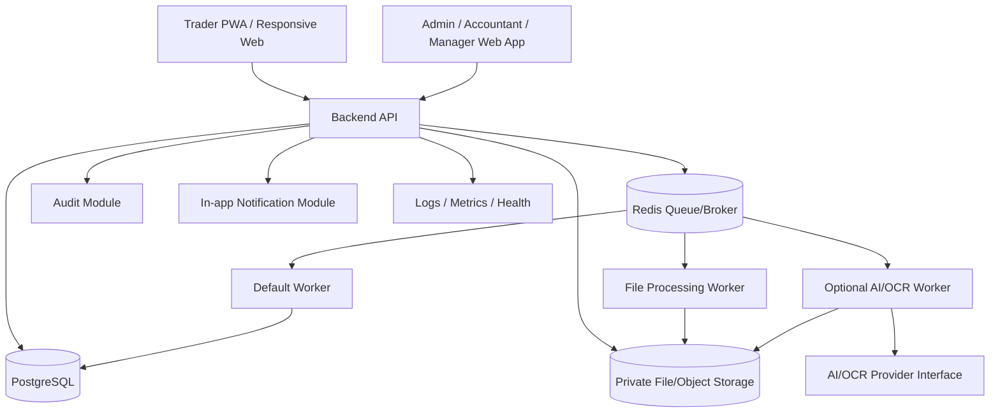
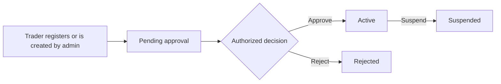
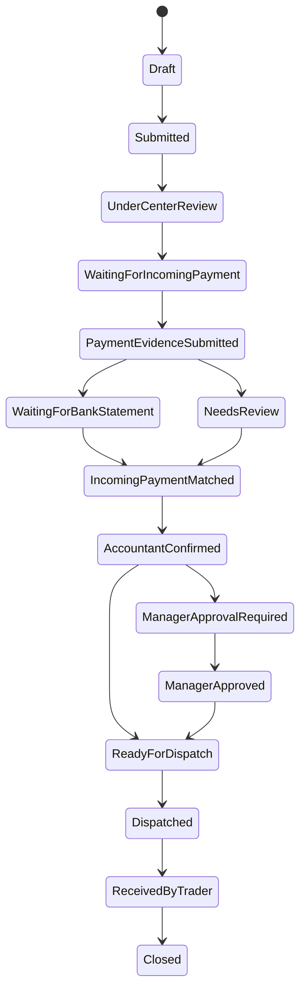
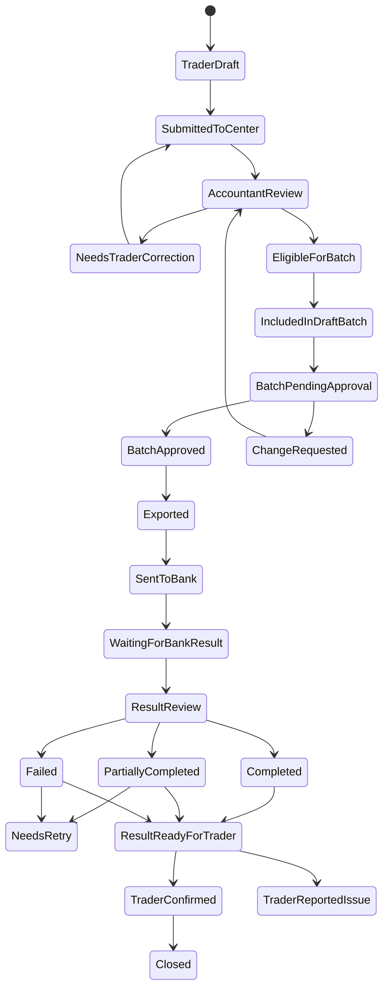
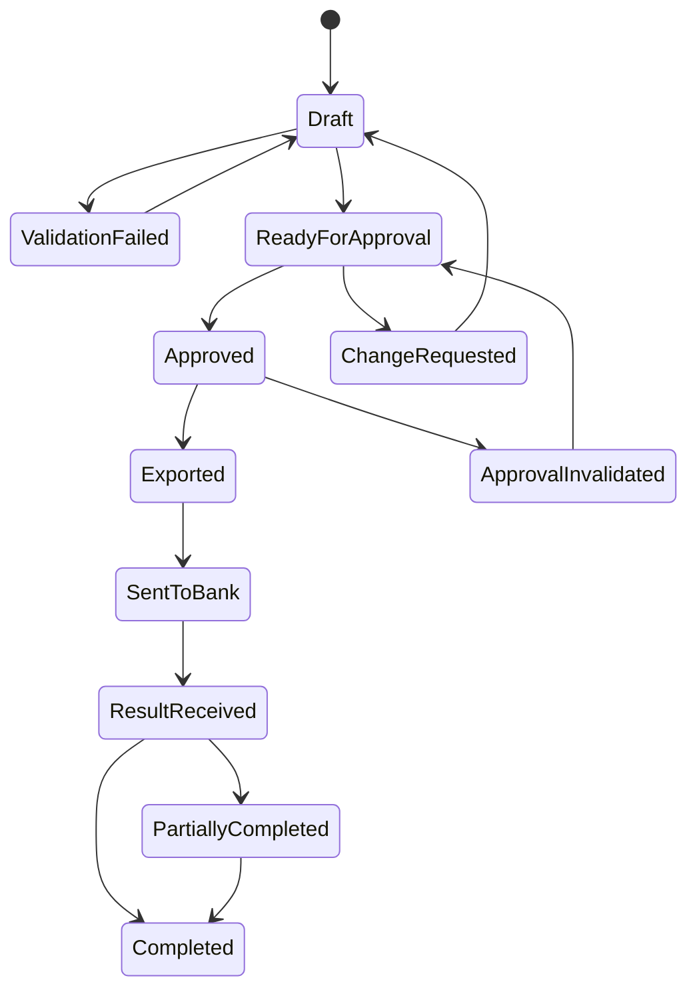
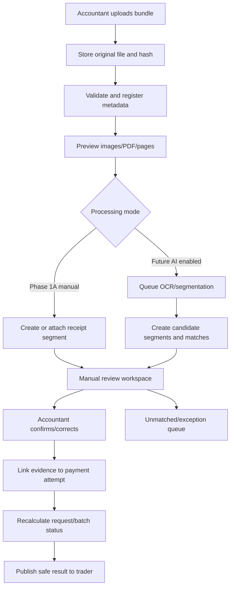

# Gold Trade Settlement Platform

## Master Implementation Blueprint

**Document ID:** `00_Master_Implementation_Blueprint`  
**Version:** `1.1`  
**Status:** Revised implementation baseline — pending final project-owner approval  
**Document owner:** Product Owner and Technical Lead  
**Technical reviewers:** DevOps, Security, Backend, Frontend, QA  
**Language:** English  
**Primary audience:** Product owner, technical lead, DevOps engineer, backend engineer, frontend engineer, AI/OCR engineer, QA engineer, and coding agents  
**Recommended format for coding agents:** Markdown  

### Change Log

| Version | Summary |
|---|---|
| `1.0` | Initial implementation blueprint. |
| `1.1` | Clarified product purpose, process-modernization principles, batch-level manager approval, domain boundaries, UI/UX direction, phase plan, financial integrity controls, retention governance, technical defaults, and documentation inventory. |

---

## 1. Purpose of This Document

This document is the master blueprint for implementing a **standardized gold trade operations and settlement management platform**.

The platform must support controlled, traceable, multi-bank, role-based financial workflows for a gold trading center and its known traders/goldsmiths.

The existing use of messaging applications, spreadsheets, photographed bank documents, paper records, and manual confirmations is a source of discovery information. It helps identify business needs, exceptions, banking constraints, and operational risks. It is **not** an implementation template.

The platform must preserve required business outcomes and approval responsibilities while redesigning, standardizing, and improving how those outcomes are achieved.

The platform must support both:

1. **Gold sale flow:** the center/importer sells gold to a known trader and verifies incoming payment before dispatch or physical settlement.
2. **Outgoing payment flow:** a trader asks the center to pay a retail gold seller/beneficiary; the center validates the request, prepares a bank batch, obtains manager approval, sends a bank file manually in Phase 1A, receives bank results, and publishes the confirmed result.

The system is not merely an OCR receipt reader. It is a **Gold Trade and Settlement Management Platform** with:

- structured requests;
- financial workflow controls;
- payment tracking;
- multi-bank file handling;
- evidence management;
- human approvals;
- dispute and correction flows;
- role-based access control;
- immutable audit history;
- operational reporting;
- recoverable production deployment;
- optional future AI-assisted processing.

This document defines the global product and technical direction. More specialized documents may add detail, but they must not contradict the mandatory principles in this blueprint.

---

## 2. Implementation Philosophy

### 2.1 Preserve business intent, modernize process execution

The business outcomes, approval responsibilities, and financial controls defined by the project owner are mandatory.

The current manual tools and interaction patterns are not mandatory.

Implementation teams may redesign forms, screens, queues, batch operations, file handling, and user interactions when the redesigned process:

- preserves the required business outcome;
- preserves accountant and manager authority;
- reduces repeated data entry;
- reduces financial error;
- improves traceability and accountability;
- makes the next required action clear;
- does not bypass required approval;
- keeps a complete audit history;
- remains practical for real users in the gold trade.

The application must not imitate a messaging interface, spreadsheet workflow, or paper process unless that interaction remains the best operational solution.

### 2.2 Manual-first, AI-assisted

The system must be fully usable without AI, OCR, bank APIs, or automatic segmentation.

AI/OCR must be treated as an assistive layer, not as the foundation of the product, because:

- bank files can be inconsistent;
- banks may use different Excel and result formats;
- Iranian banking integrations may be unavailable or require separate contracts;
- international AI services may be unavailable or unstable;
- financial decisions are sensitive and must remain human-confirmed;
- the first production release must support fully manual operation.

### 2.3 Human confirmation is mandatory for financial decisions

AI may extract, suggest, rank, warn, and recommend. It must not finalize financial confirmations.

The default rule is:

```text
AI can propose.
Accountant verifies and confirms operational results.
Manager approves the exact outgoing-payment batch before money leaves the center.
```

### 2.4 Keep Phase 1A small but operationally complete

Phase 1A must deliver a complete workflow that the business can actually use:

- register and approve traders;
- create gold sale and outgoing payment requests;
- validate structured request data;
- build payment batches and payment attempts;
- preview the exact batch submitted for approval;
- obtain manager approval;
- generate versioned bank Excel files;
- upload bank statement and result files;
- preview bank documents;
- manually create or attach transaction evidence;
- manually register and confirm bank results;
- publish safe result evidence to the owning trader;
- record disputes and corrections;
- retain complete audit logs;
- support backup, restore, monitoring, and rollback.

OCR, automatic segmentation, advanced matching, anomaly detection, bank API integration, and SaaS productization are not required for Phase 1A.

### 2.5 Design for future automation from day one

Even when a feature is manual in Phase 1A, the data model and service boundaries must allow later automation.

Examples:

- bank result files must be stored as `BankResultBundle`;
- specific transaction evidence must be stored as `ReceiptSegment` or an equivalent evidence entity;
- `PaymentRequest` and `PaymentAttempt` must remain separate;
- generated bank files must be versioned;
- manager approval must reference an immutable batch snapshot;
- AI/OCR jobs must be asynchronous and provider-independent;
- bank-specific rules must be configurable;
- manual actions must produce structured data that future automation can use.

---

## 3. Product Scope

### 3.1 In scope for the platform

The platform includes:

- trader-facing responsive web application/PWA;
- center/admin responsive web application;
- trader onboarding, approval, suspension, and history;
- gold sale order management;
- incoming payment evidence and bank statement verification;
- outgoing payment request management;
- beneficiary management;
- payment attempt creation and splitting;
- payment batch preparation;
- batch-level manager approval;
- versioned bank Excel generation;
- bank statement and bank result bundle upload;
- document preview;
- minimal manual receipt-segment/crop creation for bank results;
- manual payment result registration;
- evidence attachment and correction history;
- accountant work queues;
- manager approval queues;
- trader result publication and dispute handling;
- operational and management reports;
- audit logs;
- role-based access control;
- configurable bank profiles;
- backup, restore, monitoring, and deployment runbooks;
- extensible AI/OCR interfaces for later phases.

### 3.2 Out of scope for Phase 1A

The following must not block Phase 1A:

- automatic bank API integration;
- OCR as a required workflow step;
- automatic receipt segmentation;
- automatic financial matching or confirmation;
- automatic anomaly or fraud decisions;
- automatic national ID/IBAN ownership verification;
- native mobile applications;
- Telegram/Bale/WhatsApp as official operational channels;
- retail seller login or portal;
- full accounting-ledger replacement;
- multi-company SaaS operation;
- subscription billing;
- advanced AI-generated dashboards;
- public financial APIs;
- automatic legal or compliance decisions.

### 3.3 Potential future scope

Future phases may include:

- OCR extraction;
- AI-assisted segmentation;
- candidate matching;
- duplicate and anomaly detection;
- national ID and IBAN validation through approved local providers;
- bank API/open-banking integration;
- accounting software integration;
- advanced operational dashboards;
- configurable stronger authentication;
- multi-company deployments;
- subscription and billing;
- product analytics and support tooling.

---

## 4. Core Actors and Responsibilities

| Actor | Description | Main responsibilities |
|---|---|---|
| Trader | A known goldsmith/trader working with the center. | Submit gold purchase and outgoing payment requests; manage permitted beneficiaries; track status; view and share confirmed results; report issues. |
| Retail Seller / Beneficiary | A payment recipient introduced by a trader. This person does not log in. | Stored as sensitive beneficiary data only. |
| Accountant | Center employee responsible for daily settlement operations. | Review requests; validate data; prepare batches; generate exports; upload bank files; register and verify results; attach evidence; manage exceptions and corrections. |
| Manager | Business decision-maker. | Review and approve exact outgoing-payment batch snapshots; reject or request changes; review high-risk operations and reports. |
| Warehouse / Dispatch User | User responsible for physical gold dispatch or receipt. | Register dispatch, delivery, receipt, and physical settlement status. |
| Technical Admin | System administrator. | Manage users, bank profiles, feature flags, service settings, and operational configuration; does not automatically receive unrestricted financial-file access. |
| Read-only Auditor/User | Internal viewer. | View authorized reports and records without changing financial state. |
| System Worker | Background processing component. | Validate files, generate exports, execute scheduled jobs, process optional AI/OCR jobs, and update job status. |
| AI/OCR Provider | Optional external or internal service. | Return structured suggestions; never make final financial decisions. |

Role definitions and file-access permissions must be refined in `12_Security_RBAC_Audit.md`.

---

## 5. High-Level System Architecture

### 5.1 Architecture style

Use a **modular monolith backend with asynchronous workers** for MVP and early production.

This is preferred over early microservices because:

- business rules are still evolving;
- financial transactions are easier to reason about within one application boundary;
- deployment and recovery are simpler;
- module boundaries can still be strict;
- slow jobs can run asynchronously;
- later extraction into services remains possible.

### 5.2 Logical architecture



### 5.3 Phase 1A deployment architecture

Recommended logical services:

```text
- frontend-trader-pwa
- frontend-admin-panel
- backend-api
- worker-default
- postgres
- redis
- nginx
- private file storage
- backup service/scripts
- monitoring/logging agent
```

Phase 1A may run on a single production server using Docker Compose when capacity, backup, and restore requirements are satisfied.

PostgreSQL, Redis, and private file storage must not be publicly exposed.

Environment-specific secrets must be separated by service. Frontend services must never receive backend/database secrets.

The design must support later separation of:

- PostgreSQL;
- storage;
- workers;
- monitoring;
- reverse proxy/load balancer.

---

## 6. Main Applications

### 6.1 Trader PWA

The trader application must be:

- Persian-first and RTL;
- mobile-first;
- installable as a PWA;
- fully usable as a normal responsive web application;
- suitable for educated business users familiar with financial amounts;
- task-oriented rather than menu-heavy.

Primary areas:

- login and account status;
- dashboard and next actions;
- gold sale requests;
- outgoing payment request creation;
- beneficiary selection/creation;
- structured amount and IBAN entry;
- optional supporting image/document upload;
- request status and correction;
- payment result detail;
- result download/share;
- dispute/issue reporting;
- profile and security.

The trader must always see:

```text
Current status
Next required action
Who is responsible now
Reason for delay/rejection
Relevant evidence
```

### 6.2 Admin, Accountant, and Manager Web Application

The center application must be:

- web-based;
- desktop-first;
- responsive for laptop, tablet, and occasional mobile use;
- optimized for repeated daily financial operations;
- queue-first rather than menu-first;
- information-dense without becoming visually cluttered.

Primary areas:

- actionable work queues;
- trader management;
- gold sale orders;
- incoming payment verification;
- outgoing payment requests;
- beneficiaries;
- batch preparation;
- batch approval;
- bank export generation;
- bank statement and result uploads;
- document review workspace;
- manual receipt-segment creation;
- result matching and confirmation;
- corrections and disputes;
- dispatch/receipt management;
- operational reports;
- management dashboard;
- audit history;
- user, role, bank, and system settings.

Manager views must prioritize:

- total amount awaiting approval;
- exact batch row count;
- warnings and exceptions;
- bank and account context;
- changes since the last approval;
- approve, reject, or request-change actions.

---

## 7. Core Domain Concepts

### 7.1 Trader

A trader is a known business customer of the center.

Important properties include:

- identity and contact information;
- account and approval status;
- optional risk/credit settings;
- permitted bank accounts where required;
- history of sale orders and outgoing payment requests;
- internal notes and flags.

A trader may register, but cannot perform financial operations until approved.

### 7.2 Beneficiary

A beneficiary is the recipient of an outgoing payment requested by a trader.

Important rules:

- a beneficiary is not a system user;
- a beneficiary does not own a payment amount;
- a beneficiary may be reused by the same trader;
- a beneficiary includes name, IBAN, optional bank, optional national ID, optional phone, and notes;
- payment amount, payment purpose, and request-specific description belong to `PaymentRequest`;
- beneficiary data is sensitive and must be isolated by trader and role.

### 7.3 Gold Sale Order

Represents a sale from the center to a trader.

Typical lifecycle:

```text
Draft
-> Submitted
-> Priced/Reviewed
-> Waiting for Incoming Payment
-> Payment Evidence Submitted
-> Bank Verification
-> Accountant Confirmed
-> Ready for Dispatch
-> Dispatched
-> Received
-> Closed
```

Optional manager approval may be triggered by configurable business rules.

### 7.4 Incoming Payment Receipt

Evidence submitted or entered to show that a trader paid the center.

Phase 1A supports structured manual entry and attachment.

Future OCR may suggest extracted fields, but accountant verification remains authoritative.

### 7.5 Bank Statement File

A bank-provided file showing transactions for an account and time range.

It is primarily used to verify incoming payments.

Statement formats and mappings must be configured per bank profile.

### 7.6 Payment Request

A business-level request submitted by a trader asking the center to pay one beneficiary.

It contains:

- trader;
- beneficiary;
- requested amount in canonical IRR;
- original user-entered amount and unit;
- purpose/description;
- attachments;
- lifecycle status;
- correction and approval history.

A payment request may create one or more payment attempts.

### 7.7 Payment Batch

A versioned group of eligible payment requests/payment attempts prepared for one bank submission process.

A batch has:

- bank profile;
- source account if applicable;
- selected requests/attempts;
- totals;
- row count;
- validation results;
- version;
- content hash;
- approval status;
- export versions;
- sent-to-bank status.

Manager approval applies to an exact immutable batch snapshot.

### 7.8 Payment Attempt

A concrete bank transfer row.

One payment request may create several attempts because of bank limits or retries.

A payment attempt may be:

- prepared;
- included in a batch;
- approved as part of a batch;
- exported;
- sent to bank;
- completed;
- failed;
- partially resolved;
- retried;
- manually confirmed;
- superseded/corrected.

Failed attempts must not replace or destroy the original request.

### 7.9 Bank Excel Export

A versioned file generated from an approved batch snapshot using a bank-profile template.

It must record:

- batch and batch version;
- bank profile and template version;
- generation timestamp and user;
- included attempts;
- file hash and path;
- sent-to-bank confirmation;
- related result bundles.

### 7.10 Bank Result Bundle

Any file or group of files returned by a bank after processing.

It may include:

- images;
- photographed printouts;
- scanned documents;
- multi-page PDFs;
- Excel files;
- mixed transactions;
- results from several batches or traders.

It is stored independently from generated exports.

### 7.11 Receipt Segment / Transaction Evidence

A specific item of evidence related to a bank transaction.

In Phase 1A it may be created by:

- selecting/cropping a region from an uploaded image or PDF page;
- uploading an externally prepared crop;
- attaching a complete single-transaction receipt;
- recording structured bank-result data with an attachment.

Candidate matching and confirmed linking are different:

```text
Candidate matching:
One segment may have several candidate payment attempts.

Confirmed primary evidence:
One confirmed transaction segment links to one payment attempt by default.

Supplementary evidence:
One payment attempt may have additional supporting files.

Correction:
The old confirmed link is marked replaced/superseded.
It is not deleted.
```

### 7.12 Matching Candidate and Confirmed Evidence Link

A `MatchingCandidate` is a suggestion based on amount, IBAN, name, bank, date, batch context, or tracking number.

A confirmed evidence link is a human-confirmed relationship used for official status and trader publication.

AI or deterministic rules may create candidates. Only an authorized human action may confirm the official link.

### 7.13 Manual Review Task

A structured work item created when:

- no automatic suggestion exists;
- several candidates exist;
- evidence is low quality;
- a result is unmatched;
- duplicate evidence is suspected;
- a user reports an issue;
- a correction is required;
- a batch or payment contains a warning.

---

## 8. Critical Business Rules

### 8.1 AI cannot finalize financial confirmation

AI output is always a suggestion. It cannot:

- approve a batch;
- confirm that money left or arrived;
- publish an official result;
- override a human-confirmed link;
- change a financial status without human authorization.

### 8.2 Manager approval is batch-level by default

For Phase 1A, manager approval applies to the exact outgoing-payment batch snapshot.

Before approval, the manager must see:

- bank profile;
- source account where applicable;
- row count;
- total IRR and Toman equivalent;
- included requests/attempts;
- validation warnings;
- changed or exceptional rows;
- batch version.

Approval must store:

```text
batch_id
batch_version
row_count
total_amount_irr
content_hash
approved_by
approved_at
approval_comment
```

If the amount, beneficiary, IBAN, payment attempts, source account, bank profile, or included rows change after approval:

- the previous approval becomes invalid for submission;
- the batch returns to a state requiring approval;
- the change is audited.

The manager may remove/reject rows or request changes. The system must not force separate approval of every ordinary row unless a future configurable rule explicitly requires it.

### 8.3 No bank export before valid approval

A final bank export may only be generated or released for download from an approved batch snapshot.

A preview/draft export may exist before approval only if it is clearly marked non-submittable and cannot be confused with the final approved file.

### 8.4 Accountant result confirmation

An accountant may manually register or confirm a bank result after reviewing evidence.

Corrections after publication are allowed only through a traceable correction flow.

Manager re-approval is required when a correction changes:

- actual financial outcome;
- amount;
- beneficiary;
- IBAN;
- approved outgoing-money content.

Evidence-only correction that does not change the financial outcome is audited but does not require manager approval by default.

### 8.5 No unmatched item is silently rejected

Unmatched or ambiguous bank-result evidence remains in a review queue until an authorized user resolves, archives with reason, or explicitly marks it unrelated.

### 8.6 Bank rules are configurable

Bank-specific rules must not be hard-coded.

Configurable rules include:

- template and column mapping;
- required/optional fields;
- transfer channel;
- source account;
- amount limits;
- time-dependent limits;
- split rules;
- description/reference format;
- matching fields and weights;
- result-file format hints.

### 8.7 Amount policy

Canonical storage:

```text
Integer Iranian Rial (IRR)
No floating-point money
```

The system must also retain:

- original value entered by the user;
- original input unit;
- canonical converted IRR;
- conversion rule/version where relevant.

Display policy:

- bank exports and settlement calculations use IRR as authoritative;
- trader forms may accept Toman or Rial according to configured product policy;
- the canonical IRR equivalent must be shown before submission;
- manager approval displays both IRR and Toman;
- every amount input and display must label its unit;
- unformatted raw financial numbers are prohibited.

### 8.8 Generated bank files may not contain reliable internal IDs

The platform should include an internal reference where the bank format supports it.

Matching must not depend exclusively on that reference.

Default matching context:

```text
amount
+ destination IBAN
+ beneficiary name
+ bank
+ batch scope
+ date/time context
+ tracking number when available
```

### 8.9 Retail seller remains outside the platform

Retail sellers/beneficiaries do not receive system accounts in Phase 1A.

The trader may share authorized result evidence outside the system.

### 8.10 Full mixed bank documents must not be shared with traders

A trader must only access evidence related to their own request and beneficiary.

Full mixed bundles, other people’s IBANs, and unrelated transactions must remain private.

---

## 9. Main Workflows

### 9.1 Trader registration and approval



Pending, rejected, or suspended traders cannot create new financial requests according to policy. Historical records remain available according to authorization and retention rules.

### 9.2 Gold sale workflow



Manager approval in the gold-sale flow is configurable and independent from mandatory outgoing-payment batch approval.

### 9.3 Outgoing payment request workflow



Request-level statuses may be derived from batch and attempt states. The implementation must avoid conflicting duplicate sources of truth.

### 9.4 Payment batch approval workflow



A material change to an approved batch invalidates the approval.

### 9.5 Bank result bundle processing workflow



---

## 10. Phase Plan

### 10.1 Phase 1A — Operational Manual Core

Goal:

```text
A secure, auditable, production-usable platform with no AI dependency.
```

Required deliverables:

- authentication foundation and RBAC;
- trader registration and approval;
- Trader PWA;
- admin/accountant/manager web application;
- gold sale requests;
- outgoing payment requests;
- beneficiaries;
- work queues;
- bank profiles;
- payment splitting;
- batch preparation and validation;
- immutable batch snapshot;
- batch-level manager approval;
- versioned bank export generation;
- bank statement/result bundle upload;
- image/PDF preview;
- minimal manual crop/receipt-segment creation;
- external evidence attachment fallback;
- manual result registration;
- result confirmation and publication;
- disputes and corrections;
- audit logs;
- operational reports;
- private storage;
- CI quality gates;
- staging;
- backups, restore test, deployment, rollback, health checks, and monitoring.

Not required:

- OCR;
- AI matching;
- auto-segmentation;
- bank API;
- anomaly detection;
- multi-company/SaaS;
- subscription billing.

### 10.2 Phase 1B — Assisted Processing

Goal:

```text
Reduce accountant workload while preserving human confirmation.
```

Potential deliverables:

- OCR job infrastructure;
- provider abstraction;
- extraction suggestions;
- stronger crop/review tools;
- match-candidate suggestions;
- confidence and provenance display;
- improved manual review queues;
- AI usage and cost monitoring.

### 10.3 Phase 2 — Advanced Intelligence and Risk Control

Potential deliverables:

- automatic segmentation of multi-page/mixed bundles;
- duplicate evidence detection;
- configurable weighted matching;
- anomaly and risk signals;
- learning/evaluation from human corrections;
- beneficiary validation through approved providers;
- advanced operational reporting.

### 10.4 Phase 3 — Integrations and Operational Scale

Potential deliverables:

- bank API/open-banking integration where contractually and technically possible;
- accounting software integration;
- service separation where justified;
- mature monitoring and SLA dashboards;
- higher availability and capacity;
- provider performance optimization.

Manual upload and fallback must remain available.

### 10.5 Phase 4 — Productization and Expansion

This phase is optional and must not be implemented early.

Potential deliverables:

- multi-company deployment;
- strict tenant isolation;
- subscription and billing;
- usage limits;
- cross-company support tooling;
- product analytics;
- reusable onboarding and configuration.

For financially sensitive deployments, separate single-tenant installations may remain preferable to shared multi-tenancy.

---

## 11. Recommended Module Map

### 11.1 Backend modules

| Module | Responsibility |
|---|---|
| Authentication | Login, session lifecycle, revocation, recovery, account state. |
| RBAC | Roles, permissions, ownership checks, sensitive-action guards. |
| Trader | Trader profile, approval, suspension, history. |
| Beneficiary | Sensitive reusable beneficiary records. |
| Sale Order | Gold sale requests, pricing, incoming payment, dispatch lifecycle. |
| Incoming Payment | Receipt evidence and bank-statement verification. |
| Outgoing Payment | Payment requests, attempts, retries, status calculation. |
| Payment Batch | Batch construction, validation, snapshots, approval, invalidation. |
| Bank Profile | Bank definitions, accounts, mappings, templates, transfer rules. |
| Bank Export | Versioned bank-file generation and sent-to-bank tracking. |
| Bank Result Bundle | Original bank result files and metadata. |
| Receipt Evidence | Segments, crops, supporting files, confirmed links, replacements. |
| Manual Review | Work queues, assignment, exception resolution. |
| Matching | Candidate generation and confirmed-link services. |
| File Storage | Secure upload/download, hashes, metadata, lifecycle. |
| Audit | Append-only action and financial change history. |
| Reporting | Operational and management reports. |
| Settings | Feature flags and controlled configuration. |
| Notifications | In-app notifications and optional future channels. |
| AI/OCR Orchestration | Optional provider adapters and asynchronous jobs. |

### 11.2 Frontend applications

| Application | Main users | Direction |
|---|---|---|
| Trader PWA | Traders | Mobile-first, status-driven, simple and trustworthy. |
| Admin Web App | Accountant, manager, warehouse, technical admin | Desktop-first, responsive, queue-first, high-efficiency financial workspace. |

### 11.3 Worker processes

Phase 1A may use one Celery worker deployment consuming separated queues.

Logical queues:

```text
default
files
exports
notifications
scheduled
```

Future queues:

```text
ocr
ai
matching
```

Jobs must be idempotent where practical and record status, attempts, errors, and correlation IDs.

---

## 12. Data Storage Principles

### 12.1 Database

Use PostgreSQL as the source of truth for business data.

Core requirements:

- UUID primary keys;
- timezone-aware timestamps;
- `created_at` and `updated_at`;
- actor fields where relevant;
- optimistic-lock/version fields on mutable financial entities;
- explicit statuses;
- database constraints for critical relationships;
- strong indexes for operational filters;
- append-only audit events;
- transactional status changes.

Financial records must not support generic deletion.

Use lifecycle states such as:

```text
cancelled
voided
superseded
replaced
archived
```

Draft, non-financial records may support controlled soft deletion where explicitly justified.

### 12.2 File storage

Large files must not be stored in PostgreSQL.

Use a storage abstraction with private access.

File metadata must include:

- file ID;
- category;
- MIME type;
- size;
- hash;
- storage key;
- uploader;
- parent entity;
- creation time;
- security classification;
- retention state;
- original filename;
- processing status.

Local production storage is acceptable only when:

- it is mounted predictably;
- it is included in tested backups;
- a separate encrypted backup destination exists;
- restore testing passes.

### 12.3 Retention governance

Financial record and file retention must be approved by the business owner with legal/accounting input.

A provisional baseline of at least five years may be used until formally confirmed.

Retention settings:

- are not ordinary technical-admin preferences;
- require restricted permission;
- must be audited;
- must not immediately delete historical records when reduced;
- must support legal hold;
- must use previewable, approval-controlled purge jobs;
- must preserve mandatory audit history.

### 12.4 Auditability

Sensitive operations must record:

- actor;
- role/session;
- time;
- action;
- target;
- previous and new values where practical;
- reason/comment;
- related files;
- source IP/device/session metadata where available;
- correlation/request ID;
- automated job details where applicable.

Audit logs must not contain unnecessary full secrets, passwords, tokens, or sensitive document contents.

---

## 13. Security and Permission Principles

### 13.1 Authentication requirements

The exact method must be finalized in an approved Architecture Decision Record before Identity and Access implementation.

Mandatory requirements:

- secure session lifecycle;
- logout and server-side revocation;
- secure password hashing;
- rate limiting and brute-force controls;
- failed-login audit;
- account suspension;
- secure recovery;
- no core dependency on SMS availability;
- stronger policy for internal users;
- re-authentication for sensitive approval when configured;
- secure HTTP-only cookies or an equivalently secure token design;
- CSRF protection where cookie authentication is used.

### 13.2 Authorization

RBAC and ownership rules must be enforced by the backend.

Frontend hiding is not security.

Technical admins must not automatically receive unrestricted access to financial files unless explicitly authorized.

### 13.3 Sensitive file access

Requirements:

- authenticated access;
- backend authorization on every access;
- short-lived signed URLs or backend proxy;
- no public static paths;
- trader isolation;
- prevention of mixed-bundle exposure;
- audit of sensitive file access where practical;
- secure caching headers.

### 13.4 Upload security

Validate:

- declared and detected MIME type;
- extension;
- size;
- allowed category;
- filename handling;
- path isolation;
- decompression/archive limits where applicable;
- malicious content using an approved scanning strategy;
- image/PDF processing limits;
- file hash and duplicate handling.

Original files must be preserved before derived processing.

### 13.5 Financial action protection

Sensitive actions require:

- explicit confirmation UI;
- backend authorization;
- idempotency;
- audit;
- current record-version validation;
- conflict handling;
- re-authentication or stronger approval where configured.

---

## 14. UI/UX Principles

### 14.1 Product design direction

The interface must be:

- modern;
- premium and trustworthy;
- appropriate for the gold trade;
- financially professional;
- minimal without hiding critical information;
- inspired by high-quality FinTech rather than decorative luxury;
- usable for business-oriented, financially experienced users.

Visual direction:

- light or subtly neutral surfaces;
- charcoal/high-contrast text;
- restrained gold accent;
- semantic green, amber, red, and blue for statuses;
- no excessive gold gradients, ornaments, or visual noise;
- strong numerical hierarchy;
- clear separation between informational and irreversible actions.

### 14.2 Persian/RTL behavior

The product UI is Persian/RTL.

Implementation documentation, APIs, database names, code identifiers, and technical comments remain English.

IBANs, tracking numbers, hashes, and technical identifiers must render LTR within the RTL interface.

Dates are displayed in Jalali where appropriate while canonical timestamps remain timezone-aware and unambiguous.

### 14.3 Status-driven experience

Each operational screen must make clear:

- current state;
- next action;
- responsible role;
- blocking reason;
- warnings;
- related evidence;
- relevant history.

### 14.4 Accountant efficiency

The accountant experience must support:

- work queues;
- keyboard-efficient actions where practical;
- saved/reusable filters where justified;
- bulk selection with safe validation;
- document and transaction side-by-side review;
- clear exception handling;
- no reliance on searching raw lists all day.

### 14.5 Manager decision experience

The manager dashboard and approval screen must prioritize:

- total batch amount;
- row count;
- bank/source account;
- warnings and exceptions;
- changed rows;
- exact approval version;
- approve/reject/request-change;
- audit history.

### 14.6 Amount input and display

- Store canonical IRR integer.
- Allow product-configured input in Toman or Rial.
- Always show unit.
- Show canonical conversion before submission.
- Show both IRR and Toman on sensitive approval screens.
- Use separators and amount-in-words where helpful for high-value confirmation.
- Never infer a unit silently.

### 14.7 Trader result sharing

After confirmation, the trader may see:

- beneficiary name;
- amount;
- masked/full IBAN according to authorization;
- bank;
- tracking number;
- payment date;
- status;
- authorized evidence;
- download/share action.

A generated clean share card is preferred over sharing a full mixed bank document.

---

## 15. AI/OCR Design Principles

### 15.1 Provider abstraction

AI/OCR must be behind a versioned interface.

No business logic may depend directly on one provider.

### 15.2 Standard output and provenance

Provider output must include:

- provider and version;
- input file/page/region;
- structured extracted fields;
- confidence;
- errors;
- processing time;
- raw-response retention policy;
- schema version.

### 15.3 Asynchronous operation

OCR and AI processing must be asynchronous.

Failure must route work to manual review without blocking core operations.

### 15.4 Human authority

AI may create:

- proposed segments;
- extracted fields;
- candidate matches;
- duplicate/risk warnings.

AI may not create official financial truth without a human-confirmed action.

### 15.5 AI observability

Track reliability, cost, latency, correction rate, provider version, and failure reasons without exposing sensitive data unnecessarily.

---

## 16. Bank File and Result Handling Principles

### 16.1 Bank profile abstraction

Each bank profile supports:

- bank identity;
- account definitions;
- input statement mapping;
- outgoing export template;
- required and optional fields;
- transfer channel;
- amount/time limits;
- split rules;
- description/reference rules;
- result-file format hints;
- matching rules;
- template version.

### 16.2 Generated bank exports

Exports are immutable, versioned artifacts.

The final downloadable/submittable export must correspond to an approved batch snapshot.

Regeneration after a material change requires re-approval.

### 16.3 Bank result bundle independence

A result bundle may relate to:

- no known export;
- one export;
- several exports;
- several traders;
- several batches;
- unmatched items.

The data model must support this without forcing false one-to-one relationships.

### 16.4 Manual review workspace

Phase 1A must provide a usable workspace with:

- file/page preview;
- zoom and rotation;
- transaction/request context;
- manual crop or segment creation;
- external evidence upload fallback;
- structured result entry;
- candidate search/filter;
- confirmed link;
- replacement/correction history.

### 16.5 Default matching context

Use configurable bank-specific matching based on:

- amount;
- destination IBAN;
- beneficiary name;
- tracking number;
- bank;
- date/time;
- batch/export context;
- source account where relevant.

Ambiguous cases require human selection.

---

## 17. Reporting Requirements

Phase 1A minimum:

- requests by status;
- daily outgoing amounts;
- batches awaiting approval;
- approved/exported/sent batches;
- completed, failed, partial, and retry payments;
- unmatched result items;
- accountant work queues;
- trader-level operational history;
- beneficiary-level authorized history;
- gold sale orders by status;
- incoming payment verification status;
- audit timeline for a record;
- correction and dispute reports;
- backup/operational status for authorized technical users.

Reports are operational, not a replacement for a complete accounting ledger.

---

## 18. Non-Functional Requirements

### 18.1 Reliability and graceful degradation

Core workflows must operate when:

- AI is disabled;
- external internet is unstable;
- bank APIs are unavailable;
- result formats are inconsistent;
- optional integrations fail.

### 18.2 Performance

Initial targets must be made measurable in specialized documents.

At minimum:

- normal CRUD/list APIs must be responsive;
- lists must be paginated;
- large jobs must be asynchronous;
- upload must provide prompt acknowledgement;
- document preview must not load unbounded pages/files;
- exports must run with timeout and job-status handling.

### 18.3 Idempotency

The following require idempotency protection:

- request submission;
- batch creation/finalization;
- manager approval;
- export generation;
- sent-to-bank confirmation;
- payment-result confirmation;
- trader-result publication;
- retryable worker jobs.

### 18.4 Concurrency control

Financial mutations must prevent lost updates through:

- optimistic locking/version fields;
- transactional guards;
- current-state validation;
- meaningful conflict responses;
- selective locks only where necessary.

### 18.5 Transactional integrity

A critical status change, related record creation, and audit event must succeed or fail atomically where they represent one business action.

### 18.6 Immutable approval snapshots

Approval must reference immutable/versioned content.

Approved content cannot be silently edited.

### 18.7 Time and date

- Store timezone-aware canonical timestamps.
- Display Jalali dates where appropriate.
- Preserve original bank date/time text when imported.
- Store normalized date/time separately.
- Define production timezone explicitly.

### 18.8 Maintainability

Use:

- clear module boundaries;
- strongly typed schemas;
- migration scripts;
- centralized configuration;
- structured error contracts;
- automated tests;
- documented ADRs;
- reusable UI components;
- explicit service ownership.

### 18.9 Observability

Provide:

- structured logs;
- correlation IDs;
- metrics;
- liveness/readiness checks;
- worker heartbeat;
- queue depth;
- backup status;
- disk/storage alerts;
- error tracking;
- audit-safe operational diagnostics.

### 18.10 Backup and recovery

Backups are mandatory for:

- PostgreSQL;
- private file storage;
- exports;
- result bundles;
- evidence;
- required configuration.

Production release requires:

- documented RPO and RTO;
- off-server backup;
- encryption;
- retention;
- monitored backup jobs;
- tested restore;
- rollback procedure;
- named responsible roles.

---

## 19. Implementation Documentation Pack

| Order | Document | Authority/purpose |
|---:|---|---|
| 00 | `00_Master_Implementation_Blueprint.md` | Global scope, mandatory principles, phase direction. |
| 01 | `01_Product_Requirements_PRD.md` | Product requirements and acceptance boundaries. |
| 02 | `02_Domain_Model_and_Business_Rules.md` | Domain entities, relationships, and invariants. |
| 03 | `03_System_Architecture.md` | Technical architecture and boundaries. |
| 04 | `04_Database_Schema.md` | Database model, constraints, indexes. |
| 05 | `05_API_Specification.md` | API contracts and permissions. |
| 06 | `06_Workflows_and_State_Machines.md` | Authoritative status transitions. |
| 07 | `07_UI_UX_Specification.md` | High-level UI/UX overview. |
| 08 | `08_Bank_File_and_Result_Processing.md` | Bank profiles, exports, statements, results. |
| 09 | `09_OCR_AI_Module_Specification.md` | Optional AI/OCR design. |
| 10 | `10_Backend_Implementation_Guide.md` | Backend implementation patterns. |
| 11 | `11_Frontend_Implementation_Guide.md` | Frontend technical implementation. |
| 12 | `12_Security_RBAC_Audit.md` | Security authority. |
| 13 | `13_DevOps_Deployment_Operations.md` | DevOps and operational architecture. |
| 14 | `14_Testing_QA_Acceptance.md` | Testing and release gates. |
| 15 | `15_Agent_Implementation_Plan.md` | Ordered implementation milestones. |
| 16 | `16_Implementation_Documentation_Index.md` | Documentation navigation and precedence. |
| 17 | `17_Future_Phases_Roadmap_and_Backlog.md` | Phase roadmap and backlog. |
| 18 | `18_Production_Setup_and_Runbook.md` | Practical production runbook. |
| 19 | `19_Client_Packaging_and_Distribution_Guide.md` | PWA and optional client packaging. |
| 20 | `20_Agent_Usage_Instructions.md` | Rules for using the documentation. |
| 21 | `21_UI_Design_System_and_Screen_Specification.md` | Primary screen/component design authority. |
| 22 | `22_UX_User_Journeys_and_Interaction_Guide.md` | Primary interaction/journey authority. |
| 23 | `23_Discovery_Questions_and_Answers_FA.md` | Historical discovery archive; not implementation authority. |

Every document must later include:

- version;
- status;
- owner;
- reviewers;
- change log;
- unresolved decisions;
- dependencies.

---

## 20. Approved Technical Direction and Required ADRs

### 20.1 Default implementation direction

```text
Repository:
Monorepo

Frontend:
Next.js + React + TypeScript
Two applications:
- Trader PWA
- Admin Web App

Backend:
Python + FastAPI + SQLAlchemy 2.x + Alembic

Database:
PostgreSQL

Workers:
Celery + Redis

Deployment:
Docker Compose + Nginx + TLS for Phase 1A

Environments:
Local + Staging + Production
```

Exact library versions must be pinned in implementation artifacts.

### 20.2 Storage direction

A backend storage abstraction is mandatory.

The production adapter must be selected before production deployment.

Local/bind-mounted storage is acceptable for a pilot only when backup and restore controls are proven.

### 20.3 Required Architecture Decision Records

Before the related implementation milestone, approve:

| ADR | Decision |
|---|---|
| ADR-001 | Authentication/session design. |
| ADR-002 | Production hosting provider and topology. |
| ADR-003 | Production file-storage backend. |
| ADR-004 | RPO, RTO, backup destination, and restore responsibility. |
| ADR-005 | Retention and legal-hold policy. |
| ADR-006 | Production timezone and date-normalization rules. |
| ADR-007 | Final bank export formats for each initial bank. |
| ADR-008 | File-malware scanning strategy. |
| ADR-009 | Re-authentication/strong-auth policy for manager approval. |

---

## 21. Coding Agent Guidance

A coding agent must:

1. Implement only the approved milestone and phase.
2. Preserve business intent without copying legacy manual interfaces.
3. Never make AI/OCR a Phase 1A dependency.
4. Never hard-code bank rules.
5. Never expose sensitive files publicly.
6. Never trust frontend permission checks.
7. Never merge `PaymentRequest`, `PaymentAttempt`, `PaymentBatch`, `BankExcelExport`, or `BankResultBundle`.
8. Never generate a final bank export without a valid approved batch snapshot.
9. Never silently preserve an approval after material batch changes.
10. Never physically delete ordinary financial records.
11. Add idempotency and concurrency controls to critical actions.
12. Write audit events for sensitive transitions.
13. Store money as integer IRR.
14. Use background jobs for long tasks.
15. Include tests, migrations, operational notes, and rollback implications.
16. Report conflicts between documents before coding.
17. Use file `23` only as historical context.

---

## 22. Key Risks and Mitigations

| Risk | Mitigation |
|---|---|
| Legacy process is copied instead of improved. | Preserve business outcomes; redesign execution using structured workflows. |
| Manager approves content that later changes. | Immutable batch version, hash, and approval invalidation. |
| Amount-unit mistakes. | Canonical IRR, original-unit capture, conversion preview, dual-unit approval display. |
| Duplicate submission or double confirmation. | Idempotency keys and transactional guards. |
| Concurrent edits overwrite each other. | Optimistic locking and conflict responses. |
| Bank formats differ. | Versioned bank profiles and adapters. |
| Mixed result documents expose other people’s data. | Private bundles, manual segments, trader-safe evidence. |
| Wrong evidence is attached. | Side-by-side review, confirmed-link cardinality, replacement history, audit. |
| AI is unavailable or inaccurate. | Manual-first operation and human authority. |
| Storage backup misses actual files. | Defined mounts/storage keys, off-server backup, restore testing. |
| Secret leakage to frontend. | Service-specific configuration and secret separation. |
| Scope creep. | Phase gates and implementation-plan enforcement. |
| Data loss or unrecoverable deployment. | RPO/RTO, monitored backups, restore drills, rollback. |
| SaaS complexity enters early. | Phase 4 only after explicit business approval. |

---

## 23. Decisions Still Required

The following remain external/business or deployment decisions and must be resolved through the specified ADR or specialized document:

- production hosting provider;
- initial banks and confirmed templates;
- expected pilot transaction and file volume;
- production storage backend;
- RPO and RTO;
- retention/legal policy;
- named backup and incident-alert recipients;
- production SSH/access owners;
- manager strong-auth policy;
- whether access is geographically/IP restricted;
- exact authorized visibility of full IBAN and national ID;
- legal restrictions on external AI processing.

These do not permit implementation teams to invent policy silently.

---

## 24. Acceptance Criteria for This Blueprint

This blueprint is ready for final approval when the project owner and technical lead confirm:

- the product standardizes the business rather than reproducing legacy tools;
- business responsibilities and approval authority are preserved;
- Phase 1A works without AI;
- batch-level manager approval is accepted;
- an approved batch is immutable or re-approved after change;
- core financial entities are distinct;
- beneficiary and request data boundaries are correct;
- amount storage/input/display policy is accepted;
- manual result review and secure evidence handling are accepted;
- financial records are not generically deleted;
- retention governance is accepted;
- Phase 1A through Phase 4 match the roadmap;
- UI/UX direction is accepted;
- DevOps, backup, restore, and security are release requirements;
- required ADRs are identified;
- downstream documents will be revised to match this version.

---

## 25. Next Step

After approval of version `1.1`, review and revise:

```text
01_Product_Requirements_PRD.md
```

Before implementation begins, all downstream documents must be checked for conflicts introduced by this revised blueprint, especially:

```text
02_Domain_Model_and_Business_Rules.md
04_Database_Schema.md
05_API_Specification.md
06_Workflows_and_State_Machines.md
08_Bank_File_and_Result_Processing.md
12_Security_RBAC_Audit.md
13_DevOps_Deployment_Operations.md
14_Testing_QA_Acceptance.md
15_Agent_Implementation_Plan.md
18_Production_Setup_and_Runbook.md
21_UI_Design_System_and_Screen_Specification.md
22_UX_User_Journeys_and_Interaction_Guide.md
```
