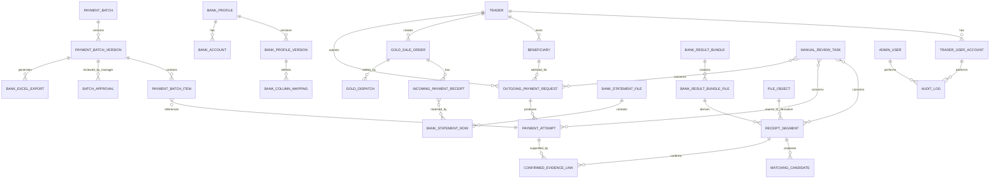

# Gold Trade Settlement Platform

## Domain Model and Business Rules

**Document ID:** `02_Domain_Model_and_Business_Rules`  
**Version:** `1.1`  
**Status:** Revised domain baseline — pending final project-owner approval  
**Document owner:** Product Owner and Technical Lead  
**Technical reviewers:** Backend, Database, Security, DevOps, Frontend, QA  
**Language:** English  
**Primary audience:** Product owner, technical lead, backend engineer, frontend engineer, QA engineer, DevOps engineer, AI/OCR engineer, and coding agents  
**Related documents:**

- `00_Master_Implementation_Blueprint.md`
- `01_Product_Requirements_PRD.md`
- `06_Workflows_and_State_Machines.md`
- `12_Security_RBAC_Audit.md`

### Change Log

| Version | Summary |
|---|---|
| `1.0` | Initial domain model and business-rule baseline. |
| `1.1` | Aligned the domain with the revised Blueprint and PRD; clarified process modernization, batch-version approval, beneficiary/request snapshots, amount provenance, evidence-link cardinality, manual crop in Phase 1A, correction/version rules, concurrency, idempotency, retention governance, and Phase 4 boundaries. |

---

## 1. Purpose

This document defines the authoritative domain model, aggregate boundaries, entity responsibilities, business rules, invariants, lifecycle calculations, and operational constraints for the **Gold Trade Settlement Platform**.

It is the bridge between the approved product baseline and technical implementation. Database schemas, API contracts, state machines, frontend actions, worker jobs, audit events, and QA scenarios must conform to this document. Where a later technical document conflicts with a domain invariant defined here, the technical document must be corrected rather than weakening the invariant.

The platform standardizes two primary business flows:

1. **Gold sale and incoming-payment verification**  
   A trader buys gold from the center, the expected financial obligation is recorded, one or more incoming payments are evidenced and verified, and dispatch or settlement is released only after the applicable financial controls are satisfied.

2. **Outgoing-payment management**  
   A trader requests payment to a beneficiary. The center validates the request, creates bank execution attempts, prepares a versioned batch, obtains manager approval for the exact immutable batch snapshot, generates a bank export, records bank results, and publishes a controlled result to the owning trader.

Existing messages, spreadsheets, photographed receipts, and bank files are discovery evidence. They explain real data, exceptions, and constraints, but they are not domain models and must not be copied as the system structure.

The system is **manual-first and automation-ready**. Manual workflows are first-class domain behavior. OCR, AI segmentation, bank APIs, anomaly detection, and automated matching may assist later phases but cannot become hidden sources of financial truth.

## 2. Domain Design Principles

### 2.1 Preserve business intent; modernize execution

The required business outcomes, responsibilities, approval authority, and financial controls are mandatory. Legacy interaction methods are not mandatory.

The domain should replace unstructured messages and duplicated spreadsheets with structured records, explicit commands, work queues, versioned artifacts, and traceable decisions. Convenience must never bypass an approval or erase history.

### 2.2 Financial decisions are human-authorized

AI/OCR may extract data, propose segments, suggest matches, score confidence, and highlight risks. It cannot approve a batch, confirm a bank payment, release gold, or publish a financial result.

```text
AI proposes.
Accountant verifies and confirms operational results.
Manager approves the exact outgoing-payment batch snapshot.
```

### 2.3 Phase 1A works without AI or external integrations

Phase 1A must provide complete manual behavior for:

- trader and beneficiary management;
- structured request submission;
- batch and attempt creation;
- batch preview and manager approval;
- versioned bank export generation;
- bank statement and result upload;
- in-application document preview;
- minimal manual crop/segment creation and external attachment fallback;
- result registration and publication;
- dispute, correction, and retry;
- audit, backup, and operational recovery.

### 2.4 Preserve traceability over destructive convenience

Financial entities are cancelled, voided, superseded, replaced, or archived. They are not silently overwritten or normally hard-deleted. Original files and historical versions remain traceable.

### 2.5 Separate business intent, approved instruction, and execution

The domain separates:

- `OutgoingPaymentRequest`: the trader's business intent;
- `PaymentAttempt`: a concrete transfer row/attempt;
- `PaymentBatchVersion`: an exact proposed set of attempts;
- `BatchApproval`: manager authorization of one exact batch version;
- `BankExcelExport`: a generated artifact derived from an approved version;
- bank result and evidence records: observed execution outcome.

A failure or correction in one layer must not destroy the other layers.

### 2.6 Approval is version-bound

Manager approval is valid only for the exact batch version reviewed. Any material change to attempts, amount, beneficiary snapshot, destination IBAN, source account, bank profile, export mapping, or row membership invalidates the approval and requires a new version and approval.

### 2.7 Bank behavior is configurable and versioned

Bank formats, transfer rules, mappings, required fields, limits, and templates may change. Historical batches and imports must retain the bank-profile/mapping version used at the time. Updating a bank configuration must not reinterpret old records silently.

### 2.8 A bank result bundle can be mixed

A bundle may contain multiple batches, traders, beneficiaries, file types, pages, overlapping photographs, and unmatched transactions. The domain must not assume one file equals one batch or one transaction.

### 2.9 Beneficiaries are sensitive data, not users

A beneficiary does not log in. The record belongs to the submitting trader's operational scope and may be reused, but each payment request/attempt preserves the beneficiary snapshot used at that time.

### 2.10 Trader data isolation is mandatory

A trader may access only their own requests, beneficiaries, orders, published results, and explicitly trader-visible evidence. Full mixed bank bundles and unrelated transactions are internal-only.

### 2.11 Money has canonical value and input provenance

Canonical storage is integer IRR. The system must also preserve the value and unit entered by the user when relevant, so unit mistakes can be audited and reproduced. No financial calculation uses floating-point values.

### 2.12 Commands must be safe under retry and concurrency

Sensitive commands require idempotency protection and version checks. A double-click, network retry, worker retry, or stale browser tab must not create duplicate batches, approvals, exports, matches, confirmations, or publications.

### 2.13 Transactional integrity includes audit/outbox state

A domain command that changes financial state must atomically or recoverably persist the entity changes, audit event, and required notification/outbox event. Partial success is not acceptable.

## 3. Domain Glossary

| Term | Meaning |
|---|---|
| Center | The single company operating a Phase 1A deployment. Multi-company productization belongs to Phase 4. |
| Trader | A known goldsmith/business customer using the Trader PWA. |
| Beneficiary / Retail Seller | A sensitive reusable payment-recipient record owned by a trader. It contains identity/bank data, not the payment amount, and has no login. |
| Gold Sale Order | The center's structured sale/settlement obligation with a trader. |
| Incoming Payment | Money transferred by a trader to the center and verified against evidence/bank data. |
| Outgoing Payment Request | A trader's logical instruction asking the center to pay a beneficiary. |
| Payment Attempt | A concrete bank transfer row/attempt, including split and retry attempts. |
| Payment Batch | A logical container whose content evolves through immutable versions before bank submission. |
| Payment Batch Version | An immutable snapshot of batch membership, attempts, totals, bank profile, source account, warnings, and content hash. |
| Batch Approval | Manager decision approving or rejecting one specific batch version. |
| Bank Excel Export | A versioned bank-submission artifact generated from one approved batch version. |
| Bank Statement File | A bank-provided account movement file used mainly for incoming-payment verification. |
| Bank Result Bundle | Original file(s) received after outgoing-payment execution; may be mixed across batches/traders. |
| Receipt Segment | A smallest useful transaction-evidence unit created by manual crop, external attachment, structured row import, or later AI segmentation. |
| Matching Candidate | A non-authoritative suggested relationship between source evidence and a target record. |
| Confirmed Evidence Link | A human-confirmed, versioned relationship between a receipt segment/result and a payment attempt. |
| Manual Review Task | A visible work item for unresolved, ambiguous, failed, disputed, or approval-required cases. |
| Confirmation | Authorized human action accepting an operational fact, such as a payment result. |
| Approval | Manager authorization of a specific high-risk instruction/version, especially an outgoing batch. |
| Evidence | Original or derived file/structured record supporting a financial fact. |
| Audit Event | Immutable append-only history of important commands, versions, and corrections. |
| AI/OCR Job | Optional asynchronous extraction/suggestion job that cannot finalize financial state. |
| Idempotency Key | Client/server operation key used to ensure a retried command has one logical result. |
| Record Version | Optimistic-lock value used to prevent stale updates and lost changes. |

## 4. Bounded Contexts

The system should be implemented as a modular monolith with clear bounded contexts. Each context should have its own service layer and business rules, even if they share one database in Phase 1A.

```text
Identity & Access
Trader Management
Gold Sale Management
Outgoing Payment Management
Bank File Management
Bank Result Processing
Matching & Review
Evidence & File Storage
Audit & Compliance
Settings & Bank Configuration
Approval & Versioning
Reporting
AI/OCR Orchestration
```

### 4.1 Identity and Access Context

Responsible for:

- admin authentication;
- trader authentication;
- role-based access control;
- user status;
- session/token management;
- permission checks.

### 4.2 Trader Management Context

Responsible for:

- trader profile;
- trader approval status;
- trader account status;
- optional credit/risk fields;
- trader history;
- trader bank/IBAN data where needed.

### 4.3 Gold Sale Management Context

Responsible for:

- gold sale orders;
- incoming payment receipt submission;
- incoming bank statement matching;
- dispatch and receipt tracking;
- order closure.

### 4.4 Outgoing Payment Management Context

Responsible for:

- payment requests submitted by traders;
- beneficiary data;
- payment batches;
- payment attempts;
- manager approval;
- result publication to traders;
- payment correction flows.

### 4.5 Bank File Management Context

Responsible for:

- bank profiles;
- bank account definitions;
- input/output Excel mappings;
- generated bank Excel files;
- bank statement files;
- bank result bundle uploads.

### 4.6 Bank Result Processing Context

Responsible for:

- normalizing uploaded result files;
- storing bundle files;
- creating receipt segments manually or automatically;
- linking evidence to payment attempts;
- tracking processing status.

### 4.7 Matching and Review Context

Responsible for:

- suggesting candidate matches;
- storing match results;
- manual review tasks;
- handling unmatched segments;
- resolving duplicates and ambiguous matches.

### 4.8 Evidence and File Storage Context

Responsible for:

- storing original files;
- storing normalized files;
- storing external crop/evidence images;
- secure download links;
- file retention rules;
- file visibility rules.

### 4.9 Audit and Compliance Context

Responsible for:

- immutable audit events;
- sensitive operation logs;
- status transition logs;
- correction history;
- exportable audit trails.

### 4.10 Settings and Bank Configuration Context

Responsible for:

- bank-specific transfer limits;
- splitting rules;
- column mapping;
- feature flags;
- AI provider settings;
- business approval thresholds;
- retention policy.

### 4.11 Approval and Versioning Context

Responsible for:

- immutable payment-batch versions;
- manager approval/rejection records;
- approval invalidation after material change;
- approved-content hashes;
- idempotency records for sensitive commands;
- optimistic-lock/version conflict enforcement.

### 4.12 Reporting Context

Responsible for:

- operational dashboards;
- accountant work queues;
- manager summaries;
- trader-level reports;
- payment status summaries;
- unmatched/mismatch reports.

### 4.13 AI/OCR Orchestration Context

Responsible for future phases:

- AI/OCR provider abstraction;
- extraction job creation;
- asynchronous processing;
- standardized result schema;
- confidence scoring;
- cost and token logging;
- fallback to manual review.

---

## 5. High-Level Domain Entity Map



The diagram is conceptual. Exact relational tables and constraints belong to `04_Database_Schema.md`, which must be revised to conform to this version.

## 6. Entity Catalog

### 6.1 Center / Organization

Represents the single business operating a Phase 1A deployment.

**Phase 1A rule:** the system is single-center and single-tenant. Do not introduce tenant-aware queries, tenant switching, or nullable `organization_id` fields across every table merely for hypothetical SaaS use.

**Future rule:** Phase 4 may add multi-company support through a dedicated migration/architecture decision with tested tenant isolation.

**Key fields:**

- `id`
- `name`
- `legal_name` optional
- `status`
- `default_currency = IRR`
- `timezone`
- `created_at`
- `updated_at`
- `record_version`

**Business rules:**

- Exactly one active center is assumed in Phase 1A.
- Center configuration changes are audited.
- Multi-company productization must not be partially implemented in Phase 1A.

### 6.2 Admin User

Internal user of the center.

**Examples:** accountant, manager, warehouse/dispatch user, technical admin, read-only user.

**Key fields:**

- `id`
- `full_name`
- `username`
- `phone_number`
- `password_hash`
- `status`
- `last_login_at`
- `created_at`
- `updated_at`

**Important statuses:**

```text
active
inactive
suspended
```

**Business rules:**

- An inactive or suspended admin user cannot log in.
- A user may have multiple roles if needed.
- Sensitive actions must be permission-checked at the backend, not only hidden in the UI.

---

### 6.3 Role and Permission

Defines what each human or system actor can do. Role names must remain aligned with `12_Security_RBAC_Audit.md`.

**Recommended roles for Phase 1A:**

```text
trader_owner
accountant
manager
warehouse_operator
business_admin
technical_admin
read_only_auditor
support_operator
system_worker
```

**Business rules:**

- `manager` approves the exact immutable outgoing `PaymentBatchVersion` and other explicitly assigned sensitive decisions.
- `accountant` performs daily review, batching preparation, matching, evidence confirmation, and result registration within workflow guards.
- `warehouse_operator` records physical dispatch or receipt only after the required financial clearance exists.
- `business_admin` manages approved business configuration and user administration but does not bypass separation-of-duties rules.
- `technical_admin` manages technical configuration and operations but has no implicit financial approval, evidence, or trader-data authority.
- `read_only_auditor` can inspect authorized records and reports without changing financial state.
- `support_operator` has limited support permissions and no generic impersonation or financial authority.
- `trader_owner` is restricted to the owning trader account and its authorized PWA data.
- `system_worker` represents background execution only; it cannot approve, confirm paid, publish, dispatch, or mark an export sent.
- A permanent unrestricted `super_admin` is not a normal business role. Emergency elevation must follow the controlled break-glass process defined by the security specification.

---

### 6.4 Trader

A known goldsmith/business customer of the center.

**Key fields:**

- `id`
- `display_name`
- `legal_name` optional
- `phone_number`
- `status`
- `approval_status`
- `risk_level` optional
- `credit_limit_irr` optional
- `notes_internal`
- `created_at`
- `updated_at`

**Approval statuses:**

```text
pending_approval
approved
rejected
```

**Operational statuses:**

```text
active
inactive
suspended
blocked
```

**Business rules:**

- A trader may self-register, but cannot perform financial operations until approved by a manager or authorized admin.
- The system should also support admin-created or invited traders.
- In Phase 1A each trader can have one login account.
- The database should not prevent future multiple users per trader account.
- A blocked or suspended trader cannot create new requests.
- A trader can see only their own orders, requests, results, and notifications.

---

### 6.5 Trader User Account

Login identity for the trader. This may be merged with `Trader` in Phase 1A for simplicity, but should be conceptually separate.

**Key fields:**

- `id`
- `trader_id`
- `phone_number`
- `password_hash` or login method fields
- `status`
- `last_login_at`
- `created_at`
- `updated_at`

**Business rules:**

- Future support for multiple users under one trader must not require major redesign.
- Authentication implementation details will be defined in the security document.

---

### 6.6 Beneficiary / Retail Seller

A reusable sensitive payment-recipient record owned by one trader.

**Key fields:**

- `id`
- `trader_id`
- `full_name`
- `normalized_name` optional
- `iban`
- `normalized_iban`
- `bank_name` optional
- `national_id` optional in Phase 1A
- `phone_number` optional
- `status`
- `blocked_reason` optional
- `notes_internal`
- `created_at`
- `updated_at`
- `record_version`

**Statuses:**

```text
active
inactive
blocked
superseded
```

**Business rules:**

- A beneficiary is not a user and never has login access.
- Amount does not belong to the beneficiary; it belongs to a payment request.
- A beneficiary may be reused only within the owning trader's scope.
- Name/IBAN normalization supports duplicate warnings but must not merge records automatically.
- A blocked beneficiary cannot be used in a new request without an authorized override.
- Editing a beneficiary never rewrites historical requests or attempts. Requests and attempts preserve snapshots.
- Sensitive values are masked according to role and are never visible to unrelated traders.
- National-ID/IBAN owner validation is optional and provider-based in later phases.

### 6.7 Bank Profile and Bank Profile Version

`BankProfile` is the stable identity of a bank configuration. `BankProfileVersion` is an immutable version of operational rules and export/import behavior.

**BankProfile key fields:**

- `id`
- `name`
- `code` optional
- `status`
- `current_version_id`
- `created_at`
- `updated_at`
- `record_version`

**BankProfileVersion key fields:**

- `id`
- `bank_profile_id`
- `version_number`
- `effective_from`
- `effective_to` optional
- `default_transfer_limit_irr` optional
- `after_cutoff_transfer_limit_irr` optional
- `cutoff_time` optional
- `splitting_enabled`
- `supports_description_field`
- `required_fields_json`
- `rules_json`
- `created_by_admin_id`
- `created_at`
- `status`

**Business rules:**

- Bank rules are never hard-coded in core payment services.
- Historical batches, attempts, statements, and exports reference the exact profile version used.
- Updating bank rules creates a new version; it does not mutate the interpretation of historical records.
- A new bank may be added through configuration/adapters when the format is supported.
- Time-based rules use explicit bank/business timezone and retain the evaluated rule/result on each split.

### 6.8 Bank Account

Represents center-owned bank account(s) used in operations.

**Key fields:**

- `id`
- `bank_profile_id`
- `account_number`
- `deposit_number`
- `iban`
- `display_name`
- `status`
- `created_at`
- `updated_at`

**Business rules:**

- Payment batches and bank statement files should reference a bank account when known.
- Future reports may group by bank account.

---

### 6.9 Bank Column Mapping / Template Version

Configures how one bank-profile version imports or exports a specific file type.

**Key fields:**

- `id`
- `bank_profile_version_id`
- `file_type`
- `template_version`
- `mapping_json`
- `required_fields_json`
- `normalization_rules_json` optional
- `sample_header_hash` optional
- `status`
- `created_by_admin_id`
- `created_at`

**File types:**

```text
incoming_bank_statement
outgoing_bank_excel_export
bank_result_excel
```

**Business rules:**

- Mapping/template versions are immutable once used by a production import/export.
- Required-column failure blocks processing; unknown columns are preserved as raw data where possible.
- Technical admin may prepare mappings but publishing a mapping that changes financial output requires authorized business approval according to RBAC policy.
- Historical files retain their mapping/template version.
- Test/preview validation is required before activation.

### 6.10 Gold Sale Order

Represents a center-to-trader gold sale/settlement obligation.

**Key fields:**

- `id`
- `trader_id`
- `order_number`
- `status`
- `gold_type`
- `gold_weight` optional
- `weight_unit` default/configured
- `gold_purity` optional
- `pricing_method` optional
- `unit_price_irr` optional
- `expected_amount_irr`
- `final_amount_irr` optional
- `entered_amount_value` optional
- `entered_amount_unit` optional
- `pricing_version`
- `pricing_note`
- `created_by_actor_type`
- `created_by_actor_id`
- `closed_at` optional
- `created_at`
- `updated_at`
- `record_version`

**Recommended statuses:**

```text
draft
submitted
under_center_review
priced
waiting_for_incoming_payment
payment_evidence_submitted
waiting_for_bank_statement
needs_review
incoming_payment_partially_confirmed
incoming_payment_confirmed
manager_approval_required
ready_for_dispatch
dispatched
received_by_trader
settled_or_offset
closed
rejected
cancelled
```

**Business rules:**

- Pricing/expected amount is a versioned snapshot and changes are audited.
- One order may have multiple incoming-payment receipts and bank-row matches.
- Confirmed incoming payments may be partial, exact, or overpaid; mismatch/overpayment requires review.
- Dispatch/settlement is blocked until confirmed incoming amount satisfies the required amount or an explicitly authorized override exists.
- Physical dispatch and offset/manual settlement are distinct outcome types.
- Cancellation/closure does not erase pricing, payments, dispatch, or evidence history.

### 6.11 Incoming Payment Receipt

A trader-submitted or admin-recorded claim that money was transferred to the center.

**Key fields:**

- `id`
- `gold_sale_order_id`
- `trader_id`
- `amount_irr`
- `entered_amount_value` optional
- `entered_amount_unit` optional
- `tracking_number` optional
- `raw_payment_date` optional
- `payment_at_normalized` optional
- `source_bank` optional
- `source_account_hint` optional
- `destination_bank_account_id` optional
- `sender_name` optional
- `evidence_file_id` optional
- `status`
- `confirmed_amount_irr` optional
- `confirmed_by_admin_id` optional
- `confirmed_at` optional
- `created_at`
- `updated_at`
- `record_version`

**Statuses:**

```text
submitted
waiting_for_bank_statement
candidate_match
needs_review
duplicate_suspected
partially_confirmed
confirmed
rejected
superseded
```

**Business rules:**

- Uploading a receipt is a claim, not proof of settlement.
- Confirmation requires authorized accountant action based on bank data/evidence.
- One receipt may match one or more bank rows only when a justified combined/partial-payment model is explicitly used.
- Bank row relationships are stored through match records, not generic polymorphic columns on the row.
- Raw user/bank values and normalized values are preserved.
- Duplicate evidence/reference produces a warning and review, not automatic rejection.

### 6.12 Bank Statement File

Bank-provided account movement file used mainly to verify incoming payments from traders to the center.

**Key fields:**

- `id`
- `bank_profile_id`
- `bank_account_id`
- `uploaded_by_admin_id`
- `original_file_id`
- `status`
- `date_range_start`
- `date_range_end`
- `row_count`
- `mapping_id`
- `created_at`
- `updated_at`

**Statuses:**

```text
uploaded
parsed
parse_failed
ready_for_matching
archived
```

**Business rules:**

- The same bank statement file should not be parsed multiple times unless explicitly reprocessed.
- Rows should be stored separately as `BankStatementRow`.
- Raw row data must be preserved.

---

### 6.13 Bank Statement Row

A single immutable movement row parsed from a bank statement file.

**Key fields:**

- `id`
- `bank_statement_file_id`
- `row_number`
- `transaction_at_normalized` optional
- `raw_date`
- `raw_time` optional
- `amount_in_irr`
- `amount_out_irr`
- `balance_irr` optional
- `tracking_number` optional
- `description`
- `counterparty_name` optional
- `counterparty_account` optional
- `raw_data_json`
- `row_fingerprint`
- `status`
- `created_at`

**Business rules:**

- Parsed rows are immutable; reprocessing creates a new parse/import version.
- Rows are never deleted merely because they are unmatched.
- Matching is represented by dedicated match records, allowing traceable correction and future one-to-many cases.
- Duplicate fingerprints are warned/reviewed; they are not silently discarded.
- Raw values remain available for dispute and parser debugging.

### 6.14 Outgoing Payment Request

A trader's logical business instruction to pay one beneficiary.

**Key fields:**

- `id`
- `trader_id`
- `beneficiary_id`
- `request_number`
- `amount_irr`
- `entered_amount_value`
- `entered_amount_unit`
- `beneficiary_name_snapshot`
- `beneficiary_iban_snapshot`
- `beneficiary_national_id_snapshot` optional
- `description` optional
- `source_attachment_id` optional
- `status`
- `submitted_at` optional
- `reviewed_by_admin_id` optional
- `review_note` optional
- `cancelled_reason` optional
- `created_at`
- `updated_at`
- `record_version`

**Recommended statuses:**

```text
draft
submitted_to_center
under_accountant_review
needs_trader_correction
eligible_for_batching
batched
sent_to_bank
partially_paid
paid
failed
retry_required
result_ready_for_trader
result_published
trader_acknowledged
trader_disputed
cancelled
closed
```

**Business rules:**

- Amount and beneficiary snapshot are immutable after submission unless the request enters an explicit amendment/correction flow.
- Editing the reusable beneficiary does not alter this snapshot.
- Accountant review makes a request eligible for batching; it is not manager approval of the individual request.
- One request may produce multiple split/retry attempts.
- A request cannot participate in more than one active execution path for the same unpaid amount.
- Request aggregate status is calculated from attempt outcomes and publication/dispute state.
- A material amendment after batching invalidates affected batch versions/approvals and creates traceable replacement records.

### 6.15 Payment Batch, Payment Batch Version, and Batch Approval

`PaymentBatch` is the stable logical container. Its financial content is represented by immutable `PaymentBatchVersion` records.

**PaymentBatch key fields:**

- `id`
- `batch_number`
- `status`
- `current_version_id`
- `created_by_admin_id`
- `sent_to_bank_at` optional
- `created_at`
- `updated_at`
- `record_version`

**PaymentBatchVersion key fields:**

- `id`
- `payment_batch_id`
- `version_number`
- `bank_profile_version_id`
- `bank_account_id`
- `status`
- `row_count`
- `total_amount_irr`
- `content_hash`
- `validation_summary_json`
- `created_by_admin_id`
- `created_at`

**PaymentBatchItem key fields:**

- `id`
- `payment_batch_version_id`
- `payment_attempt_id`
- `row_order`
- `attempt_snapshot_json`
- `created_at`

**BatchApproval key fields:**

- `id`
- `payment_batch_version_id`
- `decision`
- `decided_by_manager_id`
- `decided_at`
- `reason` optional
- `approved_content_hash` optional
- `authentication_context_json` optional
- `created_at`

**Recommended batch statuses:**

```text
draft
ready_for_approval
approved
approval_invalidated
exported
sent_to_bank
result_received
partially_resolved
resolved
rejected
cancelled
```

**Business rules:**

- Every outgoing Phase 1A batch requires manager approval.
- Manager approves/rejects a specific immutable batch version, not a mutable batch row set.
- The approved hash must equal the version hash used by the final bank export.
- Any material change creates a new version and invalidates prior approval for operational use.
- A final export cannot be generated/downloaded as sendable unless a valid approval exists.
- A batch may include attempts from multiple traders if the business permits and trader-safe publication remains isolated.
- Cancellation after bank submission uses correction/reconciliation flow and never pretends executed attempts disappeared.

### 6.16 Payment Attempt

A concrete transfer instruction/attempt representing all or part of one payment request.

**Key fields:**

- `id`
- `payment_request_id`
- `attempt_number`
- `attempt_type`
- `amount_irr`
- `beneficiary_name_snapshot`
- `beneficiary_iban_snapshot`
- `beneficiary_national_id_snapshot` optional
- `bank_profile_version_id`
- `bank_account_id` optional
- `split_rule_snapshot_json` optional
- `status`
- `bank_tracking_number` optional
- `bank_result_at` optional
- `failure_code` optional
- `failure_reason` optional
- `retry_of_attempt_id` optional
- `supersedes_attempt_id` optional
- `created_at`
- `updated_at`
- `record_version`

**Attempt types:**

```text
original
split
retry
correction
```

**Statuses:**

```text
created
included_in_batch_version
sent_to_bank
bank_result_pending
paid
failed
retry_required
superseded
cancelled
```

**Business rules:**

- An attempt preserves the exact instruction snapshot used for bank submission.
- Batch membership is versioned through `PaymentBatchItem`; do not store one mutable `payment_batch_id` as the sole history.
- Retrying a sent/failed attempt creates a new attempt linked with `retry_of_attempt_id`.
- An unsent draft attempt may be replaced before approval, with history retained.
- Active attempt allocation must not exceed the unpaid amount of the request.
- The paid amount of a request is the sum of authoritative paid attempts, without double counting superseded/reversed records.
- Evidence relationships are stored in `ConfirmedEvidenceLink`, not a single mutable `receipt_segment_id` field.

### 6.17 Bank Excel Export

A generated preview or final artifact prepared in a bank-specific format.

**Key fields:**

- `id`
- `payment_batch_version_id`
- `batch_approval_id` optional for preview, required for final
- `bank_profile_version_id`
- `bank_mapping_id`
- `file_id`
- `export_type`
- `format_version`
- `row_count`
- `total_amount_irr`
- `content_hash`
- `generated_by_admin_id`
- `generated_at`
- `status`

**Export types:**

```text
preview
final
```

**Statuses:**

```text
generated
validated
downloaded
sent_to_bank_marked
superseded
quarantined
cancelled
```

**Business rules:**

- Preview files are clearly marked/non-sendable and do not grant approval.
- A final export is reproducible only from the exact approved batch version.
- Final export content hash, row count, and total must match the approved snapshot.
- A mismatch blocks download/send marking and creates an audit/security event.
- Regeneration creates a new export record; previous artifacts are superseded, never overwritten.
- Internal references may be included when supported but matching cannot depend solely on them.

### 6.18 Bank Result Bundle

The file or collection of files returned by the bank after executing outgoing payments.

**Key fields:**

- `id`
- `bank_profile_id` optional if unknown
- `uploaded_by_admin_id`
- `bundle_number`
- `status`
- `source_type`
- `notes`
- `created_at`
- `updated_at`

**Source types:**

```text
image
multiple_images
scanned_image
pdf
multi_page_pdf
excel
mixed
unknown
```

**Statuses:**

```text
uploaded
files_stored
normalization_pending
normalized
manual_review_required
ai_processing_pending
ai_processed
partially_matched
matched
closed
archived
```

**Business rules:**

- A bundle may be mixed and may include results for multiple batches or traders.
- A bundle must not be rejected just because some parts are unmatched.
- Unmatched parts should become review tasks or remain as unresolved evidence.
- The original uploaded files must be preserved.
- Future normalization may convert PDFs or Excel data into page images or normalized structured rows.

---

### 6.19 Bank Result Bundle File

A file inside a bank result bundle.

**Key fields:**

- `id`
- `bank_result_bundle_id`
- `file_id`
- `file_order`
- `page_count` optional
- `normalized_file_id` optional
- `status`
- `created_at`

**Business rules:**

- Multiple uploaded files may belong to one bundle.
- File order must be preserved when uploaded together.
- Normalized output should not replace the original.

---

### 6.20 Receipt Segment

A smallest useful transaction-evidence unit derived from a bank-result file or entered as a structured manual result.

**Key fields:**

- `id`
- `bank_result_bundle_id` optional
- `bank_result_bundle_file_id` optional
- `source_file_id` optional
- `segment_file_id` optional
- `page_number` optional
- `bbox_json` optional
- `rotation_degrees` optional
- `source_type`
- `entered_fields_json` optional
- `extracted_fields_json` optional
- `status`
- `created_by_admin_id` optional
- `created_by_method`
- `created_at`
- `updated_at`
- `record_version`

**Created-by methods:**

```text
manual_in_panel_crop
manual_external_attachment
manual_structured_result
excel_row_import
ai_auto_segmentation
```

**Statuses:**

```text
created
unmatched
candidate_found
confirmed_linked
published
superseded
voided
```

**Business rules:**

- Original source file is preserved before segment creation.
- Phase 1A supports image/PDF preview and minimal rectangular manual crop; external attachment remains a fallback.
- Automatic segmentation is later-phase behavior.
- One segment may have several candidates, but by default has at most one active primary confirmed link to one payment attempt.
- Grouped evidence requires an explicit future policy and cannot be inferred ad hoc.
- Trader access is controlled per published result/evidence visibility, never by bundle membership alone.
- Segment correction creates replacement/superseded records rather than overwriting provenance.

### 6.21 Matching Candidate and Confirmed Evidence Link

#### Matching Candidate

A non-authoritative proposed relationship between evidence/source data and a target record.

**Key fields:**

- `id`
- `receipt_segment_id`
- `candidate_type`
- `candidate_id`
- `score` optional
- `reasons_json`
- `created_by_method`
- `status`
- `created_at`

**Statuses:** `proposed`, `accepted_for_review`, `rejected`, `superseded`.

Candidate acceptance does not itself mark a payment paid unless the authorized confirmation command performs all required validation and creates a confirmed link/result atomically.

#### Confirmed Evidence Link

The authoritative, human-confirmed relationship between a receipt segment/result and a payment attempt.

**Key fields:**

- `id`
- `receipt_segment_id`
- `payment_attempt_id`
- `link_type`
- `status`
- `confirmed_by_admin_id`
- `confirmed_at`
- `reason` optional
- `replaces_link_id` optional
- `created_at`

**Statuses:** `active`, `replaced`, `revoked`.

**Business rules:**

- A payment attempt has at most one active primary confirmed transaction-evidence link by default.
- Additional supporting files use supplementary link type and do not replace the primary proof.
- Re-linking never edits/deletes the old link; the old link becomes `replaced` and a new link is created.
- Confirmation, payment-status update, request aggregate recalculation, audit event, and publication invalidation/notification are one transactional domain operation.
- Candidate scores never override a human-confirmed active link.

### 6.22 Manual Review Task

A work item requiring accountant or manager review.

**Key fields:**

- `id`
- `task_type`
- `priority`
- `status`
- `assigned_to_admin_id` optional
- `related_entity_type`
- `related_entity_id`
- `description`
- `resolution_note`
- `created_at`
- `resolved_at`

**Task types:**

```text
unmatched_bank_result_segment
ambiguous_match
duplicate_suspected
payment_failure
missing_evidence
incoming_payment_mismatch
manager_approval_required
trader_issue_reported
```

**Statuses:**

```text
open
in_progress
resolved
cancelled
```

**Business rules:**

- Manual review tasks should appear in accountant or manager queues.
- Unmatched evidence should not silently disappear.
- Tasks must be resolved with an action or note.

---

### 6.23 Attachment / File Object

Represents stored files.

**Key fields:**

- `id`
- `storage_key`
- `original_filename`
- `mime_type`
- `size_bytes`
- `checksum`
- `scan_status`
- `quarantine_reason` optional
- `file_category`
- `original_file_id` optional
- `derivation_metadata_json` optional
- `uploaded_by_type`
- `uploaded_by_id`
- `visibility_scope`
- `created_at`

**Visibility scopes:**

```text
internal_only
trader_visible
system_only
```

**Business rules:**

- Sensitive files must use controlled access URLs.
- Original files should be immutable.
- Replacements should create new file records, not overwrite old evidence.
- Retention follows an approved policy and legal-hold rules; a technical admin cannot unilaterally shorten retention and trigger deletion.
- Malware/suspicious files remain quarantined and are not previewed/downloaded through normal flows.
- Derived files reference the original file and processing version.

---

### 6.24 Gold Dispatch / Gold Receipt

Records physical or settlement-related movement of gold.

**Key fields:**

- `id`
- `gold_sale_order_id`
- `dispatch_type`
- `status`
- `weight`
- `gold_purity`
- `dispatch_date`
- `receiver_name`
- `tracking_or_delivery_note`
- `evidence_file_id` optional
- `created_by_admin_id`
- `confirmed_by_trader_id` optional
- `created_at`
- `updated_at`

**Dispatch types:**

```text
physical_dispatch
physical_receipt
offset_settlement
manual_settlement
```

**Business rules:**

- Phase 1A can use a simple dispatch/receipt model.
- Future support for offset/settlement must not be blocked.
- Evidence attachment should be supported where useful.

---

### 6.25 Audit Log

Immutable record of important actions.

**Key fields:**

- `id`
- `actor_type`
- `actor_id`
- `action`
- `entity_type`
- `entity_id`
- `before_json` optional
- `after_json` optional
- `metadata_json`
- `ip_address`
- `user_agent`
- `correlation_id` optional
- `idempotency_key_hash` optional
- `entity_version` optional
- `created_at`

**Business rules:**

- Audit logs should not be editable through normal application workflows.
- Sensitive operations must create audit logs.
- Corrections must include previous and new values where feasible.
- Audit logs must survive cancellation, archival, and any permitted deletion of non-financial drafts.
- Audit events are append-only and must not contain secrets or unnecessary full sensitive identifiers.

---

### 6.26 Notification

In-app notification or work alert.

**Key fields:**

- `id`
- `recipient_type`
- `recipient_id`
- `title`
- `message`
- `related_entity_type`
- `related_entity_id`
- `status`
- `created_at`
- `read_at`

**Business rules:**

- Phase 1A uses in-app notifications only.
- SMS is not required for Phase 1A.
- Critical work items may be represented as manual review tasks rather than simple notifications.

---

### 6.27 System Setting

Configurable business or technical parameter.

**Examples:**

- default currency display behavior;
- bank transfer limits;
- approval thresholds for exceptional non-batch actions;
- feature flags;
- file retention duration;
- AI provider enabled/disabled;
- OCR enabled/disabled;
- advanced crop/OCR assistance enabled/disabled.

**Business rules:**

- Settings that affect financial outcomes should be audited.
- Configuration ownership is separated: technical settings, bank/business settings, and security settings have different permissions.
- Every outgoing batch still requires manager approval in Phase 1A; a threshold does not bypass batch approval.
- Retention reduction requires approved governance, legal-hold check, dry run, and separate deletion execution.
- Defaults must be safe and conservative.

---

### 6.28 AI/OCR Job

Asynchronous processing job for future OCR or segmentation tasks.

**Key fields:**

- `id`
- `job_type`
- `provider`
- `input_entity_type`
- `input_entity_id`
- `status`
- `input_file_id` optional
- `output_json` optional
- `error_message` optional
- `confidence_summary` optional
- `cost_usd` optional
- `started_at`
- `finished_at`
- `created_at`

**Job types:**

```text
file_normalization
receipt_segmentation
ocr_extraction
match_suggestion
anomaly_detection
```

**Business rules:**

- AI job failure must not block manual workflow.
- AI output should be stored for review and improvement.
- AI cost and provider data should be logged in future phases.

---

## 7. Amount, Currency, and Date Rules

### 7.1 Canonical money storage

All persisted money uses signed/unsigned integer IRR according to field semantics. Floating-point types are prohibited.

```text
amount_irr
requested_amount_irr
total_amount_irr
paid_amount_irr
credit_limit_irr
```

Database and service validation must define safe numeric bounds and prevent overflow.

### 7.2 Input provenance

Where a human enters an amount, preserve:

- canonical `amount_irr`;
- `entered_amount_value` as the formatted decimal/integer value entered;
- `entered_amount_unit` (`IRR` or `TOMAN`);
- actor and timestamp;
- conversion rule/version if applicable.

The system must not silently infer the unit from the number's magnitude.

### 7.3 Display and confirmation

- Trader forms may allow configured IRR/Toman input with an explicit selector.
- Bank export and settlement calculation are authoritative in IRR.
- Manager approval shows IRR and Toman, row count, total, and where practical amount in words.
- Every input and confirmation displays the unit adjacent to the value.
- Large/unusual values trigger warnings but are not automatically rejected solely by magnitude.

### 7.4 Equality and allocation

- Request/attempt sums use exact integer arithmetic.
- No hidden tolerance is used for outgoing payment completion.
- Any exceptional adjustment is a separate audited business action/version, not an arbitrary tolerance.
- Superseded/revoked attempts are excluded from aggregate calculations.

### 7.5 Date and time

- System timestamps are timezone-aware and stored in UTC.
- Business/bank timezone is explicit (normally Iran time) when evaluating cutoff rules.
- UI displays Jalali dates where appropriate.
- Raw bank date/time strings are preserved alongside normalized timestamps.
- Ambiguous/unparseable dates remain raw and require review; they are not guessed.

### 7.6 Raw external values

Every parser/import stores raw source values, file/mapping version, normalized values, and parsing warnings so historical interpretation is reproducible.

## 8. Core Business Rules

### 8.1 Trader onboarding

1. A trader may self-register or be created/invited by an authorized internal user.
2. A new trader is not allowed to submit financial requests until approved.
3. Approval/rejection/suspension/reactivation is permission-checked and audited.
4. A blocked/suspended trader cannot create new requests; historical access follows policy.
5. Trader ownership isolation applies to records, files, exports, notifications, search, and APIs.

### 8.2 Beneficiary management

1. Beneficiary belongs to one trader and is not a login user.
2. Default required fields are name and valid Iranian IBAN.
3. Amount never belongs to the beneficiary entity.
4. Duplicate detection is advisory; no automatic merge.
5. Request/attempt snapshots preserve historical data after beneficiary edits.
6. Blocked beneficiary use requires an authorized override with reason.

### 8.3 Outgoing request submission

1. Drafts are editable by the owning trader.
2. Submission freezes amount/beneficiary snapshot and records input provenance.
3. Accountant may return the request for correction with reason.
4. Accountant marks a valid request `eligible_for_batching`; this is not manager approval.
5. A submitted/materially amended request uses optimistic locking and version history.
6. Cancellation is blocked or escalated after irreversible bank execution.

### 8.4 Payment splitting and retry

1. Splitting uses the selected bank-profile version and source account context.
2. Every split records the evaluated rule snapshot.
3. Active attempts allocated to a request cannot exceed its unpaid amount.
4. Sent/failed attempts are not edited into retries; retry creates a new linked attempt.
5. Aggregate paid/partial/failed status is derived without double counting superseded records.

### 8.5 Batch preparation and approval

1. Accountant creates a draft batch/version from eligible attempts.
2. Validation produces exact row count, total, warnings, bank profile version, source account, and content hash.
3. Every Phase 1A outgoing batch requires manager approval.
4. Manager approves/rejects one immutable `PaymentBatchVersion` after recent/step-up authentication according to the security ADR.
5. A material change creates a new version and invalidates prior approval for export/use.
6. Approval is not transferable to a different version even when totals are equal.
7. Reject/change-request reason is stored; the rejected version remains historical.

### 8.6 Bank export

1. Preview export may be generated before approval but must be clearly non-sendable.
2. Final export is generated only from an approved batch version.
3. Final export hash/row count/total must match the approved snapshot.
4. Mapping/profile versions and attempt snapshots are stored with the export.
5. Regeneration creates a new artifact; old exports become superseded.
6. Marking sent-to-bank records actor, timestamp, export ID, and optional bank submission note/reference.

### 8.7 Bank result bundle

1. Preserve original files before normalization, preview, crop, parsing, or OCR.
2. A bundle may span multiple batches/traders and may remain partially unresolved.
3. Phase 1A supports in-app preview, manual result entry, minimal crop, and external attachment fallback.
4. Unmatched items remain visible until linked, marked unknown/duplicate/non-transaction with reason, or otherwise resolved.
5. Bundle closure requires explicit resolution accounting; closing cannot hide unresolved relevant items.

### 8.8 Evidence and matching

1. Matching candidates are suggestions only.
2. Confirmed evidence links are explicit human decisions.
3. Default cardinality: one active primary transaction-evidence link per attempt and one primary target per segment.
4. Supplementary evidence may be attached separately.
5. Re-linking replaces rather than deletes the old link.
6. Duplicate references/checksums create warnings and review, not automatic financial decisions.

### 8.9 Result confirmation and publication

1. Accountant confirms paid/failed/unknown outcome based on reviewed evidence/bank result.
2. Confirmation, evidence link, attempt status, request aggregate, audit, and notification/outbox update are atomic/recoverable.
3. Trader publication is a separate controlled action/version.
4. Trader sees only safe summary and explicitly trader-visible evidence.
5. A corrected published result creates a new publication version and notifies the trader when material visible content changes.
6. Trader dispute creates a review task and does not automatically reverse the bank fact.

### 8.10 Gold sale and incoming payment

1. Pricing/expected amount is versioned.
2. Receipt upload is not confirmation.
3. One order may receive multiple partial incoming payments.
4. Accountant verifies against bank statement data or approved manual evidence path.
5. Underpayment, overpayment, duplicate, or ambiguity requires review.
6. Dispatch/settlement is blocked until financial conditions or authorized override are satisfied.

### 8.11 Corrections and deletion

1. Financial history is append-only through versions, correction records, replacement links, and audit events.
2. Normal UI cannot hard-delete financial records or original evidence.
3. Draft/non-financial data may be removed only under explicit safe policy.
4. `cancelled`, `voided`, `superseded`, `replaced`, and `archived` have distinct meanings and are not interchangeable.
5. Any correction affecting approved/exported/published content triggers dependent invalidation/recalculation.

### 8.12 Retention and legal hold

1. Retention duration is an approved business/legal policy, not a casual technical setting.
2. Reducing retention does not immediately delete data.
3. Deletion execution requires authorization, legal-hold check, dry-run scope, audit, and operational backup policy.
4. Audit/evidence needed to interpret retained financial records cannot expire earlier than those records.

### 8.13 Idempotency and concurrency

Idempotency is required for request submission, batch creation/version finalization, manager decision, final export generation, sent-to-bank marking, result confirmation, correction, and publication.

Optimistic locking applies to mutable aggregates and configuration. Stale commands fail with a conflict and must not overwrite newer state.

### 8.14 AI/OCR

AI/OCR is optional, asynchronous, feature-flagged, provider-independent, auditable, and never authoritative for final financial state.

## 9. State and Aggregate Calculation Rules

Status names and allowed transitions are finalized in `06_Workflows_and_State_Machines.md`. The following aggregate rules are domain invariants.

### 9.1 Request financial aggregate

Let `authoritative_paid_attempts` include paid attempts that are not superseded/revoked/double-counted.

```text
paid_total = sum(authoritative_paid_attempt.amount_irr)
remaining = request.amount_irr - paid_total

if paid_total == request.amount_irr:
    financial_status = paid
elif 0 < paid_total < request.amount_irr:
    financial_status = partially_paid
elif no paid attempts and all completed attempts failed and no active retry:
    financial_status = failed
elif any attempt is sent/pending:
    financial_status = sent_to_bank
else:
    financial_status follows review/batching workflow
```

`paid_total > request.amount_irr` is an invariant violation requiring review; it must not be silently treated as paid.

### 9.2 Batch approval state

- `approved` is valid only when an approved `BatchApproval` references the current operational `PaymentBatchVersion` and matching content hash.
- Creating a new material version sets operational state to `approval_invalidated`/`ready_for_approval`.
- A final export does not restore approval; approval precedes final export.

### 9.3 Batch resolution aggregate

```text
if all included authoritative attempts are paid:
    resolved
elif at least one is paid and at least one failed/pending/unresolved:
    partially_resolved
elif all terminal attempts failed:
    resolved_with_failure_summary (or the exact workflow status defined in document 06)
else:
    sent_to_bank/result_received
```

### 9.4 Bundle resolution aggregate

Bundle progress distinguishes file-processing state from business-resolution state. Parsing success does not mean financial matching success.

- partially resolved: some relevant items resolved, others open;
- resolved: every relevant item has an explicit disposition;
- archived: retention/storage lifecycle, not business confirmation.

### 9.5 Gold sale financial aggregate

Confirmed incoming amount is summed from authoritative confirmed incoming-payment matches. Dispatch-ready is true only when confirmed amount satisfies the current approved expected/final amount or an authorized override is active.

### 9.6 Publication state

Publication is versioned independently of bank confirmation. A correction may keep the bank outcome but invalidate/replace the published trader result.

## 10. Permission Matrix Summary

Detailed permissions belong to `12_Security_RBAC_Audit.md`. Domain intent:

| Action | Trader | Accountant | Manager | Warehouse | Technical Admin | Read-only |
|---|---:|---:|---:|---:|---:|---:|
| Create/submit own request | Yes | No | No | No | No | No |
| Manage own beneficiaries | Yes | Assisted/authorized | No | No | No | No |
| View own published results | Yes | No | No | No | No | No |
| Review requests | No | Yes | View/override if granted | No | No | View |
| Prepare batch/version | No | Yes | View | No | No | View if granted |
| Approve/reject batch version | No | No | Yes | No | No | No |
| Generate final bank export | No | Yes after approval | Optional | No | No by default | No |
| Mark sent to bank | No | Yes | Optional | No | No | No |
| Upload/result-review bank bundle | No | Yes | View/optional | No | No by default | View if granted |
| Create manual crop/segment | No | Yes | Optional | No | No | No |
| Confirm result/evidence link | No | Yes | Optional exceptional | No | No | No |
| Correct published result | No | Yes with policy | Optional approval for material cases | No | No | No |
| Configure bank mapping | No | No | Business activation optional | No | Technical preparation | No |
| View raw financial files | Own published only | Yes | Yes | No | No by default/temporary audited access | Masked/limited |
| Register gold dispatch | No | Optional | Optional | Yes | No | View |
| Change retention/security setting | No | No | Business approval | No | Technical execution where authorized | No |

Technical-admin role does not imply unrestricted financial-data access or financial approval authority.

## 11. Important Domain Invariants

These invariants must be enforced in backend services, database constraints where possible, and automated tests.

1. **Trader isolation:** a trader never accesses another trader's beneficiary, request, order, result, notification, or file.
2. **No AI authority:** AI/OCR cannot approve/confirm/release/publish financial state.
3. **Batch approval scope:** every Phase 1A outgoing batch requires manager approval of one exact immutable version.
4. **Approval hash integrity:** final export content must equal the approved version/hash.
5. **Approval invalidation:** material change after approval invalidates operational use of that approval.
6. **Request/attempt separation:** a request is not an attempt; split/retry attempts preserve parent intent.
7. **Allocation integrity:** active attempt allocation and authoritative paid total cannot exceed request amount.
8. **Snapshot integrity:** submitted requests, attempts, batch items, and exports preserve beneficiary/amount/bank data used at that time.
9. **Original file immutability:** original uploads are never overwritten by normalization/crop/OCR.
10. **Evidence cardinality:** at most one active primary confirmed transaction-evidence link per attempt by default.
11. **Correction traceability:** replaced links/versions remain historical and audit-visible.
12. **Unmatched visibility:** unresolved relevant bank items remain in an operational queue/disposition list.
13. **Canonical money:** all calculations use integer IRR and retain input unit provenance where applicable.
14. **No generic financial deletion:** financial records use lifecycle states, not normal hard delete/soft-hidden delete.
15. **Idempotent sensitive commands:** retry cannot create duplicate financial effects.
16. **Optimistic concurrency:** stale mutation cannot overwrite a newer record/version.
17. **Transactional command boundary:** financial mutation, audit, and required outbox/notification are atomic or recoverable.
18. **Configuration versioning:** historical import/export references exact bank profile/mapping versions.
19. **Controlled publication:** traders never receive full mixed bundles by default.
20. **Single-center Phase 1A:** no partial/untested multi-tenant behavior is introduced before Phase 4.

## 12. Edge Cases and Required System Behavior

| Case | Required behavior |
|---|---|
| Mixed bundle across traders/batches | Preserve one bundle; create multiple segments/dispositions; publish only scoped results. |
| Rotated, low-quality, overlapping bank documents | Preview/rotate/manual crop or external attachment; mark review; never require OCR. |
| No match | Create unresolved review item; do not reject/close whole bundle. |
| One request split into several attempts | Preserve parent; track each attempt; exact aggregate. |
| Partial success | Parent becomes partial; remaining amount may create traceable retries. |
| All attempts fail | Preserve failed attempts/reasons; request may enter retry or terminal failure flow. |
| Same amount/name repeated | Use IBAN, batch, bank, date, tracking, and context; require manual choice. |
| Wrong evidence linked | Replace link, preserve old link, recalculate, and notify if published result changed. |
| Trader dispute | Create review task; do not auto-reverse bank fact. |
| Bank format changes | Activate new profile/mapping version; old imports remain interpreted by old version. |
| Amount entered in wrong unit | Explicit unit/preview blocks ambiguity; correction creates new version and invalidates dependencies. |
| Request edited after batching | Use amendment flow; invalidate affected batch approval/export. |
| Batch changed after approval | New version; approval invalid; final export blocked until re-approved. |
| Export differs from approved snapshot | Quarantine/block artifact; audit/security alert. |
| Manager double-clicks approval | Idempotency returns one decision; no duplicate side effects. |
| Concurrent accountants update same result | Stale version fails; user refreshes/reviews. |
| Crash during confirmation | No partial paid status without evidence/audit/outbox consistency. |
| Duplicate file/reference | Warn/review; do not silently discard or auto-confirm. |
| Storage unavailable | Upload/confirmation/publication does not falsely succeed; recoverable error and alert. |
| Retention reduced | No immediate deletion; governance, legal hold, dry run, separate execution. |
| Offset instead of physical dispatch | Record explicit settlement type and supporting details. |
| Beneficiary edited after historical payment | New requests use new data; historical snapshots remain unchanged. |
| Bank result arrives before sent marker | Review with warning; authorized reconciliation may correct timeline with audit. |
| Retry later succeeds after original failure | New attempt linked to original; aggregate excludes double counting. |

## 13. Domain Events

Commands should emit append-only audit events and, where asynchronous side effects are required, transactional outbox events.

```text
TraderRegistered
TraderApproved
TraderSuspended
BeneficiaryCreated
BeneficiaryUpdated
BeneficiaryBlocked
GoldSaleOrderCreated
GoldSalePricingVersionCreated
IncomingReceiptSubmitted
IncomingPaymentMatched
IncomingPaymentConfirmed
OutgoingPaymentRequestCreated
OutgoingPaymentRequestSubmitted
OutgoingPaymentRequestReturnedForCorrection
OutgoingPaymentRequestAmended
PaymentAttemptCreated
PaymentAttemptRetried
PaymentBatchCreated
PaymentBatchVersionCreated
PaymentBatchValidationCompleted
PaymentBatchApprovalRequested
PaymentBatchVersionApproved
PaymentBatchVersionRejected
PaymentBatchApprovalInvalidated
BankExportPreviewGenerated
BankExportFinalGenerated
BankExportValidationFailed
BankExportMarkedSent
BankResultBundleUploaded
BankResultBundleFileStored
ReceiptSegmentCreated
MatchingCandidateCreated
ConfirmedEvidenceLinkCreated
ConfirmedEvidenceLinkReplaced
PaymentAttemptConfirmedPaid
PaymentAttemptMarkedFailed
PaymentRequestPartiallyPaid
PaymentRequestPaid
ResultPublicationCreated
ResultPublicationReplaced
TraderAcknowledgedResult
TraderReportedIssue
ManualReviewTaskCreated
ManualReviewTaskResolved
GoldDispatched
GoldSettlementRecorded
EntityCorrectionRecorded
RetentionPolicyChanged
DeletionExecutionRequested
```

Event payloads include entity ID, entity version, actor, correlation ID, reason, and the minimum necessary data. They must not expose secrets or unnecessary full sensitive identifiers.

## 14. Validation Rules

### 14.1 Iranian IBAN

- Normalize spaces/dashes and uppercase before validation.
- Validate `IR` prefix, length, character set, and checksum.
- Store normalized canonical value and optionally the original entered representation.
- Owner validation is not assumed in Phase 1A.

### 14.2 Amount

- Positive integer IRR within configured/system numeric bounds.
- Explicit input unit and deterministic conversion.
- Suspicious magnitude warning and confirmation.
- Batch total equals exact sum of included attempt snapshots.
- Export total/row count/hash equal approved batch version.

### 14.3 Payment request

Required defaults:

```text
beneficiary_id or validated new beneficiary data
beneficiary_name_snapshot
beneficiary_iban_snapshot
amount_irr
entered_amount_value
entered_amount_unit
```

Submission validates trader active/approved, beneficiary allowed, ownership, amount, and record version.

### 14.4 Batch/version

- Every item is eligible and not actively allocated elsewhere for the same unpaid amount.
- One bank-profile version and source account apply to the version unless a future explicit mixed-bank model exists.
- Row order, totals, warnings, snapshots, and content hash are deterministic.
- Manager decision requires current version and valid recent authentication context.

### 14.5 Evidence/result

- File/segment belongs to an authorized internal scope.
- Primary active link uniqueness is enforced.
- Paid confirmation requires allowed evidence/result fields and authorized accountant.
- Replacing a link requires reason and old-link status transition.

### 14.6 File

Phase 1A categories support configured image/PDF/Excel formats. Validate filename, extension, MIME signature, size, category, checksum, scan/quarantine status, and authorized relationship. Store outside public web root.

### 14.7 State and concurrency

- Invalid transitions are rejected server-side.
- Commands include expected record/version where mutable state can be stale.
- Sensitive commands include idempotency key.
- Overrides are explicit permissions/actions with reason; they are not generic bypass flags.

### 14.8 Dates and bank rules

- Evaluate cutoffs in the configured timezone.
- Persist the rule/profile version and evaluation result used.
- Raw external date text remains available when normalization fails.

## 15. Phase 1A Domain Boundary

### Required

- Single-center identity/access and RBAC.
- Trader and reusable beneficiary records with ownership isolation.
- Structured outgoing-payment requests with amount/input provenance and snapshots.
- Payment attempts, splitting, retry lineage, and exact aggregate calculation.
- Logical batches, immutable batch versions, batch items, and manager approval records.
- Preview and final versioned bank exports derived from approved snapshots.
- Bank profiles, source accounts, and versioned mappings/rules for initial banks.
- Bank result bundle/file preservation and internal preview.
- Minimal manual rectangular crop/receipt-segment creation plus external attachment fallback.
- Matching candidates, confirmed evidence links, correction/replacement history.
- Manual result confirmation, safe trader publication, acknowledgement/dispute.
- Gold sale pricing, incoming-payment evidence/verification, dispatch/settlement guard.
- Manual review tasks, audit events, idempotency/concurrency controls.
- Secure private file records, retention governance, backup/recovery compatibility.

### Not required in Phase 1A

- OCR as a required step.
- Automatic segmentation.
- Automatic financial matching/confirmation.
- Bank API integration.
- External IBAN/national-ID owner validation.
- Advanced anomaly/fraud decisions.
- Full accounting ledger replacement.
- Retail-seller portal.
- Multi-company/tenant operation.
- Subscription/billing.
- Native mobile apps.

## 16. Future Domain Extensions

### Phase 1B — Assisted processing

- OCR extraction and provider abstraction;
- candidate suggestions/confidence;
- richer crop/review tools;
- duplicate warnings and operator productivity improvements.

### Phase 2 — Advanced intelligence and risk control

- automatic segmentation;
- advanced deterministic/AI matching;
- anomaly/duplicate analysis;
- evaluation datasets and learning from corrections;
- approved identity/IBAN validation providers.

### Phase 3 — Integrations and operational scale

- bank/API adapters with manual fallback;
- accounting integrations;
- larger deployment topology and advanced monitoring;
- integration reconciliation and SLA metrics.

### Phase 4 — Productization and expansion

- multi-company/single-tenant-per-customer or tested multi-tenant model;
- subscription/billing;
- tenant/support-access audit;
- product analytics that protect financial privacy.

Future extensions must preserve Phase 1A invariants and cannot remove manual fallback or human financial authority without an explicitly approved new product policy.

## 17. Implementation Guidance for Coding Agents

### 17.1 Implement aggregate commands, not generic CRUD

Required services/command handlers should represent business actions such as:

```text
SubmitPaymentRequest
AmendPaymentRequest
CreatePaymentAttempts
CreateBatchVersion
ValidateBatchVersion
ApproveBatchVersion
InvalidateBatchApproval
GenerateFinalBankExport
MarkBankExportSent
UploadBankResultBundle
CreateManualReceiptSegment
ConfirmPaymentResult
ReplaceEvidenceLink
PublishTraderResult
ResolveTraderDispute
ConfirmIncomingPayment
ReleaseGoldDispatch
```

### 17.2 Use explicit transactional boundaries

Creating/approving/versioning a batch, confirming a result, replacing evidence, recalculating aggregates, and publishing results update multiple records. Entity changes, audit, and outbox events commit together or recover safely.

### 17.3 Use optimistic locking and idempotency

Mutable aggregates have `record_version`. Sensitive command endpoints accept expected version and idempotency key. Retried commands return the existing logical result or a safe conflict.

### 17.4 Keep historical snapshots immutable

Do not reconstruct historical exports from current beneficiary/bank settings. Store snapshots and version references used at the time.

### 17.5 Isolate bank and AI code

Bank mappings/rules and AI providers use adapters/interfaces. Core financial state does not depend on provider availability.

### 17.6 Model evidence links explicitly

Do not place one mutable `receipt_segment_id` directly on `PaymentAttempt` as the only source of truth. Use versioned link records with replacement history.

### 17.7 Do not implement premature tenancy

Phase 1A is single-center. Do not add untested tenant scoping everywhere merely because Phase 4 may exist.

### 17.8 Preserve raw and normalized data

External files, rows, dates, and provider responses retain raw form, normalized form, parser/provider version, and warnings.

### 17.9 Test invariants, not only happy-path endpoints

Automated tests must cover approval invalidation, hash mismatch, stale writes, duplicate retries, split/retry aggregates, evidence replacement, ownership isolation, and crash/recovery boundaries.

## 18. Minimum Acceptance Criteria for This Domain Model

The domain baseline is acceptable only if implementation preserves all of the following:

1. Requests, attempts, batch versions, approvals, exports, and results are separate concepts.
2. Beneficiary contains no payment amount; historical requests/attempts store snapshots.
3. Every Phase 1A outgoing batch is approved at immutable version level.
4. Material batch change invalidates approval and requires a new version.
5. Final export is cryptographically/content-wise tied to the approved version.
6. AI/OCR is optional and cannot finalize financial state.
7. Manual preview, crop/segment, result registration, and review work without AI.
8. Matching candidates and confirmed evidence links are separate.
9. Confirmed-link replacement preserves prior link and audit history.
10. Trader ownership isolation covers database, API, file, notification, and export access.
11. Money uses integer IRR with explicit input-unit provenance.
12. Split/retry aggregates do not double count or exceed request amount.
13. Original files, historical versions, and bank configuration versions are immutable/traceable.
14. Sensitive commands are idempotent and concurrency-safe.
15. Financial mutation, audit, and required outbox state are atomic/recoverable.
16. Unmatched/review items stay visible until explicit disposition.
17. Financial records are not generically deleted or hidden by soft deletion.
18. Retention reduction follows governance and legal-hold checks.
19. Phase 1A remains single-center; SaaS/multi-company is Phase 4.
20. `04_Database_Schema.md`, `05_API_Specification.md`, and `06_Workflows_and_State_Machines.md` are updated to implement these rules without contradiction.

## 19. Decisions Required Before Production Commitment

These do not change the core domain invariants but must be approved before production:

| Decision | Current direction |
|---|---|
| Legal/accounting retention period and legal-hold owner | Minimum working assumption 5 years; no deletion automation until approved. |
| Initial bank profiles, source accounts, templates, limits, and sample fixtures | Must be configured/tested from anonymized real samples. |
| Authentication/session ADR and step-up method | Must satisfy security requirements; ordinary operation cannot depend solely on SMS. |
| RPO/RTO, backup location, restore-test owner | Must be approved before production. |
| Maximum file size, expected daily volume, and capacity assumptions | Needed for load/storage planning. |
| Trader share format/branding and IBAN masking policy | Must preserve safe scoped evidence. |
| Gold-sale offset/settlement operational details | Domain supports it; exact Phase 1A UI/permissions require owner confirmation. |
| Material published-result correction requiring manager approval | Default accountant correction with audit; high-risk cases may require configured manager review. |
| Bank result textual confirmation without image | Allowed only under explicit business/evidence policy and audit. |

Already decided for this baseline:

- every outgoing Phase 1A batch requires manager approval;
- approval is version/hash-bound;
- minimal manual crop is Phase 1A;
- automatic segmentation is Phase 2;
- multi-company/SaaS is Phase 4;
- generic admin impersonation is not a Phase 1A capability.

## 20. Recommended Next Document

The next document should be:

```text
03_System_Architecture.md
```

Before it is approved, it must be revised to conform to Domain Model v1.1 and define:

- application boundaries;
- backend module boundaries;
- worker architecture;
- queue design;
- storage design;
- deployment topology;
- environment strategy;
- integration boundaries;
- how this domain model maps to implementation services.
