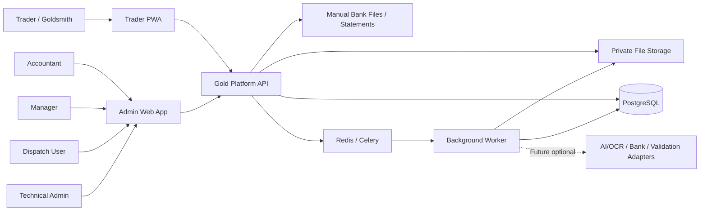
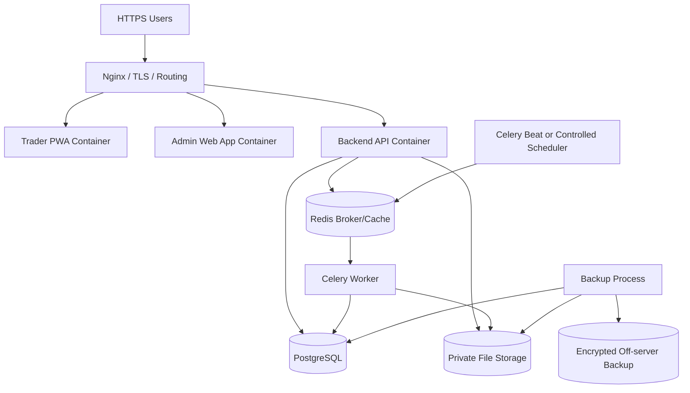
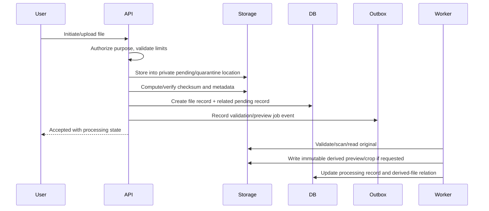
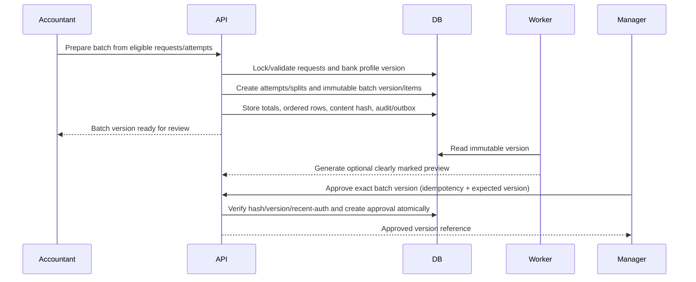

# Gold Trade Settlement Platform

## System Architecture

**Document ID:** `03_System_Architecture`  
**Version:** `1.1`  
**Status:** Reviewed architecture baseline  
**Language:** English  
**Primary audience:** Technical lead, DevOps engineer, backend engineer, frontend engineer, security engineer, QA engineer, product owner, and coding agents  
**Architecture style:** Single-tenant modular monolith with asynchronous workers  
**Phase baseline:** Phase 1A — Operational Manual Core

**Authoritative upstream documents:**

- `00_Master_Implementation_Blueprint.md`
- `01_Product_Requirements_PRD.md`
- `02_Domain_Model_and_Business_Rules.md`

When this document conflicts with an upstream business invariant, the upstream invariant wins. Exact table, endpoint, state, permission, deployment, and test details are finalized respectively in documents `04`, `05`, `06`, `12`, `13`, `14`, and `18` after they are revised against this version.

### Change Log

| Version | Summary |
|---|---|
| 1.0 | Initial implementation baseline draft. |
| 1.1 | Aligned architecture with Blueprint, PRD, and Domain Model v1.1; fixed batch-version approval boundaries; selected Celery; added idempotency, optimistic concurrency, transactional outbox, manual crop in Phase 1A, service-specific secrets, deterministic export integrity, explicit storage/backup constraints, standardized health endpoints, and production hardening requirements. |

---

## 1. Purpose and Architectural Authority

This document defines the technical architecture of the **Gold Trade Settlement Platform**. It converts the approved product and domain rules into implementable application boundaries, runtime components, persistence rules, communication patterns, deployment constraints, and failure-handling principles.

The platform is not an electronic copy of the previous messenger-and-Excel process. Existing manual artifacts are discovery evidence. The architecture must preserve required business outcomes and controls while replacing fragmented execution with structured commands, versioned records, secure evidence handling, and auditable workflows.

The architecture must support:

1. a mobile-first Trader PWA;
2. a desktop-first responsive internal web application for accountants, managers, dispatch users, technical admins, and auditors;
3. a backend that is the sole authority for permissions, workflow transitions, approval validity, and financial invariants;
4. exact separation between payment intent, bank execution attempt, batch version, approval, export, result, and evidence;
5. manual operation without AI, OCR, bank APIs, SMS, or external validation services;
6. minimal in-application document preview and manual rectangular crop in Phase 1A;
7. future AI/OCR and integrations through adapters and asynchronous jobs;
8. production deployment, backup, restore, monitoring, and incident recovery suitable for sensitive financial information.

This document is not the exact database schema or API contract. It establishes constraints that those specifications must implement.

---

## 2. Approved Architecture Principles

### 2.1 Preserve business intent; modernize execution

The architecture preserves required actors, approvals, financial controls, evidence, and audit history. It does not preserve inefficient legacy interaction patterns merely because they existed before the platform.

Implementation may replace free-form messages and manually tracked spreadsheets with structured forms, reusable beneficiaries, queue-based work, batch previews, immutable approval snapshots, and controlled evidence publication.

### 2.2 Modular monolith for Phase 1A

The backend shall be a **modular monolith**, deployed as one API application and one or more worker processes using the same codebase.

This is preferred because:

- financial commands often modify several related records atomically;
- the initial operational volume does not justify distributed transactions;
- one deployment unit is easier to secure, back up, restore, and operate;
- internal module boundaries still allow later extraction when justified;
- premature microservices would increase failure modes and operational cost.

Module boundaries are mandatory even though the database is shared. A module must not bypass another module's service boundary to mutate its aggregate.

### 2.3 Single center and single tenant in Phase 1A

Phase 1A serves one center/company. It must not implement partial multi-tenancy, tenant switching, or tenant-aware support access.

A global center configuration record is permitted. Multi-company/SaaS design belongs to Phase 4 and must be introduced only with a complete isolation model, migrations, permission rules, backup policy, and tenant-isolation tests.

### 2.4 Two distinct frontend applications

The approved frontend topology is:

- `Trader PWA`
- `Admin Web App`

They shall be separate Next.js applications in one monorepo. They may share UI primitives, localization utilities, and generated API types, but not backend business authority.

### 2.5 Manual-first does not mean external-tool-first

Core financial decisions remain manual and human-authorized in Phase 1A. However, the system must provide the minimum internal tools needed to make manual work safe and efficient:

- image and PDF preview;
- page navigation, zoom, pan, and rotation;
- minimal rectangular manual crop;
- storage of crop coordinates and provenance;
- external evidence upload as fallback.

Automatic segmentation remains a later capability.

### 2.6 Human authority is explicit

No AI model, OCR provider, parser, worker, or rule engine may approve a batch, confirm a payment, publish a sensitive result, or authorize outgoing money.

```text
AI/provider proposes.
Accountant confirms bank result and evidence.
Manager approves the exact outgoing batch version.
```

### 2.7 Approval is immutable and version-bound

Manager approval is attached to an immutable `PaymentBatchVersion`, not to a mutable batch container.

The approval must include or reference:

- batch ID;
- batch version ID and version number;
- bank profile version;
- source bank account;
- ordered row/attempt membership;
- row count;
- total amount in IRR;
- content hash;
- approver and approval timestamp;
- recent-auth/step-up evidence as required by security policy.

Any material change creates a new version and invalidates the previous approval for future export or submission.

### 2.8 Commands are idempotent and concurrency-aware

Critical mutations are implemented as domain commands, not generic CRUD updates. They must support:

- an idempotency key;
- an expected aggregate/record version;
- an authenticated actor context;
- a correlation/request ID;
- deterministic response replay for repeated identical commands;
- safe conflict response for stale writes.

### 2.9 Transactional integrity includes audit and outbox

For sensitive commands, business state, audit event, and outbox event must commit in the same PostgreSQL transaction.

Notifications and asynchronous side effects are delivered from the outbox after commit. A successful financial state change must never depend on a best-effort log call or direct message dispatch.

### 2.10 External and bank-specific behavior is adapter-based and versioned

Core modules must not hard-code:

- bank column names;
- transfer limits;
- cutoff rules;
- result formats;
- external AI/OCR response formats;
- bank APIs;
- accounting-system APIs;
- storage-provider APIs.

Bank configuration used by a batch/import/export must be versioned so later changes cannot reinterpret historical operations.

### 2.11 Sensitive data is private by default

Bank files, statement files, result bundles, receipt segments, national IDs, account details, and audit information are private assets.

Public file paths are prohibited. Access is granted only after backend authorization or by a short-lived scoped signed URL generated after authorization.

### 2.12 Redis and workers are not sources of truth

Redis is a broker, rate-limit/session support store, lock helper where justified, and short-lived cache. Permanent business and job state resides in PostgreSQL. Redis loss may interrupt background execution or require re-login, but must not lose an approved financial record.

---

## 3. Approved Technical Direction

| Layer | Approved Phase 1A Direction | Architectural Constraint |
|---|---|---|
| Repository | Monorepo | Application and infrastructure versions change together. |
| Trader frontend | Next.js + React + TypeScript | Separate deployable PWA. |
| Internal frontend | Next.js + React + TypeScript | Separate deployable web app. |
| Styling/design system | Tailwind CSS plus shared accessible primitives | Persian/RTL and mixed-direction data are first-class. |
| Backend | Python + FastAPI | Backend is the workflow and authorization authority. |
| ORM/migrations | SQLAlchemy 2.x + Alembic | Explicit transactions and reviewed migrations. |
| Database | PostgreSQL | Financial source of truth. |
| Queue/broker | Redis | No permanent business truth. |
| Worker framework | Celery | Selected; RQ is no longer an open implementation choice. |
| File storage | Storage abstraction; local bind-mounted adapter permitted for pilot | Production backend selected by ADR-003 before production. |
| Reverse proxy | Nginx | Only public network entry point in Phase 1A deployment. |
| Deployment | Docker Compose | Single-server pilot by default; no Kubernetes requirement. |
| Observability | Structured logs, metrics, error tracking, health checks | Sensitive values must be redacted. |
| AI/OCR | Provider abstraction, disabled by default in Phase 1A | Cannot finalize financial state. |

All application, dependency, base-image, and infrastructure versions must be pinned. Production must not deploy mutable `latest` images.

### 3.1 Technology that remains replaceable

The following remain behind interfaces:

- production object/file storage backend;
- AI/OCR provider;
- bank API provider;
- external identity or IBAN validation provider;
- accounting integration;
- notification provider beyond in-app notifications;
- error-monitoring vendor.

### 3.2 Decisions that require ADR approval

| ADR | Decision | Required Before |
|---|---|---|
| ADR-001 | Authentication/session and CSRF design | Authentication implementation |
| ADR-002 | Production hosting provider and topology | Production infrastructure provisioning |
| ADR-003 | Production file-storage backend and migration path | Production file upload |
| ADR-004 | RPO, RTO, backup destination, encryption, and restore owner | Production launch |
| ADR-005 | Retention, legal hold, deletion authority | Retention automation or production policy approval |
| ADR-006 | Production timezone and bank-date normalization | Date/time implementation finalization |
| ADR-007 | Initial bank export/import templates and fixtures | Bank-profile production activation |
| ADR-008 | Malware scanning/quarantine strategy | Production file upload |
| ADR-009 | Manager re-authentication/strong-auth policy | Batch approval implementation |

---

## 4. System Context and Runtime Topology

### 4.1 System context



The bank is not an online dependency in Phase 1A. Accountants manually submit generated files and upload returned results.

### 4.2 Phase 1A runtime components



### 4.3 Runtime service inventory

| Service | Phase 1A Responsibility |
|---|---|
| `nginx` | TLS termination, host/path routing, request limits, security headers, and public ingress. |
| `frontend_trader` | Trader PWA assets/server rendering and trader-only routes. |
| `frontend_admin` | Internal operational application. |
| `backend_api` | Auth, authorization, commands, queries, transactions, audit/outbox writes, file authorization. |
| `worker_default` | File previews/crops, export generation, notifications, report jobs, cleanup verification. |
| `scheduler` | Controlled scheduled jobs; may share worker image but runs separately. |
| `postgres` | Permanent business, audit, outbox, and job state. |
| `redis` | Celery broker, short-lived rate limits/session/cache support. |
| `private_storage` | Original and derived private files. |
| `backup` | Automated database/storage backup and verification jobs. |

One Celery worker process may consume several Phase 1A queues for a small pilot. Queue separation must still exist in configuration so heavy file jobs can be scaled or isolated later.

### 4.4 Public and private network boundaries

Only Nginx exposes host HTTP/HTTPS ports.

- PostgreSQL, Redis, worker, and storage endpoints must not be publicly reachable.
- Admin and trader applications use separate hostnames or clearly separated route origins.
- API CORS/CSRF policy permits only approved application origins.
- Infrastructure management ports are restricted by firewall/VPN/allowlist according to ADR-002.

Recommended production hostnames:

```text
trader.example.ir
admin.example.ir
api.example.ir
```

The final hostname and cookie strategy must be recorded in ADR-001 and deployment configuration.

---

## 5. Frontend Application Architecture

### 5.1 Monorepo applications

```text
apps/
  trader-pwa/
  admin-web/
packages/
  ui/
  localization/
  api-client/
  shared-display-types/
  eslint-config/
  tsconfig/
```

The two apps are independently buildable and deployable.

### 5.2 Permitted shared frontend code

Shared packages may include:

- accessible design-system primitives;
- typography, spacing, icon, and status tokens;
- Persian/RTL utilities;
- LTR formatting for IBAN, tracking numbers, account numbers, hashes, and filenames;
- generated OpenAPI client/types;
- formatting helpers for IRR/Toman and Jalali display;
- non-authoritative form validation for immediate user feedback.

Shared frontend code must not become the sole implementation of a financial rule. Backend validation is mandatory.

### 5.3 Trader PWA architecture

The Trader PWA is mobile-first and supports normal browser use and installation as a PWA.

Architectural requirements:

- trader-owned APIs only;
- no admin routes or admin API tokens in its bundle;
- offline caching limited to application shell and explicitly safe non-sensitive assets;
- no offline creation/final submission of financial commands unless a future approved design defines conflict and security behavior;
- sensitive API responses and evidence are not stored indefinitely in browser caches;
- share/download actions use scoped backend endpoints.

### 5.4 Admin Web App architecture

The Admin Web App is desktop-first and responsive.

It must support:

- queue-first navigation;
- dense but readable operational tables;
- explicit record versions and stale-data conflict handling;
- exact batch preview before approval;
- document/evidence workspace with preview, page navigation, zoom, rotation, and crop;
- step-up/recent-auth prompt for manager approval according to ADR-009;
- no generic UI impersonation of traders in Phase 1A.

### 5.5 State management

Use server-state tooling that supports caching, invalidation, cancellation, and mutation error handling. Canonical workflow state comes from the API.

Local state may manage:

- temporary form values;
- UI filters;
- crop rectangle before submission;
- non-authoritative previews.

Frontend state must not optimistically show a sensitive financial action as completed until the backend command succeeds.

### 5.6 API compatibility

Frontend builds must be tested against the generated OpenAPI schema. Breaking API changes require coordinated release or a compatibility period under `/api/v1`.

---

## 6. Backend Modular Architecture

### 6.1 Recommended package structure

```text
backend/
  app/
    main.py
    core/
      config.py
      database.py
      security.py
      logging.py
      errors.py
      correlation.py
      idempotency.py
      concurrency.py
      transactions.py
    modules/
      identity/
      trader_management/
      beneficiary_management/
      gold_sales/
      incoming_payments/
      outgoing_requests/
      payment_batching/
      approvals/
      bank_configuration/
      bank_exports/
      bank_results/
      evidence/
      matching_review/
      files/
      audit_outbox/
      notifications/
      reporting/
      settings/
      ai_ocr/
    workers/
      celery_app.py
      file_tasks.py
      export_tasks.py
      notification_tasks.py
      reporting_tasks.py
      ai_tasks.py
    adapters/
      storage/
      bank_formats/
      ai_ocr/
      integrations/
    shared/
      schemas/
      value_objects/
      enums/
      validators/
      time.py
  migrations/
  tests/
```

### 6.2 Module ownership

| Module | Owns/Controls |
|---|---|
| `identity` | User identities, credentials, sessions, recovery, account status. |
| `trader_management` | Trader profile, approval, operational status, ownership scope. |
| `beneficiary_management` | Reusable beneficiary records, normalization, duplicate warnings, status/history. |
| `gold_sales` | Gold sale aggregate, pricing versions, dispatch/settlement guards. |
| `incoming_payments` | Incoming receipts, statements, statement rows, matches, receipt confirmation. |
| `outgoing_requests` | Outgoing payment request intent, amendment, cancellation, aggregate result state. |
| `payment_batching` | Payment attempts, batch container, batch versions/items, split and retry allocation. |
| `approvals` | Batch approval records, approval validity, re-auth evidence reference, invalidation. |
| `bank_configuration` | Bank profile versions, accounts, mappings, templates, rules. |
| `bank_exports` | Preview/final export generation and export integrity. |
| `bank_results` | Result bundles/files, bundle lifecycle, manual result provenance. |
| `evidence` | Receipt segments, confirmed evidence links, visibility, replacement history. |
| `matching_review` | Matching candidates, ambiguity/duplicate warnings, review tasks. |
| `files` | File metadata, private storage operations, preview/crop/derived-file lifecycle. |
| `audit_outbox` | Append-only audit events and transactional outbox. |
| `notifications` | In-app notification projection and delivery status. |
| `reporting` | Read models, queue counts, operational exports. |
| `settings` | Non-bank feature flags and governed configuration. |
| `ai_ocr` | Optional job/provider orchestration; no financial authority. |

### 6.3 Module interaction rules

- A module may read another module through an explicit query/service interface.
- A module must not directly update another module's tables.
- Cross-module financial commands are coordinated by an application service with one transaction.
- Import cycles between modules are prohibited.
- Shared code contains technical primitives and value objects, not aggregate-specific business logic.
- Explicit foreign keys are preferred for financial relationships. Generic `entity_type/entity_id` references are acceptable for audit, notification, and review metadata where a polymorphic reference is intentional.

### 6.4 Domain services and application services

Domain services enforce invariants and return deterministic decisions. Application services coordinate authorization, transactions, repositories, audit/outbox, and external job creation.

Example application commands:

```text
RegisterTrader
ApproveTrader
CreateBeneficiary
SubmitOutgoingPaymentRequest
PrepareBatchVersion
ApproveBatchVersion
GenerateFinalBankExport
MarkExportSentToBank
UploadBankResultBundle
CreateManualReceiptSegment
ConfirmPaymentAttemptResult
ReplaceConfirmedEvidenceLink
PublishPaymentResult
ConfirmIncomingPayment
RecordGoldDispatch
```

Generic endpoints such as `PATCH /payment-attempt/{id}` must not permit arbitrary status or financial-field mutation.

---

## 7. Command, Query, Idempotency, and Concurrency Architecture

### 7.1 Command envelope

Sensitive commands should carry:

```json
{
  "idempotency_key": "client-generated-unique-key",
  "expected_version": 7,
  "reason": "optional or required business reason",
  "payload": {}
}
```

Actor identity, roles, permissions, session assurance, request ID, IP, and user agent are derived from authenticated request context rather than trusted from payload.

### 7.2 Idempotency storage

Use a PostgreSQL idempotency/command record keyed by at least:

- actor/security principal;
- operation/route name;
- idempotency key.

Store:

- request hash;
- processing status;
- resource/result reference;
- response status/body or a reproducible response reference;
- creation and expiry timestamps.

Rules:

- same key and same request returns the original result;
- same key and different request returns conflict;
- concurrent processing of the same key permits only one winner;
- idempotency records for critical financial commands are retained according to an approved operational policy.

### 7.3 Optimistic concurrency

Mutable operational aggregates include `record_version` or equivalent.

Updates use a predicate such as:

```sql
UPDATE ...
SET ..., record_version = record_version + 1
WHERE id = :id AND record_version = :expected_version;
```

No affected row means stale state and returns a conflict requiring refresh. Last-write-wins is not permitted for financial or configuration aggregates.

### 7.4 Transaction isolation and locking

Default application transactions use PostgreSQL `READ COMMITTED` with explicit row locks or atomic conditional updates for critical coordination.

Use `SELECT ... FOR UPDATE` or equivalent only where necessary, including:

- finalizing a batch version;
- approving a batch version;
- allocating an attempt to an active batch version;
- replacing a confirmed evidence link;
- recalculating request financial state after confirmation/retry.

Lock order must be documented to avoid deadlocks. Long file or network operations never run while database locks are held.

### 7.5 Query architecture

Queries may use optimized read projections but may not mutate domain state. Lists are paginated, filterable, permission-scoped, and stable-sorted.

Reporting may use materialized views later. Phase 1A reads from PostgreSQL without creating a separate analytics platform.

---

## 8. Transactional Audit and Outbox Architecture

### 8.1 Atomic command commit

A sensitive command transaction writes:

1. aggregate changes;
2. version/history records;
3. audit event;
4. outbox event;
5. idempotency completion state.

The transaction commits once. If any mandatory write fails, none of the financial state is committed.

### 8.2 Audit log

Audit records are append-only from the application perspective and include:

- actor ID/type and effective roles;
- action/event name;
- target and target version;
- before/after values or approved snapshot reference;
- reason;
- request/correlation ID;
- session assurance/step-up reference where relevant;
- IP and user agent where available;
- related file/export/approval IDs;
- timestamp.

Audit records are not normal application logs and must not be lost through log rotation.

### 8.3 Transactional outbox

Outbox events are inserted in the same transaction as domain changes. A worker claims and publishes them to internal handlers.

Required properties:

- unique event ID;
- aggregate ID and version;
- event type;
- payload/version;
- creation time;
- claim/attempt state;
- retry count and last error;
- processed time.

Handlers must be idempotent. Examples include notification creation, report projection refresh, and generation of a derived share output.

### 8.4 No dual-write shortcuts

The API must not update PostgreSQL and then directly send a notification or enqueue a critical job without an outbox/recoverable job record. A process crash between those operations would create inconsistent state.

---

## 9. Persistence and Data Ownership

### 9.1 PostgreSQL source of truth

PostgreSQL stores:

- identity and authorization data;
- trader and beneficiary data;
- gold sale and incoming-payment aggregates;
- outgoing requests and attempts;
- batch containers, versions, items, approvals, and exports;
- bank profiles, versions, accounts, mappings, and rules;
- result bundles, receipt segments, matching candidates, and confirmed evidence links;
- file metadata;
- audit and outbox records;
- job records;
- notifications and settings.

### 9.2 History and immutability

Historical financial snapshots are immutable. Corrections create a new record/version/link and mark the prior one as superseded, replaced, voided, or archived as defined by the domain.

Normal application operations do not hard-delete financial records.

### 9.3 Database migrations

Alembic migrations must:

- be deterministic and reviewed;
- apply to an empty database in CI;
- be tested against a representative previous schema in staging;
- avoid unbounded table rewrites during normal deployment where possible;
- include a data-migration plan for enum/status changes;
- use expand-and-contract strategy when application compatibility requires it;
- define rollback or documented forward-fix strategy.

### 9.4 Redis usage

Permitted Redis uses:

- Celery broker;
- short-lived session/rate-limit state if ADR-001 selects it;
- non-authoritative cache;
- short-lived distributed lock only when database coordination is unsuitable and failure semantics are documented.

Redis must not contain the only copy of job status, approval, audit, payment state, or file metadata.

---

## 10. Private File and Storage Architecture

### 10.1 Storage categories

Private storage contains:

- trader attachments and incoming-payment evidence;
- bank statement originals;
- generated bank export previews and final files;
- bank result bundle originals;
- generated page previews/thumbnails;
- manual crops/receipt segments;
- trader-safe generated result files;
- optional future AI/OCR artifacts.

### 10.2 Storage interface

```text
StorageService.put(stream, metadata) -> StoredObject
StorageService.open(object_id, byte_range?) -> stream
StorageService.head(object_id) -> ObjectMetadata
StorageService.copy(source_id, target_metadata) -> StoredObject
StorageService.archive(object_id, policy_context) -> ArchiveResult
StorageService.exists(object_id) -> bool
StorageService.verify_checksum(object_id, expected_checksum) -> bool
```

`delete()` is not a routine domain operation. Physical deletion is performed only by an approved retention process after legal-hold and audit checks.

### 10.3 Production adapter rule

The production adapter is selected in ADR-003.

When the pilot uses local storage:

- use an explicit bind mount such as `/srv/gold-platform/storage:/app/storage`;
- do not hide critical files only inside an opaque Docker named volume;
- run API and worker under a shared non-root UID/GID with minimum permissions;
- include the exact host path in backup, restore, capacity, and monitoring configuration;
- preserve a future migration path to S3-compatible storage.

### 10.4 Upload lifecycle



If storage succeeds but database commit fails, an orphan-reconciliation job removes or archives unreferenced pending objects after a safe delay. If database commit succeeds but the file is unavailable, the record remains visibly failed and cannot be used as evidence.

### 10.5 Validation and quarantine

Production upload processing must implement ADR-008. At minimum:

- extension and MIME validation;
- magic-byte/content detection;
- size and page-count limits;
- image dimension/decompression-bomb protection;
- safe generated filenames/storage keys;
- checksum;
- quarantine/validation status;
- malicious or unsupported file rejection;
- no execution or active-content rendering from uploaded documents.

### 10.6 Preview and manual crop in Phase 1A

The file subsystem must support:

- browser-safe image preview;
- PDF page preview generated by a controlled server-side renderer;
- thumbnails;
- page number and orientation metadata;
- zoom/pan/rotation in frontend;
- rectangular crop request with source file/page and normalized coordinates;
- server-side creation of an immutable segment file;
- checksum and derivation relation from original;
- authorization before crop generation or viewing.

A crop command is idempotent. The crop coordinates and renderer/version are retained so the segment can be reproduced or investigated.

### 10.7 Download architecture

Downloads use one of two patterns:

1. backend proxy streaming after authorization; or
2. short-lived signed URL generated only after backend authorization.

Signed URLs are scoped, short-lived, non-guessable, and never grant access to unrelated bundle contents.

---

## 11. Background Worker and Queue Architecture

### 11.1 Celery selection

Celery is the approved worker framework. Redis is the Phase 1A broker.

Suggested queues:

```text
files
exports
notifications
reports
maintenance
ai          # disabled until an approved later phase
```

A small pilot may run one worker consuming `files,exports,notifications,reports,maintenance`. Queue names and routing remain explicit.

### 11.2 Permanent job state

Each asynchronous operation has a PostgreSQL job record with:

- job type and version;
- input entity/file references;
- idempotency/deduplication key;
- status;
- attempt count;
- timestamps;
- progress where useful;
- error code and redacted error detail;
- output references;
- worker identity/heartbeat where useful.

Celery task result storage is not the authoritative job record.

### 11.3 Retry policy

Retries are permitted only for retry-safe operations. Use bounded exponential backoff with jitter and a maximum attempt count.

After exhaustion:

- mark the job failed;
- retain the original input;
- create an operational alert/review item where required;
- allow authorized manual retry with a new execution attempt;
- never mark financial success merely because a task was retried.

### 11.4 Worker authority limitations

Workers may:

- validate files;
- generate previews/crops/exports;
- calculate checksums;
- create matching suggestions;
- deliver outbox side effects;
- generate reports;
- run maintenance verification.

Workers may not independently approve batches, confirm bank payments, or publish sensitive results. A worker output is consumed by an authorized application command when human confirmation is required.

### 11.5 Scheduler

Celery Beat or an equivalent controlled scheduler may trigger:

- outbox polling;
- orphan-object reconciliation;
- expired-session/idempotency cleanup according to policy;
- backup verification alerts;
- disk/storage capacity checks;
- stale-job detection;
- retention dry runs only after policy approval.

Only one active scheduler instance is permitted unless leader election is explicitly implemented.

---

## 12. Outgoing Payment and Approval Architecture

### 12.1 Aggregate boundaries

```text
OutgoingPaymentRequest     business intent
PaymentAttempt             exact transfer attempt/split/retry
PaymentBatch               mutable operational container identity
PaymentBatchVersion        immutable ordered snapshot
PaymentBatchItem           attempt membership in a version
BatchApproval              manager decision for one version/hash
BankExcelExport            immutable preview/final export artifact
```

### 12.2 Batch preparation sequence



### 12.3 Content hash

The content hash is computed from a canonical serialization of all bank-relevant approved data, including:

- batch version ID/version;
- bank profile/template version;
- source bank account;
- ordered rows;
- attempt IDs;
- beneficiary snapshots;
- destination IBANs;
- amounts;
- description/reference values used in export;
- applicable rule versions.

Canonicalization and hash algorithm are versioned. Changing serialization rules creates a new implementation version and must not silently change historical hashes.

### 12.4 Approval validation

Approval command must fail if:

- version is not in an approvable state;
- expected version is stale;
- validation contains unresolved blocking errors;
- total/row count/hash differs from reviewed content;
- user lacks manager permission;
- required recent-auth/step-up assurance is absent;
- an equivalent approval command is concurrently processing.

### 12.5 Final export generation

Final bank export is generated only from an approved, still-valid batch version.

Before marking the final export ready:

- recompute canonical content hash;
- verify it matches the approval;
- use the approved bank template version;
- generate deterministic row data;
- calculate export file checksum;
- store export metadata and file immutably;
- audit generation.

A pre-approval preview must contain a clear machine- and human-visible preview status and cannot be marked final or sent-to-bank.

### 12.6 Change after approval

A material change does not edit the approved version. It creates a new batch version. The prior approval remains historical but cannot authorize the new version.

### 12.7 Marking sent to bank

The sent-to-bank command references the exact final export and approved batch version. It records sender, timestamp, optional note, and export checksum. It is idempotent and cannot silently substitute another file.

---

## 13. Bank Result, Evidence, and Publication Architecture

### 13.1 Bank result bundle

A `BankResultBundle` is independent from generated exports and may reference zero, one, or many batches, traders, or attempts. Original files are preserved before any processing.

### 13.2 Manual review workspace

Phase 1A Admin Web App provides:

- bundle/file list;
- image/PDF preview;
- page navigation, zoom, rotation;
- payment search and filters;
- manual crop/segment creation;
- manual status/result entry;
- candidate list where available;
- warning display;
- explicit confirmation action;
- unresolved queue.

### 13.3 Candidate versus confirmed link

`MatchingCandidate` is advisory and may contain multiple possible targets.

`ConfirmedEvidenceLink` records the authorized relationship. Default rules:

- one primary active confirmed transaction-evidence link per payment attempt;
- supplementary evidence may coexist;
- replacing a primary link marks the prior link `replaced` and creates a new link;
- historical links and files remain auditable;
- link confirmation and attempt result confirmation are explicit commands.

### 13.4 Result confirmation transaction

A result confirmation transaction may atomically:

- create/activate confirmed evidence link;
- record manually entered bank result fields;
- update attempt result status;
- recalculate request aggregate status;
- create audit and outbox events;
- create a publication-ready state or review task.

File generation or notification delivery happens after commit.

### 13.5 Publication to trader

Trader publication is separate from internal confirmation. Publication selects a safe result projection and approved evidence.

The trader never receives a full mixed bundle by default. A generated share output includes only allowed fields and files. Corrections after publication create new publication state/output and notify the trader according to the approved policy.

---

## 14. Gold Sale and Incoming Payment Architecture

The incoming-payment flow is separate from outgoing bank result processing.

Primary components:

```text
GoldSaleOrder
GoldSalePricingVersion
IncomingPaymentReceipt
BankStatementFile
BankStatementRow
IncomingPaymentMatch
GoldDispatchOrSettlement
ManualReviewTask
AuditLog
```

Phase 1A supports:

- structured sale request/order;
- center pricing/expected-payment version;
- one or more incoming receipts;
- original receipt file preservation;
- bank statement upload and versioned mapping;
- manual statement-row matching;
- underpayment, overpayment, ambiguity, and duplicate review;
- accountant confirmation;
- dispatch/settlement guard;
- physical dispatch or offset/manual settlement type.

Dispatch cannot proceed without confirmed payment or an explicit authorized override recorded as a separate audited command.

---

## 15. Bank Configuration and Adapter Architecture

### 15.1 Versioned bank configuration

Use distinct concepts:

```text
BankProfile
BankProfileVersion
BankAccount
BankColumnMappingVersion
BankExportTemplateVersion
BankRuleVersion
```

A historical import, batch, attempt, and export references the versions used at that time.

### 15.2 Bank format adapters

```text
BankStatementAdapter
  inspect(file, mapping_version) -> InspectionResult
  parse(file, mapping_version) -> NormalizedStatementRows

BankExportAdapter
  validate(batch_version, template_version) -> ValidationResult
  render(batch_version, template_version) -> ExportArtifact

BankResultAdapter       # optional structured Excel parsing
  inspect(bundle_file, profile_version) -> InspectionResult
  parse(bundle_file, profile_version) -> NormalizedResultItems
```

Adapters return normalized values plus raw values and provenance. They do not confirm financial state.

### 15.3 Configuration activation

A new bank configuration version is draft until validated with anonymized fixtures and explicitly activated. Activation is audited. Previously active versions remain available for historical interpretation and controlled rollback.

---

## 16. Authentication, Authorization, and Security Architecture

### 16.1 Authentication ADR

ADR-001 must be approved before authentication code is considered final.

Recommended default for evaluation is an **opaque server-side session** carried in a `Secure`, `HttpOnly` cookie, with explicit revocation and bounded lifetime. If a token design is selected instead, it must provide equivalent revocation, rotation, browser storage safety, and CSRF/XSS protections.

### 16.2 Session requirements

- separate session security context for trader and internal users;
- account status and permission checks on every sensitive request;
- server-side revocation after password change, suspension, or role change;
- idle and absolute expiration;
- secure logout;
- login rate limiting and lock/alert controls;
- session inventory/revocation for privileged internal users where practical;
- no sole dependency on SMS for normal operation or recovery.

### 16.3 CSRF and CORS

If cookie-based authentication is used:

- state-changing requests require CSRF protection;
- allowed origins are explicit;
- wildcard credentialed CORS is prohibited;
- cookies use appropriate `SameSite`, domain, path, and secure attributes;
- Nginx and application agree on forwarded-host/protocol trust.

### 16.4 Authorization

Authorization combines:

- role/permission checks;
- trader ownership scope;
- file visibility scope;
- aggregate state guards;
- recent-auth/step-up requirement for sensitive manager commands;
- configuration-specific restrictions.

Frontend hiding is not authorization.

### 16.5 Technical admin separation

Technical admin does not receive financial approval powers or unrestricted financial-file access by default. Temporary support access, if later required, must be explicit, time-bounded, least-privileged, and audited.

### 16.6 Secrets and configuration

- secrets are never committed to Git;
- frontend environments contain no backend/database/JWT/AI secrets;
- each service receives only its required variables/secrets;
- production secrets are injected by deployment tooling or protected environment files with strict permissions;
- secret rotation procedures are documented;
- logs and errors never print secrets.

### 16.7 Security headers and browser controls

Nginx/frontend must support an appropriate Content Security Policy, HSTS after validation, frame protection, MIME sniffing protection, referrer policy, and restrictive permissions policy. Exact headers are tested in staging.

---

## 17. API Architecture

### 17.1 API style and versioning

Use REST-style JSON APIs under:

```text
/api/v1/...
```

Commands use explicit action endpoints rather than arbitrary status patches, for example:

```text
POST /api/v1/payment-batches/{id}/versions
POST /api/v1/payment-batch-versions/{id}/approve
POST /api/v1/payment-batch-versions/{id}/generate-final-export
POST /api/v1/bank-exports/{id}/mark-sent
POST /api/v1/payment-attempts/{id}/confirm-result
POST /api/v1/evidence-links/{id}/replace
POST /api/v1/payment-results/{id}/publish
```

Exact routes are defined in document `05`.

### 17.2 Idempotency and expected version

Critical commands require an `Idempotency-Key` header or equivalent explicit field and an expected version through request body or `If-Match` semantics.

### 17.3 Error model

```json
{
  "error_code": "BATCH_VERSION_STALE",
  "message": "The batch changed. Refresh and review the current version.",
  "details": {
    "current_version": 8
  },
  "request_id": "..."
}
```

Errors expose safe user information, not stack traces or sensitive values.

### 17.4 Pagination and filtering

All unbounded collections use cursor or stable page-based pagination with deterministic sort. Filter fields are allowlisted and permission-scoped.

### 17.5 Health endpoints

The standardized contract is:

```text
GET /api/v1/health/live          public/minimal liveness
GET /api/v1/health/ready         readiness for load balancer/deployment
GET /api/v1/health/dependencies  restricted internal/admin detail
GET /api/v1/health/workers       restricted worker heartbeat summary
```

This contract must replace inconsistent health paths in documents `05`, `13`, and `18` when they are revised.

---

## 18. Observability Architecture

### 18.1 Structured operational logs

Required fields where applicable:

```text
timestamp
level
service
module
environment
release_version
request_id
correlation_id
user_id/actor_id (non-sensitive internal identifier)
action
entity_type
entity_id
job_id
error_code
message
```

Do not log full IBAN, national ID, passwords, session tokens, signed URLs, raw bank rows, or file contents. Use redaction and masked identifiers.

### 18.2 Metrics

Track at minimum:

- request rate, latency, and 4xx/5xx rate;
- auth failures and rate-limit events;
- database connection/use and slow queries;
- Redis availability and queue depth;
- worker heartbeat, task duration, retries, and failures;
- upload/preview/crop/export failures;
- storage capacity and error rate;
- unresolved review queue age/count;
- batch approval and export failure counts;
- backup success, age, size, and verification status;
- disk usage and certificate expiry;
- AI metrics only when enabled.

### 18.3 Correlation

Every incoming request receives a request/correlation ID. It propagates to audit metadata, outbox events, job records, and worker logs.

### 18.4 Error tracking

Backend and frontend error tracking may use Sentry-compatible tooling or an approved local alternative. Payloads must be scrubbed of sensitive financial data.

### 18.5 Health semantics

- `live`: process can respond; does not query all dependencies.
- `ready`: API can safely serve required traffic; checks critical DB and required configuration, and may check storage/Redis with bounded timeouts.
- `dependencies`: detailed restricted diagnostics.
- worker heartbeat: persisted/metric-based, not inferred only from container running state.

---

## 19. Deployment Architecture

### 19.1 Phase 1A topology

Default production pilot: one hardened Linux server running Docker Compose, plus a physically/logically separate encrypted backup destination.

A separate staging environment is required before production launch. It may be a smaller server but must not share production database/storage.

### 19.2 Compose services

```yaml
services:
  nginx:
  frontend_trader:
  frontend_admin:
  backend_api:
  worker_default:
  scheduler:
  postgres:
  redis:
  backup:
```

Storage may be a bind mount or external S3-compatible service according to ADR-003.

### 19.3 Network layout

```text
public_net:
  nginx only

app_net:
  nginx, frontends, backend

data_net:
  backend, workers, postgres, redis, storage adapter endpoint
```

PostgreSQL and Redis expose no public host ports in production.

### 19.4 Service-specific environment and secrets

Do not use one shared environment file containing backend secrets for frontend services.

Recommended separation:

```text
.env.frontend-trader.production   # public/non-secret configuration only
.env.frontend-admin.production    # public/non-secret configuration only
.env.backend.production           # backend secrets
.env.worker.production            # worker-required secrets only
.env.postgres.production          # database initialization credentials
```

Build-time public frontend variables are explicitly prefixed and reviewed. A secret must never use a public frontend prefix.

### 19.5 Container hardening

- pinned image versions/digests;
- non-root runtime users;
- minimal images;
- read-only root filesystem where feasible;
- writable volumes only where required;
- health checks;
- resource reservations/limits appropriate to deployment;
- log rotation;
- dropped Linux capabilities where feasible;
- no Docker socket mount into application containers;
- graceful shutdown and bounded termination period for API/workers.

### 19.6 No premature Kubernetes

Kubernetes is not required for Phase 1A. It may be reconsidered only when scale, availability, or organizational capability justifies its operational complexity.

---

## 20. CI/CD and Release Architecture

### 20.1 Pull-request quality gates

CI must fail on:

- backend lint/type/test failure;
- frontend lint/type/unit/component test failure;
- API contract/schema failure;
- database migration failure on a clean PostgreSQL instance;
- migration compatibility test failure where configured;
- production frontend build failure;
- backend/worker/container build failure;
- critical dependency/container vulnerability according to approved policy;
- secret scan failure;
- prohibited mutable production tag use.

Generate an SBOM or equivalent dependency inventory for release artifacts where practical.

### 20.2 Release artifacts

Build immutable images once and promote the same image digest from staging to production. Do not rebuild source differently for production after staging approval.

### 20.3 Deployment flow

```text
merge approved change
→ build and scan immutable artifacts
→ migrate/deploy staging
→ automated smoke + integration tests
→ UAT/approval where required
→ production backup/prechecks
→ maintenance or compatible migration
→ deploy pinned artifacts
→ readiness and smoke tests
→ monitor
```

### 20.4 Rollback and migrations

Application rollback must not assume database downgrade is safe. Each release records:

- application rollback procedure;
- migration compatibility window;
- forward-fix procedure;
- backup/restore escalation criteria.

Risky migrations use maintenance mode or expand-and-contract deployment.

---

## 21. Backup, Restore, and Retention Architecture

### 21.1 Backup scope

Back up:

- PostgreSQL;
- all private original and derived storage required for evidence/audit;
- generated bank exports;
- deployment manifests/configuration without exposing secrets;
- TLS material when self-managed;
- release/version metadata needed to restore a compatible system.

### 21.2 Off-server rule

A backup stored only on the production disk is not an adequate disaster-recovery backup. Production requires an encrypted, access-controlled copy on a separate server/service/device according to ADR-004.

### 21.3 Database and file consistency

Backup jobs produce a manifest containing:

- database backup identifier/time;
- storage backup/snapshot identifier/time;
- application release/schema version;
- file/object counts and sizes where practical;
- checksum/verification results.

For a small pilot, backups may use a defined low-activity/maintenance window to reduce inconsistency. More advanced deployments may use snapshots/WAL archiving. The runbook must state the consistency model.

### 21.4 Verification and restore drills

Automated checks verify command exit status, file existence, reasonable size, checksum, and backup age. A successful restore test is required before production and repeated at the approved cadence.

Restore validation includes:

- database migration/schema compatibility;
- login and RBAC;
- sample request/batch/approval/export records;
- file metadata-to-object consistency;
- opening sample evidence and bank files;
- audit/outbox integrity;
- trader ownership restrictions.

### 21.5 Retention

Backup retention and application-record retention are distinct policies. Physical deletion is disabled until ADR-005 is approved and implemented with legal-hold checks, dry-run, authorization, audit, and backup implications.

---

## 22. Performance and Capacity Architecture

Phase 1A targets from the PRD:

- normal list/dashboard load under 3 seconds under agreed pilot data;
- normal API p95 under 500 ms where practical;
- upload acknowledgement under 5 seconds;
- moderate export generation under 30 seconds or asynchronous with visible status;
- all large lists paginated and filterable.

Architecture requirements:

- indexes for status, trader, date, bank, batch, amount, and normalized identifiers based on actual query plans;
- no binary file loading through PostgreSQL;
- streaming upload/download;
- bounded preview rendering;
- background processing for large files and exports;
- query limits and timeouts;
- connection pooling sized to server resources;
- storage capacity monitoring and forecast;
- load tests based on approved expected daily volume and maximum file sizes.

The exact capacity profile remains a production decision because expected volume and file sizes are not yet approved.

---

## 23. Failure Modes and Degraded Operation

| Failure | Required Behavior |
|---|---|
| AI/OCR unavailable | Manual workflow remains complete; optional job fails visibly. |
| Redis unavailable | Existing read operations may continue where safe; background operations are unavailable; no job is falsely completed. |
| Worker unavailable | Jobs remain pending/stale and alert; API does not perform unbounded heavy work synchronously. |
| Storage unavailable | New upload/crop/export is blocked; existing metadata remains readable; no evidence confirmation references a missing file. |
| PostgreSQL unavailable | Writes stop; readiness fails; show maintenance/dependency error. |
| File validation/preview fails | Preserve original in controlled state; allow authorized fallback/download when security policy permits. |
| Batch changes after approval | Create new version; previous approval cannot authorize it. |
| Duplicate approval/export request | Idempotency returns original result or conflict; no duplicate authorization/file. |
| Export hash differs from approval | Block final export/send; create alert/audit. |
| Concurrent accountant edits | One succeeds; stale command returns conflict. |
| Crash after financial commit | Outbox/job polling recovers side effects. |
| Crash before commit | No partial financial state/audit commit. |
| Mixed/unmatched result bundle | Keep unresolved items in visible review queue. |
| Wrong evidence link | Replace through explicit audited command; do not delete history. |
| Backup failure | Immediate monitored alert; previous valid backups retained. |
| Disk near capacity | Alert before critical threshold; uploads may be stopped safely before corruption. |

---

## 24. Testing Architecture Requirements

The architecture must be testable at several levels.

### 24.1 Unit/domain tests

Test invariants and deterministic services:

- splitting and allocation;
- batch canonicalization/hash;
- approval validity/invalidation;
- payment aggregate recalculation;
- evidence-link cardinality/replacement;
- bank version selection;
- amount/unit conversion provenance.

### 24.2 Integration tests

Use real PostgreSQL and Redis containers for:

- transactions and locks;
- idempotency races;
- optimistic concurrency;
- outbox claiming/retry;
- migrations;
- storage adapter contract;
- Celery task/job-state integration.

### 24.3 Contract tests

- OpenAPI schema generation and frontend client compatibility;
- bank adapter fixture tests;
- storage adapter contract tests;
- AI provider adapter tests with mock provider only until enabled.

### 24.4 Security tests

- trader ownership isolation;
- role/permission matrix;
- file access authorization;
- CSRF/CORS/session controls according to ADR-001;
- step-up requirement for approval;
- upload validation;
- sensitive log/error redaction.

### 24.5 End-to-end and operational tests

- outgoing request through approved export and result publication;
- partial payment/retry;
- manual PDF preview and crop;
- gold sale incoming verification and dispatch guard;
- stale-data and double-click scenarios;
- backup restore and smoke tests;
- deployment rollback/forward-fix rehearsal.

---

## 25. Phase Architecture Boundaries

### Phase 1A — Operational Manual Core

Required:

- two frontend applications;
- modular-monolith API;
- PostgreSQL, Redis, Celery;
- private storage abstraction;
- manual preview and crop;
- versioned bank configuration;
- immutable batch version and approval;
- deterministic final export;
- manual result confirmation/evidence;
- audit/outbox/idempotency/concurrency controls;
- staging, monitoring, backup, and restore proof.

Not dependent on:

- AI/OCR;
- automatic segmentation;
- bank API;
- SMS;
- external IBAN/national-ID validation;
- multi-company/SaaS.

### Phase 1B — Assisted Processing

Add optional OCR, extraction, candidate ranking, confidence display, and review efficiency. Human authority remains unchanged.

### Phase 2 — Advanced Intelligence and Risk Control

Add automatic segmentation, advanced duplicate/anomaly detection, validation integrations, and analytics after sufficient real data and acceptance thresholds exist.

### Phase 3 — Integrations and Operational Scale

Add bank/accounting adapters, stronger high-availability/monitoring options, and scale improvements while retaining manual fallback.

### Phase 4 — Productization and Expansion

Add multi-company/SaaS, billing, tenant isolation, support access, and product analytics only after a dedicated architecture/security redesign.

---

## 26. Repository and Infrastructure Structure

```text
gold-trade-platform/
  apps/
    trader-pwa/
    admin-web/
  packages/
    ui/
    localization/
    api-client/
    shared-display-types/
  backend/
    app/
    migrations/
    tests/
  infra/
    compose/
      docker-compose.local.yml
      docker-compose.staging.yml
      docker-compose.production.yml
    docker/
    nginx/
    scripts/
      deploy/
      backup/
      restore/
      smoke/
    monitoring/
    runbooks/
  docs/
    00_Master_Implementation_Blueprint.md
    01_Product_Requirements_PRD.md
    02_Domain_Model_and_Business_Rules.md
    03_System_Architecture.md
    adr/
  .env.example
  README.md
```

Operational knowledge and ADRs belong in the repository. Real production secrets and real bank/customer sample files do not.

---

## 27. Architecture Risks and Mitigations

| Risk | Mitigation |
|---|---|
| Approval attached to mutable batch | Immutable batch versions, canonical hash, version-bound approval. |
| Export differs from approved content | Deterministic generation plus hash/checksum verification. |
| Duplicate financial command | PostgreSQL idempotency record and unique constraints. |
| Concurrent edits overwrite data | Optimistic concurrency and targeted row locks. |
| State committed but notification/job lost | Transactional outbox. |
| Bank configuration changes history | Versioned profiles/templates/rules. |
| Evidence leaks unrelated banking data | Private storage, explicit visibility, scoped publication. |
| Local storage backup misses Docker volume | Explicit bind mount or object storage; exact path in backup manifest. |
| Shared `.env` leaks secrets to frontend | Service-specific environments and secret minimization. |
| Worker retries duplicate side effects | Persistent job records and idempotent handlers. |
| Redis loss removes job truth | PostgreSQL authoritative job/outbox state. |
| Manual review is too slow | Internal preview/crop, queue-first workspace, later optional assistance. |
| Premature multi-tenancy leaks data | Single-tenant Phase 1A; full redesign in Phase 4. |
| Overengineering deployment | Docker Compose single-server pilot; no premature Kubernetes. |
| Backups cannot restore | Off-server copy, manifests, monitoring, repeated restore drills. |

---

## 28. Recommended Implementation Order

```text
1. Approve ADR-001, ADR-006, and initial security assumptions required for development.
2. Create monorepo, pinned development containers, CI, and environment separation.
3. Implement PostgreSQL/Alembic foundation, transaction helpers, correlation IDs.
4. Implement audit, outbox, idempotency, and optimistic-concurrency infrastructure.
5. Implement identity/RBAC and trader ownership foundations.
6. Implement trader and beneficiary modules.
7. Implement file metadata, private storage adapter, upload validation, preview/crop pipeline.
8. Implement outgoing requests and payment attempts/splitting.
9. Implement bank configuration versioning and anonymized bank adapter fixtures.
10. Implement batch container/version/items, canonical hash, and approval service.
11. Implement deterministic preview/final bank export and sent-to-bank command.
12. Implement result bundles, manual evidence links, confirmation, publication, and disputes.
13. Implement gold sale/incoming-payment and dispatch/settlement guards.
14. Implement queues, dashboards, reports, and notification projections.
15. Harden containers, monitoring, backup/restore, staging, and deployment runbooks.
16. Complete security, concurrency, failure, load, E2E, and restore acceptance tests.
17. Add AI/OCR interfaces only as disabled extension points; do not build Phase 1B scope early.
```

Worker infrastructure is established early enough for file preview/crop and outbox processing; it is not deferred until after all domain functionality.

---

## 29. Architecture Acceptance Criteria

This architecture is approved for implementation only when all of the following are true:

- modular monolith and module ownership are accepted;
- Phase 1A is single-tenant;
- Trader PWA and Admin Web App are separate deployables;
- Celery + Redis is the selected worker stack;
- PostgreSQL is authoritative for business, audit, outbox, idempotency, and job state;
- batch approval is version/hash-bound;
- final export integrity is verified against approval;
- critical commands implement idempotency and optimistic concurrency;
- audit and outbox commit with financial state;
- original files are private and immutable;
- minimal preview and manual crop are Phase 1A capabilities;
- confirmed evidence links are explicit and replace history rather than delete it;
- health endpoints use the standardized `/api/v1/health/*` contract;
- production frontend services never receive backend secrets;
- local storage, if used, has an explicit backed-up bind mount;
- only Nginx is publicly exposed in the Phase 1A Compose topology;
- production artifacts are pinned and promoted immutably;
- database and file backups include off-server copy and a successful restore test;
- AI/OCR and external integrations are optional adapters with no financial authority;
- open production ADRs are approved before the dependent production capability.

---

## 30. Coding Agent Rules

1. Do not implement generic CRUD that bypasses domain commands for sensitive records.
2. Do not attach manager approval to a mutable batch record.
3. Do not generate a final bank export from an unapproved or hash-mismatched version.
4. Do not use frontend state as the authority for permissions or workflow state.
5. Do not let workers approve or confirm financial outcomes.
6. Do not store permanent business/job truth only in Redis or Celery result storage.
7. Do not expose private storage paths or mixed bank bundles to traders.
8. Do not overwrite original or historical files, exports, approvals, attempts, or evidence links.
9. Do not hard-code bank formats or rules into core modules.
10. Do not use one shared production environment file for frontend and backend secrets.
11. Do not deploy mutable `latest` production images.
12. Do not hide production files in an unbacked opaque volume.
13. Do not implement partial multi-tenancy in Phase 1A.
14. Do not make AI, OCR, SMS, bank APIs, or validation providers required for core operation.
15. Always propagate correlation IDs and redact sensitive logs.
16. Always implement idempotency and expected-version checks for critical commands.
17. Always write audit and outbox state transactionally with sensitive changes.
18. Always keep lists paginated, permission-scoped, and filterable.
19. Always test failure, retry, concurrency, ownership, and restore scenarios—not only happy paths.
20. Stop and request an approved ADR when implementation reaches a decision explicitly marked unresolved.

---

## 31. Remaining Decisions Before Production Commitment

The following are not architecture gaps in the core design, but production cannot launch until they are approved:

- authentication/session and step-up ADRs;
- production provider/topology;
- production storage backend;
- maximum upload/file/page sizes and expected daily volume;
- RPO/RTO, backup destination, encryption, and responsible owner;
- retention/legal-hold policy;
- production timezone and bank-date rules;
- malware scanning strategy;
- initial bank profiles, accounts, mappings, templates, limits, and anonymized fixtures;
- alert recipients and incident ownership;
- trader share branding/IBAN masking policy;
- exact gold offset/settlement operational permissions.

---

## 32. Summary

The approved Phase 1A architecture is a **single-tenant, manual-first modular monolith** with two separately deployed Next.js applications, a FastAPI/SQLAlchemy backend, PostgreSQL, Celery with Redis, private file storage, Nginx, and Docker Compose.

Its defining controls are:

- explicit domain commands instead of unrestricted CRUD;
- immutable batch versions and hash-bound manager approvals;
- deterministic, versioned bank exports;
- idempotency and optimistic concurrency;
- transactional audit and outbox;
- private immutable file provenance;
- internal preview and manual crop;
- strict trader isolation;
- versioned bank configuration;
- production backup, restore, monitoring, and release safety;
- optional adapters for future AI/OCR and integrations.

This document is the architectural source for revising the database schema, API specification, workflow state machines, security model, DevOps documents, production runbook, and testing plan.
