# Gold Trade Settlement Platform

## Workflows and State Machines

**Document ID:** `06_Workflows_and_State_Machines`  
**Version:** `1.1`  
**Status:** Authoritative implementation baseline  
**Language:** English  
**Primary audience:** Product owner, technical lead, backend engineer, frontend engineer, QA engineer, security engineer, DevOps engineer, and coding agents  
**Authority:** This document is normative for workflow commands, states, guards, transition side effects, correction paths, and derived-status behavior.

**Related authoritative documents:**

- `00_Master_Implementation_Blueprint.md`
- `01_Product_Requirements_PRD.md`
- `02_Domain_Model_and_Business_Rules.md`
- `03_System_Architecture.md`
- `04_Database_Schema.md`
- `05_API_Specification.md`

### Change log

| Version | Summary |
|---|---|
| 1.0 | Initial workflow baseline. |
| 1.1 | Aligns all workflows with immutable request revisions and batch versions, exact-version manager approval, final-export integrity, Phase 1A manual crop, confirmed evidence links, immutable result publications, mandatory idempotency, optimistic concurrency, transactional outbox, corrected phase boundaries, and single-center Phase 1A. |

---

# 1. Purpose and Authority

This document defines the executable business workflows of the Gold Trade Settlement Platform. It specifies:

- canonical states;
- explicit commands;
- allowed transitions;
- actors and permissions;
- guard conditions;
- transaction boundaries;
- audit and outbox side effects;
- idempotency and concurrency requirements;
- derived-status calculations;
- correction, replacement, superseding, cancellation, and reopen behavior;
- failure and recovery paths;
- Phase 1A boundaries.

The system improves and standardizes the client's current operation. Existing messenger messages, spreadsheets, screenshots, and paper evidence are discovery inputs, not implementation templates. Required business outcomes and financial controls are preserved, while execution is redesigned for safety, traceability, speed, and consistency.

When this document conflicts with a historical discovery note, this document wins. When a workflow state conflicts with the API or database specification, the three documents must be reconciled before implementation; coding agents must not invent a local alternative.

---

# 2. Normative Terms

The words **MUST**, **MUST NOT**, **SHOULD**, **SHOULD NOT**, and **MAY** are normative.

- **Command:** an explicit domain action, usually exposed as an action endpoint.
- **Aggregate:** a consistency boundary updated through one domain service.
- **Mutable aggregate:** a resource with `record_version` and ETag/`If-Match` protection.
- **Immutable snapshot:** a revision/version/publication/export/approval addressed by ID and content hash and never patched.
- **Material change:** a change to amount, beneficiary, IBAN, bank profile version, bank mapping, source account, attempt allocation, ordered batch rows, or other data affecting financial execution.
- **Authoritative paid attempt:** a non-superseded, non-cancelled attempt confirmed as paid by an authorized human command.
- **Primary evidence:** the active transaction-level evidence link used as the main proof for one attempt.
- **Supplementary evidence:** additional supporting evidence that does not replace the primary proof.
- **Recent authentication:** a security level proving that the manager authenticated recently enough for a sensitive approval.

---

# 3. Global Workflow Principles

## 3.1 Human authority

AI, OCR, parsing, rules, and matching may create suggestions and technical artifacts. They MUST NOT:

- approve a payment batch;
- mark an outgoing attempt paid or failed as a final financial decision;
- confirm incoming settlement;
- authorize dispatch against an unpaid order;
- publish a corrected financial result without an authorized human command;
- shorten retention or delete governed records.

Default authority model:

```text
AI/worker suggests or prepares.
Accountant verifies and confirms operational evidence/results.
Manager approves exact outgoing-money batch versions and sensitive overrides.
```

## 3.2 Explicit commands, not generic status editing

Financial state changes MUST use domain commands. Controllers, workers, scripts, and frontends MUST NOT directly set a financial status.

Examples:

```text
PaymentRequestService.submit()
PaymentRequestService.mark_eligible_for_batching()
PaymentBatchService.finalize_version()
BatchApprovalService.approve_version()
BankExportService.mark_sent_to_bank()
PaymentAttemptService.confirm_paid()
EvidenceLinkService.replace()
PaymentPublicationService.publish()
```

A generic operation such as `PATCH {"status":"paid"}` is forbidden.

## 3.3 Command transaction envelope

Every sensitive command MUST execute this envelope:

1. authenticate actor and active session;
2. authorize permission and ownership scope;
3. validate recent/step-up authentication when required;
4. validate `Idempotency-Key` when required;
5. validate `If-Match`/record version for mutable aggregates;
6. validate current state and command guards;
7. lock or otherwise protect conflicting rows;
8. apply domain changes in one database transaction;
9. recalculate affected aggregates;
10. append audit event;
11. append outbox event(s);
12. persist idempotency response;
13. commit;
14. perform asynchronous delivery/derived work from outbox/queue.

A partial result where business state changes but audit/outbox/idempotency data does not exist is unacceptable.

## 3.4 Idempotency

Idempotency is mandatory for commands with duplicate-call risk, including:

- request creation/submission;
- batch creation/version creation/finalization;
- manager approval/rejection;
- preview/final export generation;
- mark exact export sent to bank;
- paid/failed confirmation;
- retry creation;
- evidence link creation/replacement;
- publication creation/correction;
- dispatch/settlement registration;
- retention proposal/approval/activation.

Reusing a key with the same actor, command, target, and payload returns the stored result. Reusing it with a different payload returns `IDEMPOTENCY_KEY_REUSED`.

## 3.5 Optimistic concurrency

Mutable financial aggregates MUST expose a record version and ETag. Commands modifying them MUST require `If-Match`, except commands acting only on immutable snapshots whose current relationship is revalidated server-side.

A stale version returns `VERSION_CONFLICT`. Missing required precondition returns `PRECONDITION_REQUIRED`.

## 3.6 Immutable versions and hashes

The following are immutable after finalization/creation:

- payment request revisions;
- finalized payment batch versions and items;
- batch approvals;
- final bank exports;
- bank statement rows within one import run;
- confirmed evidence link history;
- result publications;
- original files;
- audit events.

Material changes create a new revision/version/replacement record. They do not rewrite history.

## 3.7 Financial records are not deleted

Normal UI/API operations use:

```text
cancelled
superseded
replaced
revoked
voided
archived
```

Generic hard delete and generic soft delete are not financial workflows.

## 3.8 Source of truth and notifications

Database state is authoritative. Notifications, emails, SMS, and external messenger messages are delivery mechanisms only. Missing a notification does not remove work from the operational queue.

## 3.9 Single-center Phase 1A

Phase 1A is one center and one deployment tenant. Workflows MUST NOT introduce tenant switching or partial multi-tenant behavior. Multi-company/SaaS is Phase 4.

---

# 4. Actors and Separation of Duties

| Actor | Main authority | Prohibited by default |
|---|---|---|
| Trader user | Own beneficiary/request/order creation, own correction, own result acknowledgment/dispute | Other traders' data, batch approval, bank bundle access |
| Accountant | Review, batching preparation, bank upload/export operations, result/evidence confirmation, normal corrections | Manager approval unless separately granted |
| Manager | Exact batch-version approval/rejection, sensitive overrides, governed reopen/correction approval | Technical configuration without permission |
| Warehouse/dispatch user | Physical dispatch/delivery records | Payment confirmation and batch approval |
| Technical admin | Infrastructure/configuration, bank mapping preparation, feature flags | Routine financial confirmation; raw financial files by default |
| Read-only internal user | Authorized read views/reports | All commands |
| System/worker | File processing, export rendering, notifications, candidate creation, technical status | Financial authorization or human confirmation |

Separation-of-duty policy MAY prevent the same person from preparing and approving a batch. The architecture MUST support this even when the first deployment does not enforce it.

---

# 5. State Design Rules

## 5.1 Explicit and derived state

- Explicit state records workflow decisions and user actions.
- Derived state summarizes child outcomes and MUST be recalculated centrally.
- A derived calculation MUST NOT silently override `cancelled`, `closed`, `trader_disputed`, or other explicit governance states.

## 5.2 Terminal and historical states

Terminal business states are not necessarily deletable. A terminal record may still receive append-only notes, audit events, tasks, or a governed correction/reopen command.

## 5.3 Reasons

Reason/note is mandatory for:

- rejection;
- request correction;
- cancellation after submission;
- evidence replacement/revocation;
- result correction;
- batch version rejection;
- approval invalidation caused manually;
- closed-record reopen;
- override;
- retention reduction.

## 5.4 State and event naming

Backend state names are stable English snake_case values. Persian UI labels are presentation mappings and do not change backend values.

---

# 6. Trader Onboarding Workflow

## 6.1 States

```text
pending_approval
active
suspended
rejected
inactive
```

## 6.2 State machine

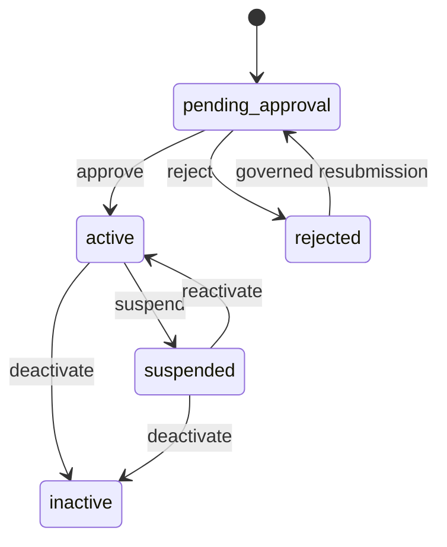

## 6.3 Transition rules

| Command | From | To | Actor | Guards | Side effects |
|---|---|---|---|---|---|
| register/create | none | pending_approval | Trader/Admin | Unique login identity; required fields | Create trader/user, audit, notify approval queue |
| approve | pending_approval | active | Authorized manager/admin | Review complete | Audit, notification, enable operational access |
| reject | pending_approval | rejected | Authorized manager/admin | Reason required | Audit, trader notification |
| suspend | active | suspended | Authorized internal user | Reason; `If-Match` | Block new submissions, revoke/limit sessions per security policy |
| reactivate | suspended | active | Authorized internal user | Reason; resolved issue | Audit, notification |
| deactivate | active/suspended | inactive | Authorized internal user | Reason | Preserve history, block operational access |

A suspended trader may read permitted historical data but cannot create/submit new financial operations.

---

# 7. Beneficiary Workflow

## 7.1 States

```text
active
inactive
blocked
superseded
```

## 7.2 Rules

- Beneficiary is owned by one trader and is never a login account.
- Amount is not beneficiary data.
- New requests may use only `active` beneficiaries unless an authorized override is recorded.
- Duplicate detection creates warnings; it does not automatically merge records.
- Editing a beneficiary does not alter request revisions or attempts already created.
- A material identity correction may create a replacement beneficiary and mark the old one `superseded`.

## 7.3 Transitions

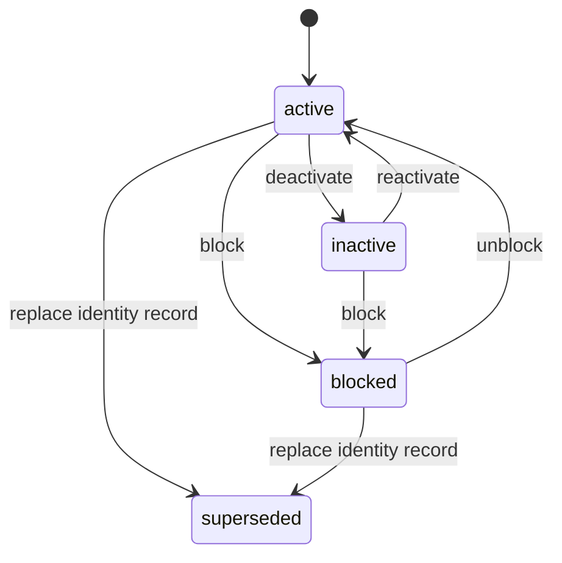

Blocked-beneficiary override requires manager permission, a reason, and inclusion in the batch approval view as a warning.

---

# 8. Gold Sale Order Workflow

## 8.1 States

```text
draft
submitted
under_center_review
priced
waiting_for_incoming_payment
payment_evidence_submitted
waiting_for_bank_statement
needs_review
incoming_payment_partially_confirmed
incoming_payment_confirmed
manager_approval_required
ready_for_dispatch
dispatched
received_by_trader
settled_or_offset
closed
rejected
cancelled
```

## 8.2 State machine

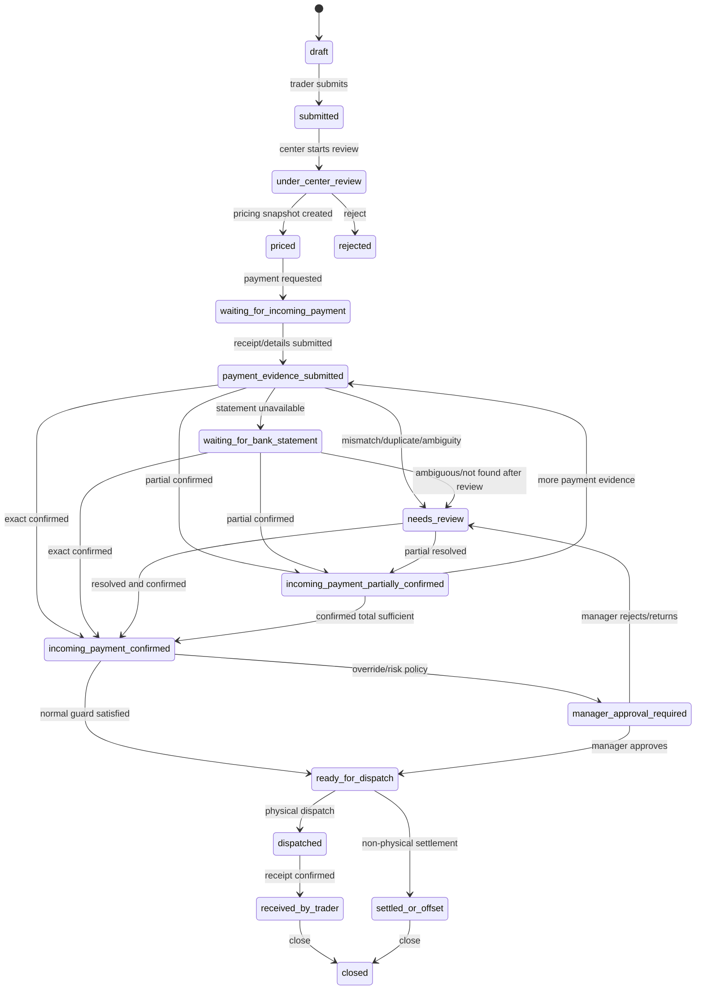

## 8.3 Dispatch guard

Dispatch/settlement MUST be blocked unless one is true:

1. authoritative confirmed incoming amount equals the required final amount; or
2. an authorized manager override explicitly states the variance and reason.

Overpayment does not silently become credit. It creates a review/settlement decision.

## 8.4 Pricing changes

Pricing is versioned. A change after payment evidence exists MUST:

- create a new pricing snapshot;
- invalidate any stale payment expectation;
- recalculate incoming-payment sufficiency;
- create a review task when the required amount changes;
- audit before/after amounts.

---

# 9. Incoming Payment Receipt Workflow

## 9.1 States

```text
submitted
waiting_for_bank_statement
candidate_match
needs_review
duplicate_suspected
partially_confirmed
confirmed
rejected
superseded
```

## 9.2 State machine

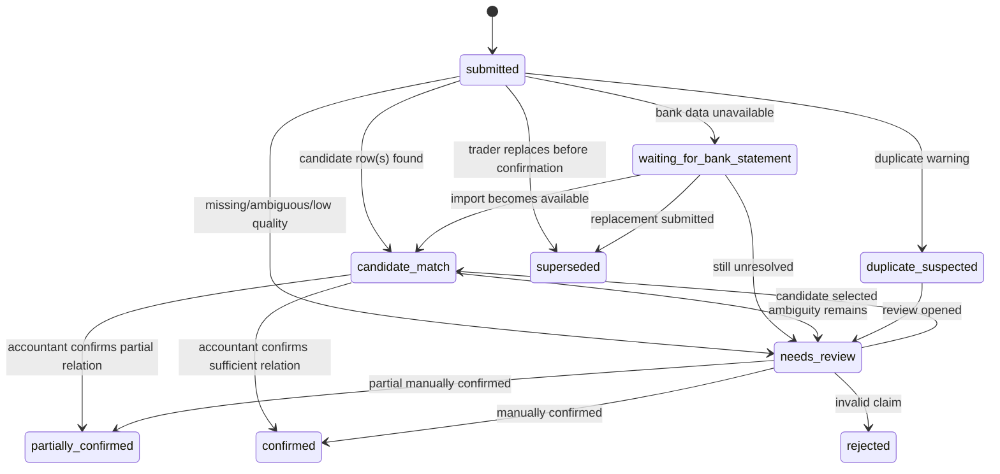

## 9.3 Rules

- A receipt is a claim, not proof.
- OCR may prefill fields but cannot confirm.
- Raw input and normalized values are preserved.
- Confirmed amount may be less than submitted amount only through an explicit partial-confirmation command.
- Replacement keeps the original record/file and marks it `superseded`.

---

# 10. Bank Statement Import Workflow

## 10.1 File states

```text
uploaded
parsed
parse_failed
ready_for_matching
archived
```

## 10.2 Import run states

```text
queued
running
succeeded
failed
cancelled
```

## 10.3 Rules

- Every parse/reparse creates a new immutable import run and immutable rows.
- A failed run does not overwrite a previous successful run.
- Unknown columns and raw values are preserved.
- Duplicate fingerprints are flagged, not silently discarded.
- Mapping/template version is fixed for each run.

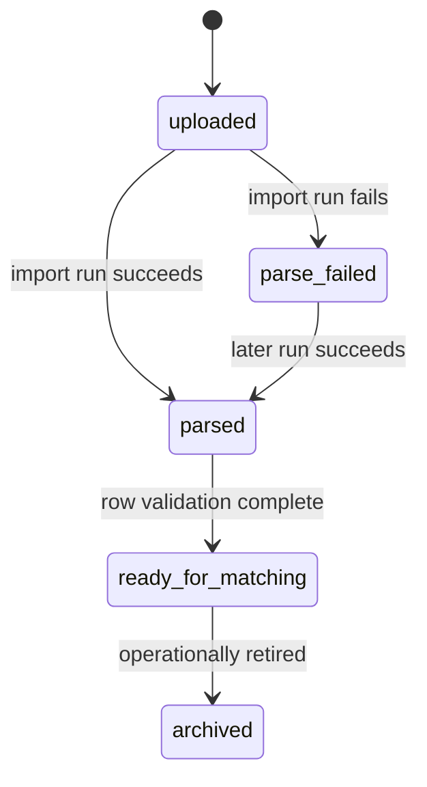

---

# 11. Incoming Match Workflow

## 11.1 Candidate states

```text
proposed
accepted_for_review
rejected
superseded
expired
```

## 11.2 Confirmed match states

```text
active
replaced
revoked
```

## 11.3 Rules

- Candidate acceptance is not financial confirmation.
- Accountant confirmation creates the authoritative receipt-to-row match and updates confirmed amounts in one transaction.
- A row already used in an active match causes a duplicate/conflict guard unless an explicit combined-payment model is used.
- Changing source receipt, import run, or row interpretation expires/supersedes stale candidates.

---

# 12. Gold Dispatch and Settlement Workflow

## 12.1 Types

```text
physical_dispatch
physical_receipt
offset_settlement
manual_settlement
```

## 12.2 States

```text
pending
dispatched
delivered
settled
cancelled
superseded
```

## 12.3 Rules

- Dispatch creation requires the order dispatch guard.
- A physical dispatch cannot be converted silently into offset settlement; create a replacement/superseding settlement record.
- Cancellation after real physical movement is not normal cancellation; use correction/reconciliation and retain evidence.
- Trader acknowledgment is not required to prove that dispatch occurred, but absence of acknowledgment keeps a follow-up task open.

---

# 13. Outgoing Payment Request and Revision Workflow

## 13.1 Request states

```text
draft
submitted_to_center
under_accountant_review
needs_trader_correction
eligible_for_batching
batched
sent_to_bank
partially_paid
paid
failed
retry_required
result_ready_for_trader
result_published
trader_acknowledged
trader_disputed
cancelled
closed
```

Manager approval is intentionally absent from the request state machine. Manager approval applies to an immutable batch version.

## 13.2 Request state machine

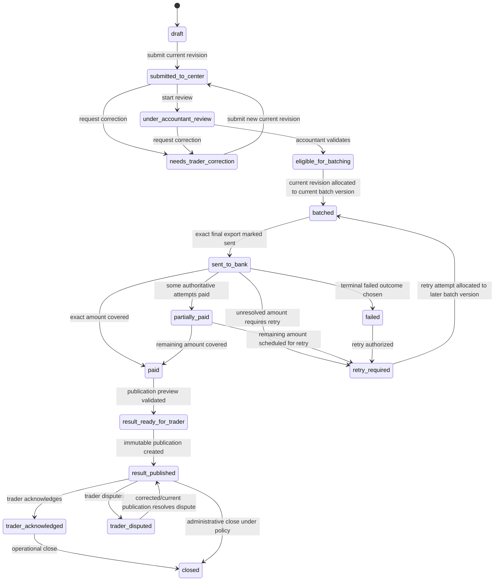

## 13.3 Revision lifecycle

Payment request content is held in immutable revisions.

```text
create request -> revision 1
material draft/correction change -> revision N+1
submit command names expected current revision
historical revisions remain immutable
```

A new revision is allowed:

- freely in `draft` by the owner;
- in `needs_trader_correction` by the owner;
- by authorized internal correction command with reason.

A material revision after batch allocation MUST:

- prevent mutation of historical attempts/versions/exports;
- create or select a new current revision;
- supersede/replace unsent draft attempts as required;
- create a replacement batch version;
- invalidate prior operational approval;
- create audit/outbox events.

## 13.4 Transition table

| Command | From | To | Actor | Guards | Side effects |
|---|---|---|---|---|---|
| create draft | none | draft | Trader/Admin | Trader active; beneficiary active; amount valid | Request + revision 1 + audit |
| create revision | draft/needs_trader_correction | same aggregate state | Owner/authorized internal | `If-Match`; valid amount/unit; reason when correction | New immutable revision, update current revision |
| submit | draft/needs_trader_correction | submitted_to_center | Trader | Expected revision is current; fields valid | Audit, accountant queue notification |
| start review | submitted_to_center | under_accountant_review | Accountant | `If-Match`; no cancellation | Audit, optional assignment/task |
| request correction | submitted/review | needs_trader_correction | Accountant | Reason/message required | Notification, task update |
| mark eligible | under_accountant_review | eligible_for_batching | Accountant | Current revision valid; no blocking warning | Audit, batching queue |
| allocate | eligible/retry_required | batched | System in batch transaction | No conflicting active allocation | Attempts/version/items created |
| mark sent | batched | sent_to_bank | System in exact export command | Valid final export marked sent | Attempt transitions, audit/outbox |
| recalc partial | sent/retry | partially_paid | System | `0 < paid_sum < requested_amount` | Queue retry/review |
| recalc paid | sent/partial/retry | paid | System | `paid_sum == requested_amount` | Publication-ready evaluation |
| recalc overpaid | any active execution | no normal state | System | `paid_sum > requested_amount` | Block normal completion, reconciliation task |
| publish | paid/result_ready | result_published | Accountant | Immutable publication created | Trader notification |
| dispute | result_published | trader_disputed | Trader | Reason required | Review task, audit |
| close | acknowledged/published | closed | Authorized internal | No open blocking task | Audit |

---

# 14. Payment Attempt Workflow

## 14.1 States

```text
created
included_in_batch_version
sent_to_bank
bank_result_pending
paid
failed
retry_required
superseded
cancelled
```

## 14.2 State machine

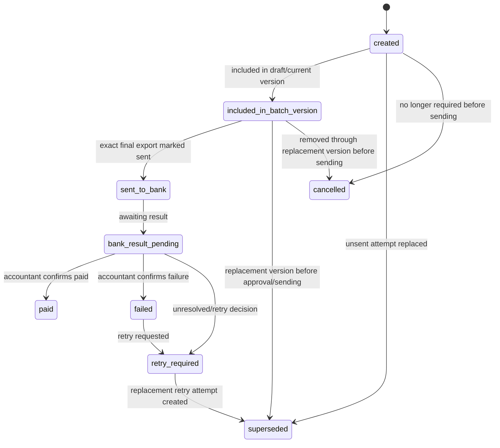

## 14.3 Allocation invariant

Inside a locked transaction:

```text
sum(active, non-superseded attempt allocations for unpaid intent)
<= request current required amount - authoritative paid amount
```

An attempt cannot be actively allocated in two current operational batch versions.

## 14.4 Paid confirmation guards

`confirm_paid` requires:

- actor has payment confirmation permission;
- attempt was sent or is in a governed manual-result exception state;
- bank result data is sufficient;
- primary evidence link or a permission-controlled text-only official result is present;
- duplicate tracking/evidence checks pass or are explicitly resolved;
- `If-Match` and idempotency pass;
- parent amount will not become overpaid;
- related publication impact is evaluated.

The command atomically:

- creates/activates confirmed evidence link when supplied;
- sets attempt to `paid`;
- stores tracking/date/result metadata;
- recalculates request and batch;
- audits;
- writes outbox events;
- completes idempotency record.

## 14.5 Failed confirmation guards

`confirm_failed` requires a failure code or reason. It preserves the sent instruction and does not delete the request. It may create a retry review task.

## 14.6 Retry

A retry is a new attempt. It MUST reference the exact payment request revision used and `retry_of_attempt_id`.

Material beneficiary/IBAN correction must first create a new request revision. Retry payload MUST NOT bypass the revision workflow by injecting arbitrary corrected beneficiary data.

## 14.7 Incorrect historical result correction

A paid/failed result is not casually toggled. The correction workflow MUST:

1. open a sensitive correction task;
2. capture reason and supporting evidence;
3. mark the incorrect authoritative attempt/result representation `superseded` when the schema model requires replacement;
4. create a correction attempt/result record referencing the original;
5. recalculate parent aggregates;
6. supersede/revoke stale publications;
7. notify affected trader when previously published;
8. audit before/after and actor authorization.

Manager authorization is required for a correction that changes a previously paid financial outcome, unless the approved security/RBAC document defines an equally strong dual-control policy.

---

# 15. Payment Batch Container Workflow

## 15.1 Batch states

```text
draft
ready_for_approval
approved
approval_invalidated
exported
sent_to_bank
result_received
partially_resolved
resolved
rejected
cancelled
```

## 15.2 Batch version states

```text
draft
ready_for_approval
approved
rejected
superseded
```

## 15.3 Core rule

`PaymentBatch` is the logical container. `PaymentBatchVersion` is the exact ordered immutable row set reviewed by the manager and used to generate a final export.

## 15.4 State machine

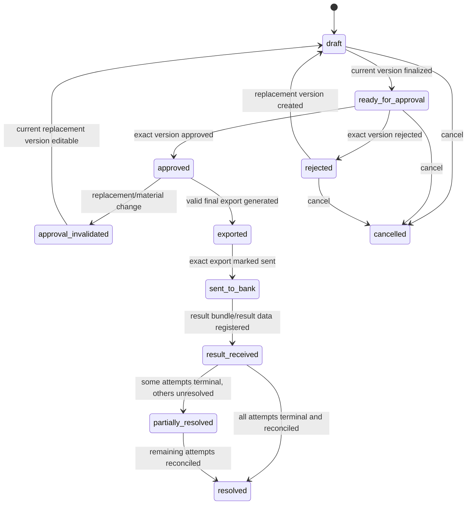

A sent batch cannot be normally cancelled. It is reconciled through attempt results/corrections.

---

# 16. Payment Batch Version Workflow

## 16.1 Create draft version

Creating a batch/version MUST atomically:

- revalidate selected requests/revisions;
- evaluate exact bank profile version, mapping, account, time rules;
- create split/original attempts;
- create ordered batch items;
- compute row hashes and canonical version hash;
- calculate row count/total;
- create audit/outbox/idempotency records.

## 16.2 Finalize

`draft -> ready_for_approval` guards:

- version is current for the batch;
- at least one row exists;
- no validation error exists;
- totals equal ordered item sums;
- row hashes/content hash recompute correctly;
- selected request revisions are still current and eligible;
- no conflicting active attempt allocation exists;
- beneficiary block/override warnings are resolved;
- bank profile/mapping/account remain valid.

After finalization, version and items are immutable.

## 16.3 Replacement

Any material change creates a new draft version. The old version becomes `superseded` when no longer operational. A prior approval remains historical but is invalid for the replacement version.

---

# 17. Manager Batch Approval Workflow

## 17.1 Scope

Every outgoing Phase 1A batch requires manager approval at the exact batch-version level.

## 17.2 Approval view

Before deciding, the manager receives an exact snapshot containing:

- batch/version identifiers;
- bank and source account;
- mapping/template version;
- ordered rows;
- beneficiaries and masked/full IBAN according to permission;
- row count and total IRR/Toman display helper;
- warnings and overrides;
- content hash;
- preparer and timestamps.

## 17.3 Approve

```text
ready_for_approval -> approved
```

Guards:

- manager permission;
- recent authentication;
- optional separation-of-duty;
- version is current;
- expected hash equals recomputed hash;
- no blocking validation error;
- no previous decision for that version;
- idempotency valid.

Side effects:

- append `BatchApproval(decision=approved)`;
- store approved content hash and authentication context;
- set version/batch approval state;
- resolve manager task;
- audit/outbox.

## 17.4 Reject

```text
ready_for_approval -> rejected
```

Reason is mandatory. Rejection does not edit the version. Accountant creates a replacement version.

## 17.5 Approval invalidation

Approval is invalid for operational use when any material input differs from the approved version. The old approval remains immutable history. The batch becomes `approval_invalidated`/`draft` as a replacement version is prepared.

---

# 18. Bank Export Workflow

## 18.1 Export types

```text
preview
final
```

## 18.2 Export states

```text
generating
generated
validated
downloaded
sent_to_bank_marked
voided
quarantined
generation_failed
```

## 18.3 Preview export

Preview MAY be generated before manager approval. It MUST be visually and technically non-sendable and must not satisfy the sent-to-bank guard.

## 18.4 Final export

Final generation requires:

- approved current batch version;
- approval hash equals version hash;
- exact bank profile/mapping/account match;
- deterministic row source;
- totals/row count match;
- no active final export for the same version unless the old one is voided/quarantined through a controlled command.

Worker rendering does not authorize the export. The API/domain command creates a pending export after validation, and the worker deterministically renders it.

## 18.5 Download integrity check

Before every final download:

```text
export.version_id == approval.version_id
export.content_hash == version.content_hash
approval.approved_content_hash == version.content_hash
export.row_count == version.row_count
export.total_amount_irr == version.total_amount_irr
file hash == stored export file hash
```

Mismatch changes export to `quarantined`, creates an urgent review task/audit event, and blocks download.

## 18.6 Mark exact export sent

Only a valid final export can be marked sent. This command atomically:

- stores sent timestamp/channel/actor;
- marks export `sent_to_bank_marked`;
- moves batch to `sent_to_bank`;
- moves included attempts to `sent_to_bank` and then `bank_result_pending` according to implementation timing;
- moves affected requests to `sent_to_bank`;
- writes audit/outbox/idempotency.

Downloading a file is not proof it was sent.

---

# 19. Bank Result Bundle Workflow

## 19.1 States

```text
uploaded
processing
ready_for_manual_review
partially_matched
matched
closed
failed
voided
```

## 19.2 State machine

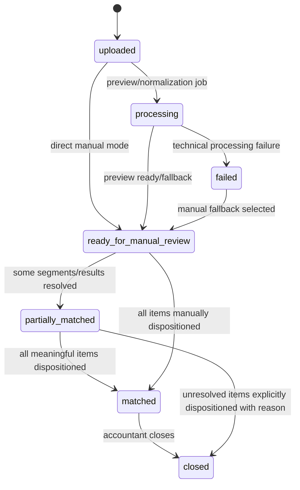

## 19.3 Rules

- A bundle may relate to multiple batches/traders or none known at upload.
- Original files are preserved.
- Technical processing failure does not block manual review.
- Unmatched content is visible until linked, rejected as irrelevant, marked unknown with reason, or otherwise dispositioned.
- Closing with unresolved content requires explicit dispositions/reason, not silent omission.
- Bundle-to-batch association is contextual and does not prove payment completion.

---

# 20. Receipt Segment and Phase 1A Manual Crop Workflow

## 20.1 States

```text
created
unmatched
candidate_found
confirmed_linked
published
superseded
voided
```

## 20.2 Creation methods

```text
manual_in_panel_crop
manual_external_attachment
manual_structured_result
excel_row_import
ai_auto_segmentation
```

## 20.3 Phase 1A crop flow

1. Accountant opens an authorized image/PDF preview.
2. UI supports page selection, zoom, pan, and rotation.
3. Accountant selects a normalized rectangle.
4. API validates source file, page, normalized coordinates, dimensions, and permissions.
5. A segment is created with provenance and a processing job may render the crop.
6. Original source remains immutable.
7. Derived crop references source file, renderer version, page, coordinates, and checksum.
8. Segment can be manually completed with structured fields.
9. Segment proceeds to candidate or confirmed-link flow.

Manual crop is required in Phase 1A. Automatic segmentation is not.

## 20.4 State machine

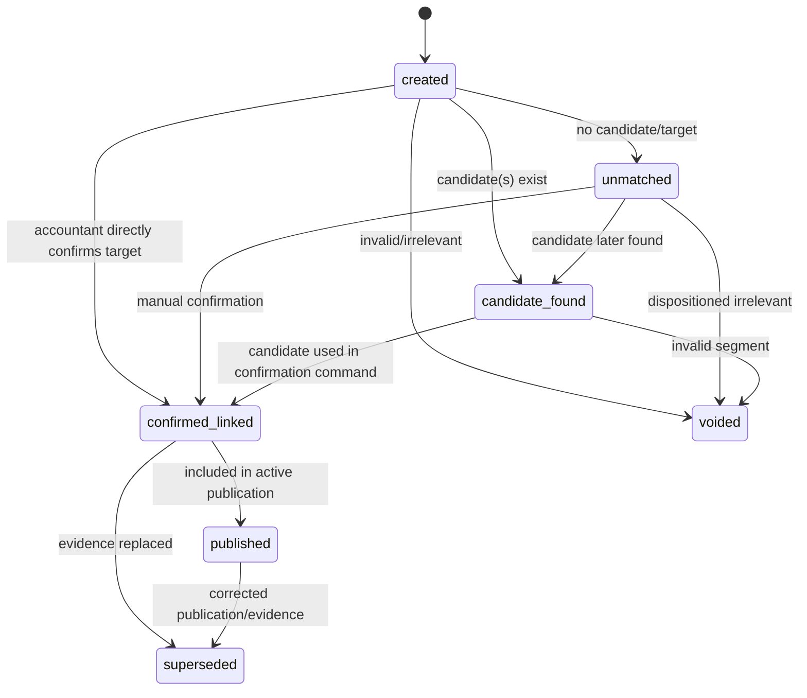

A segment status summarizes usage; confirmed-link history is authoritative for the relationship.

---

# 21. Matching Candidate Workflow

## 21.1 States

```text
proposed
accepted_for_confirmation
rejected
superseded
expired
```

## 21.2 Rules

- Workers/rules/AI may create `proposed` candidates.
- An accountant may accept a candidate for the confirmation screen.
- Acceptance alone does not mark an attempt paid and does not create final evidence authority.
- Source/target changes expire or supersede stale candidates.
- Candidate reasons, score, algorithm/provider version, and input snapshot are retained.

---

# 22. Confirmed Evidence Link Workflow

## 22.1 States

```text
active
replaced
revoked
```

## 22.2 Link types

```text
primary
supplementary
```

## 22.3 Rules

- By default, one attempt has at most one active primary link.
- By default, one segment has at most one active primary attempt link.
- Supplementary evidence does not replace primary evidence.
- Link creation and paid confirmation may occur in one atomic command.
- Replacing a link marks old link `replaced` and creates a new active link in one transaction.
- Revocation requires reason and cannot silently erase a previously published result.

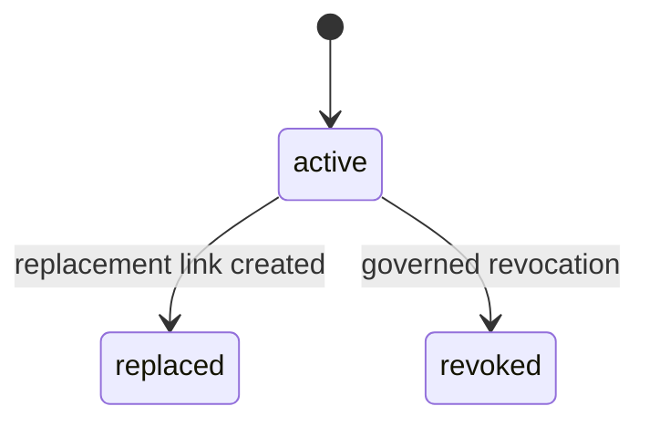

---

# 23. Payment Result Publication and Trader Response Workflow

## 23.1 Publication states

```text
active
superseded
revoked
```

## 23.2 Publication rule

A receipt segment is not independently published as the workflow source of truth. The system creates an immutable `PaymentResultPublication` containing the exact trader-visible summary and selected evidence/share artifact.

## 23.3 Flow

```text
paid
  -> publication preview validation
  -> result_ready_for_trader
  -> create immutable active publication
  -> result_published
  -> trader acknowledged OR trader disputed
```

## 23.4 Correction

A corrected publication:

- creates version N+1;
- marks prior active publication `superseded`;
- records correction reason and supersedes reference;
- retains previous share files according to policy;
- notifies trader;
- resolves or updates dispute tasks as appropriate.

Revocation without replacement is limited to cases where the publication must no longer be presented as valid and requires a governed reason.

---

# 24. Aggregate Recalculation Rules

## 24.1 Payment request paid amount

```text
authoritative_paid_sum =
  sum(amount_irr of attempts where status = paid
      and not superseded/cancelled
      and not double-counted by correction/retry lineage)
```

## 24.2 Request result

| Condition | Aggregate behavior |
|---|---|
| No sent attempts and eligible | `eligible_for_batching` |
| Current active attempt allocated | `batched` |
| Any exact export marked sent and unresolved | `sent_to_bank` |
| `0 < paid_sum < required_amount` | `partially_paid` |
| `paid_sum == required_amount` | `paid` |
| `paid_sum > required_amount` | No normal paid transition; reconciliation error/task |
| No paid amount, all authoritative attempts terminal failed, retry not chosen | `failed` |
| Unpaid amount has retry decision/attempt preparation | `retry_required` |

Publication/dispute/closed states are explicit overlays and are not overwritten by payment arithmetic without a workflow command.

## 24.3 Batch result

| Condition | Batch state |
|---|---|
| Current version draft | `draft` |
| Current version ready | `ready_for_approval` |
| Current exact version approved | `approved` |
| Replacement/material change after approval | `approval_invalidated`/`draft` |
| Valid final export exists | `exported` |
| Exact export marked sent | `sent_to_bank` |
| Any result registered | `result_received` |
| Some attempts terminal and some unresolved | `partially_resolved` |
| All attempts terminal and no unresolved reconciliation | `resolved` |

Failed attempts can still produce a resolved batch when every row has a final disposition; `resolved` does not mean every attempt was paid.

## 24.4 Bundle result

A bundle is `matched` when every meaningful segment/item has a documented disposition. It is not enough that some linked attempts are paid.

---

# 25. Manual Review Task Workflow

## 25.1 States

```text
open
in_progress
resolved
cancelled
```

Assignment is a field, not a separate financial state.

## 25.2 Task types

```text
payment_request_review
manager_batch_approval
unmatched_bank_result_segment
ambiguous_match
duplicate_suspected
payment_failure
partial_payment_retry
missing_evidence
incoming_payment_mismatch
trader_issue_reported
sensitive_result_correction
reopen_request_review
export_integrity_failure
storage_or_processing_failure
retention_change_review
```

## 25.3 Rules

- Resolving a task normally invokes a domain command; task resolution alone does not change financial truth.
- A task cannot be resolved as `completed` when the underlying issue remains unresolved without an explicit disposition/reason.
- Related entity cancellation may cancel nonessential tasks automatically.
- Assignment/start/resolve/cancel use concurrency protection.

---

# 26. Notification and Outbox Workflow

## 26.1 Notification states

```text
unread
read
dismissed
```

## 26.2 Outbox states

```text
pending
processing
published
failed
dead_lettered
```

## 26.3 Rules

- Domain transaction writes outbox events, not direct external notifications.
- Workers deliver notifications idempotently.
- Failed delivery does not roll back the completed financial transaction.
- Critical work always exists in a queue/task even when notification delivery fails.
- Trader notifications must be ownership-scoped and must not leak other traders' data.

---

# 27. Processing Job and AI/OCR Workflow

## 27.1 States

```text
queued
running
succeeded
failed
retry_scheduled
cancelled
dead_lettered
fallback_to_manual
```

## 27.2 Rules

- Jobs are idempotent per job type and idempotency key.
- Worker leases/heartbeats prevent two workers from completing the same job concurrently.
- File preview/crop/export rendering may be Phase 1A jobs.
- AI/OCR jobs are optional and disabled unless enabled in a later phase.
- AI failure creates `fallback_to_manual` when manual workflow remains possible.
- A job may create candidates/tasks/derived files, never financial approval.

---

# 28. Correction, Replacement, and Reopen Workflows

## 28.1 Evidence replacement

```text
active confirmed link
  -> validate replacement and permissions
  -> old link replaced
  -> new link active
  -> affected attempt/request recalculated
  -> active publication evaluated
  -> corrected publication if needed
  -> audit/outbox/notification
```

## 28.2 Request material correction after batching

- create new request revision;
- do not change historical sent attempt;
- replace unsent attempts when allowed;
- create new batch version;
- invalidate operational approval;
- require manager reapproval before final export.

## 28.3 Reopen closed request

Closed request reopen is exceptional. It requires:

- open dispute/accounting error/incorrect publication or equivalent documented basis;
- dedicated review task;
- authorized internal permission, and manager approval for material financial change;
- preservation of prior closure timestamp/history;
- explicit correction and re-close result.

The implementation SHOULD use a reopen event/task and controlled state transition, not an arbitrary backward status patch.

## 28.4 Published result correction

A correction after trader visibility MUST create a new publication and notify the trader. Old publication remains visible to authorized internal auditors.

---

# 29. Cancellation and Void Rules

## 29.1 Payment request

| State | Normal cancellation |
|---|---|
| `draft` | Trader may cancel |
| `submitted_to_center` | Trader/internal may cancel with policy/reason |
| `under_accountant_review` | Internal with reason |
| `needs_trader_correction` | Trader/internal with reason |
| `eligible_for_batching` | Internal/trader if no active allocation |
| `batched` | Only by replacement/removal before final sent export |
| `sent_to_bank` and later | No normal cancellation; use result/reconciliation/correction |

## 29.2 Batch/version/export

- Draft/rejected batch may be cancelled.
- Ready-for-approval may be cancelled with reason.
- Approved batch may be replaced/cancelled only before valid final export is sent; approval remains historical.
- Preview exports may be voided.
- Final exports may be voided before sent marking.
- A sent export is not voided to pretend it was never sent; use reconciliation.

## 29.3 Attempt

Only unsent attempts can be normally cancelled. Sent attempts receive outcomes/corrections.

---

# 30. Failure and Recovery Paths

| Failure | Required behavior |
|---|---|
| API timeout after command commit | Same idempotency key returns committed result |
| Worker crashes during crop/export | Job retry resumes safely; no duplicate authoritative artifact |
| Storage write succeeds, DB transaction fails | Orphan reconciliation detects/removes/quarantines object |
| DB record exists, storage write incomplete | File remains pending/failed and cannot be used |
| Redis unavailable | Synchronous financial commands may continue when safe; background work shows unavailable and remains queued/outbox-backed |
| Export hash mismatch | Quarantine export, block download/sent marking, urgent task/audit |
| Approval request submitted twice | Unique decision/idempotency returns original result |
| Two accountants confirm same attempt | Lock/version/unique constraints allow one; other receives conflict |
| Two users replace evidence | One transaction wins; other receives version/uniqueness conflict |
| AI/OCR unavailable | Manual workflow continues |
| Bank result arrives before sent marking | Store bundle/result, create reconciliation task; do not silently rewrite send history |
| Result arrives for unknown attempt | Unmatched/manual review; preserve raw data |
| Notification delivery fails | Retry/dead-letter; work queue remains authoritative |

---

# 31. End-to-End Outgoing Payment Workflow — Phase 1A

```text
1. Trader creates a draft request and immutable revision 1.
2. Trader submits the expected current revision.
3. Accountant starts review.
4. Accountant requests correction OR marks request eligible for batching.
5. Accountant previews selection using exact request revisions and bank configuration.
6. System creates batch container, draft version, attempts, and ordered items atomically.
7. Accountant creates replacement draft version when needed.
8. Accountant finalizes exact current version.
9. Manager reviews exact rows/total/bank/account/hash with recent authentication.
10. Manager approves or rejects the exact version.
11. System may generate preview export; it is non-sendable.
12. Accountant requests final export from approved version.
13. Worker deterministically generates and validates final export.
14. Authorized accountant downloads the exact validated export.
15. Accountant manually submits it to bank.
16. Accountant marks that exact export sent to bank.
17. Attempts and requests move into sent/result-pending execution state.
18. Accountant uploads one or more bank result bundles/files.
19. System creates previews; accountant may create Phase 1A manual crops/segments.
20. Accountant confirms evidence link and paid/failed result for each attempt.
21. System recalculates request and batch aggregates.
22. Retry attempts are created for unpaid retry-required amounts and processed in later batch versions.
23. When paid amount exactly covers the request, publication preview is validated.
24. Accountant creates immutable trader publication.
25. Trader views/downloads/shares, then acknowledges or disputes.
26. Accountant resolves disputes/corrections and closes the request when appropriate.
```

Critical invariants:

- no request-level manager approval;
- no final export without exact-version approval;
- no sent marking without exact final export;
- no paid state from AI/worker;
- no overpayment treated as normal success;
- no publication exposing mixed bank bundle data.

---

# 32. End-to-End Gold Sale and Incoming Verification — Phase 1A

```text
1. Trader/admin creates gold sale order.
2. Center reviews and creates pricing snapshot.
3. Center requests incoming payment.
4. Trader submits one or more payment receipts/details.
5. Accountant uploads bank statement file and starts an import run.
6. System stores immutable bank rows and may suggest candidates.
7. Accountant confirms receipt-to-row matches and confirmed amounts.
8. Order becomes partially confirmed, needs review, or fully confirmed.
9. Over/underpayment produces review; it is not silently normalized.
10. Manager approves any configured sensitive override.
11. Dispatch guard evaluates confirmed amount.
12. Warehouse records physical dispatch OR authorized settlement/offset.
13. Trader acknowledges receipt when applicable.
14. Center closes order after no blocking dispute/task remains.
```

---

# 33. Work Queues

## 33.1 Accountant queues

```text
New payment requests
Requests under review
Requests needing trader correction
Requests eligible for batching
Draft batches requiring preparation
Approved batches requiring final export
Exports downloaded but not marked sent
Batches waiting for bank result
Bank result bundles requiring review
Unmatched receipt segments
Attempts awaiting result confirmation
Failed/partial payments requiring retry decision
Incoming receipts waiting for verification
Trader disputes and publication corrections
Processing/storage failures
```

## 33.2 Manager queues

```text
Trader approvals
Exact batch versions ready for approval
Sensitive payment-result corrections
Blocked-beneficiary overrides
Incoming-payment/dispatch overrides
Reopen requests
Retention policy proposals
```

## 33.3 Dispatch queues

```text
Orders ready for dispatch
Dispatched orders waiting acknowledgment
Settlement/offset records requiring completion
Delivery disputes
```

Queue membership is determined by canonical state plus open tasks, not by notification presence.

---

# 34. UI State Presentation Rules

- Trader UI shows simplified Persian stages while preserving exact backend state in API.
- Admin UI shows exact state, current revision/version, record version, actor, timestamps, warnings, tasks, and allowed actions.
- Manager approval UI must show exact immutable version and hash context.
- Accountant bundle workspace must show source document and selected attempt/evidence context together.
- UI may hide unavailable actions, but backend remains authoritative.
- Amount actions display clear units and both IRR/Toman helpers where required; storage/calculation remains integer IRR.

Suggested trader mapping:

| Backend states | Trader label concept |
|---|---|
| `draft` | Draft |
| `submitted_to_center`, `under_accountant_review` | Under center review |
| `needs_trader_correction` | Correction required |
| `eligible_for_batching`, `batched` | Preparing payment |
| `sent_to_bank` | Sent for bank processing |
| `partially_paid`, `retry_required` | Partially processed |
| `paid`, `result_ready_for_trader` | Payment confirmed; result preparing |
| `result_published` | Result available |
| `trader_acknowledged` | Acknowledged |
| `trader_disputed` | Issue under review |
| `closed` | Closed |
| `cancelled` | Cancelled |

---

# 35. Audit Events

Required event families include:

```text
TraderRegistered
TraderApproved
TraderRejected
TraderSuspended
BeneficiaryCreated
BeneficiaryBlocked
PaymentRequestCreated
PaymentRequestRevisionCreated
PaymentRequestSubmitted
PaymentRequestReviewStarted
PaymentRequestCorrectionRequested
PaymentRequestEligibleForBatching
PaymentBatchCreated
PaymentBatchVersionCreated
PaymentBatchVersionFinalized
PaymentBatchApprovalRequested
PaymentBatchVersionApproved
PaymentBatchVersionRejected
PaymentBatchApprovalInvalidated
BankExportPreviewRequested
BankExportFinalRequested
BankExportGenerated
BankExportQuarantined
BankExportDownloaded
BankExportMarkedSent
PaymentAttemptCreated
PaymentAttemptIncludedInBatchVersion
PaymentAttemptSentToBank
PaymentAttemptPaid
PaymentAttemptFailed
PaymentAttemptRetryRequired
PaymentAttemptRetryCreated
BankResultBundleUploaded
ReceiptSegmentCreated
ReceiptSegmentCropped
MatchingCandidateCreated
MatchingCandidateAcceptedForConfirmation
ConfirmedEvidenceLinkCreated
ConfirmedEvidenceLinkReplaced
PaymentResultPublicationCreated
PaymentResultPublicationSuperseded
TraderAcknowledgedResult
TraderDisputedResult
IncomingReceiptSubmitted
IncomingMatchConfirmed
GoldDispatchCreated
GoldSettlementRecorded
ManualReviewTaskCreated
ManualReviewTaskResolved
RetentionPolicyProposed
RetentionPolicyApproved
```

Audit metadata must include correlation/request ID, actor/session, previous/new state, reason, related immutable IDs/hashes, amount where relevant, and file/evidence IDs. Secrets and unnecessary full sensitive values must not be logged.

---

# 36. Phase Boundaries

## 36.1 Phase 1A — Operational Manual Core

Required:

- trader onboarding and approval;
- beneficiaries and structured requests;
- immutable request revisions;
- accountant review and eligibility;
- split attempts;
- batch versions and exact manager approval;
- preview and final bank exports;
- manual sent-to-bank marking;
- bank result bundle upload;
- image/PDF preview, zoom/rotate, and minimal rectangular manual crop;
- manual structured result/evidence link;
- human paid/failed confirmation;
- retries and partial results;
- immutable trader publications;
- gold sale/incoming payment manual verification;
- work queues, audit, outbox, idempotency, concurrency.

Not required:

- automatic segmentation;
- OCR dependency;
- automatic financial matching/finality;
- bank API;
- external owner validation;
- anomaly detection;
- SaaS/multi-company;
- internal chat.

## 36.2 Phase 1B — Assisted Operations

May add OCR field extraction, candidate suggestions, richer crop tooling, improved share generation, and operational productivity enhancements. Human authority remains.

## 36.3 Phase 2 — Advanced Intelligence and Risk Control

May add automatic segmentation, duplicate/anomaly models, learning from corrections, and external validation integrations.

## 36.4 Phase 3 — Integrations and Operational Scale

May add bank APIs, accounting integrations, larger-scale infrastructure, and operational SLA tooling.

## 36.5 Phase 4 — Productization and Expansion

May add multi-company tenancy, SaaS billing/subscriptions, white-labeling, and broader product packaging.

---

# 37. Acceptance Criteria

The workflow implementation is acceptable only when all are true:

1. Payment request correction creates revisions and never rewrites submitted historical content.
2. Accountant review ends in `eligible_for_batching`, not manager approval.
3. Manager approves one immutable batch version with exact hash and recent authentication.
4. A material batch change requires a replacement version and reapproval.
5. Final export is generated only from a valid approved version.
6. Exact final export, not a generic batch, is marked sent to bank.
7. Payment attempts retain exact request/bank snapshots and retry lineage.
8. Paid confirmation is human, idempotent, concurrency-safe, audited, and transactional.
9. Paid sum equal to requested amount is required for normal `paid`; overpayment creates reconciliation.
10. Manual crop is available in Phase 1A and preserves provenance.
11. Candidate matching is distinct from confirmed evidence links.
12. Evidence replacement retains previous links and corrects publications when needed.
13. Trader-visible result is an immutable publication, not direct access to a mixed bundle.
14. Trader ownership is enforced in every read/download/share command.
15. Bank statement reparsing creates a new import run and immutable rows.
16. Notifications are delivered from outbox and are not workflow truth.
17. Duplicate commands return the original idempotent result.
18. Stale mutable updates fail instead of overwriting another user's work.
19. Worker/AI failure does not block manual completion.
20. Financial records are cancelled/superseded/replaced, not deleted.

---

# 38. Coding Agent Rules

Coding agents and developers MUST NOT:

1. add manager approval states to individual payment requests as the primary Phase 1A model;
2. approve a mutable batch;
3. generate/send a final export without valid exact-version approval;
4. edit finalized batch items, approvals, request revisions, publications, or original files;
5. use one mutable `payment_batch_id` on attempts as complete batch history;
6. merge candidate matches and confirmed links;
7. make AI/OCR a Phase 1A dependency or authority;
8. mark paid based only on worker output;
9. treat `paid_sum >= requested_amount` as normal success; equality is required;
10. change beneficiary master data to rewrite historical snapshots;
11. implement retry by silently editing a sent attempt;
12. detach/delete evidence history; use replace/revoke;
13. publish a receipt segment directly as the sole trader result truth;
14. expose raw/mixed bank bundles to traders;
15. omit idempotency or concurrency guards on sensitive commands;
16. update business state without audit and outbox in the same transaction;
17. close unresolved bundle content without a documented disposition;
18. treat a downloaded export as sent to bank;
19. place SaaS/multi-company logic into Phase 1A workflows;
20. copy the legacy manual process when a safer standardized workflow is defined here.

---

# 39. Suggested Domain Service Methods

```text
TraderService.register()
TraderService.approve()
TraderService.reject()
TraderService.suspend()
TraderService.reactivate()

BeneficiaryService.create()
BeneficiaryService.update()
BeneficiaryService.block()
BeneficiaryService.supersede()

PaymentRequestService.create_draft()
PaymentRequestService.create_revision()
PaymentRequestService.submit()
PaymentRequestService.start_review()
PaymentRequestService.request_correction()
PaymentRequestService.mark_eligible_for_batching()
PaymentRequestService.cancel()
PaymentRequestService.recalculate()
PaymentRequestService.open_dispute()
PaymentRequestService.close()

PaymentBatchService.preview_selection()
PaymentBatchService.create_with_draft_version()
PaymentBatchService.create_replacement_version()
PaymentBatchService.finalize_version()
PaymentBatchService.invalidate_operational_approval()
PaymentBatchService.recalculate_result()
PaymentBatchService.cancel()

BatchApprovalService.get_approval_view()
BatchApprovalService.approve_version()
BatchApprovalService.reject_version()

BankExportService.request_preview()
BankExportService.request_final()
BankExportService.validate_integrity()
BankExportService.authorize_download()
BankExportService.mark_sent_to_bank()
BankExportService.quarantine()

PaymentAttemptService.confirm_paid()
PaymentAttemptService.confirm_failed()
PaymentAttemptService.mark_retry_required()
PaymentAttemptService.create_retry()
PaymentAttemptService.correct_result()

BankResultBundleService.upload()
BankResultBundleService.start_manual_review()
BankResultBundleService.recalculate()
BankResultBundleService.close()

ReceiptSegmentService.create_manual_crop()
ReceiptSegmentService.create_external_attachment()
ReceiptSegmentService.create_structured_result()
ReceiptSegmentService.void()

MatchingCandidateService.propose()
MatchingCandidateService.accept_for_confirmation()
MatchingCandidateService.reject()

EvidenceLinkService.confirm_primary()
EvidenceLinkService.add_supplementary()
EvidenceLinkService.replace()
EvidenceLinkService.revoke()

PaymentPublicationService.preview()
PaymentPublicationService.publish()
PaymentPublicationService.publish_correction()
PaymentPublicationService.revoke()

IncomingReceiptService.submit()
IncomingMatchService.confirm()
GoldSaleOrderService.recalculate_payment()
GoldDispatchService.dispatch()
GoldDispatchService.settle_or_offset()

ManualReviewTaskService.create()
ManualReviewTaskService.start()
ManualReviewTaskService.resolve()
ManualReviewTaskService.cancel()
```

---

# 40. Remaining Governed Decisions

These decisions do not change the state-machine architecture but must be finalized before production in the relevant ADR/security/business policy:

- exact authentication/session transport;
- recent-auth method and timeout for manager approval;
- separation-of-duty enforcement level;
- policy for text-only outgoing result confirmation without evidence;
- actors required for correcting a previously published paid result;
- exact retention duration and legal authority;
- initial bank profile/mapping/template versions;
- operational thresholds for warnings and overrides;
- final Persian labels and messages.

Until a policy is approved, the implementation must use the safer default: stronger authorization, explicit reason, preserved history, and manual review.

---

# 41. Summary

The Phase 1A workflow is a manual-first but fully standardized financial operation:

- request content is revisioned;
- accountant validates requests for batching;
- batches contain immutable ordered versions;
- managers approve exact versions, not individual requests or mutable batches;
- final exports are integrity-checked against approval hashes;
- exact exports are marked sent;
- bank results are manually reviewed with built-in crop support;
- candidates are separated from confirmed evidence;
- human confirmation determines financial outcomes;
- trader results are immutable, ownership-safe publications;
- corrections replace/supersede history rather than erase it;
- idempotency, concurrency, audit, and outbox behavior are part of every sensitive command.

The next document to revise is `07_UI_UX_Specification.md`, which must map these canonical workflows to modern, role-specific, Persian RTL journeys without changing the employer-required business flow.
